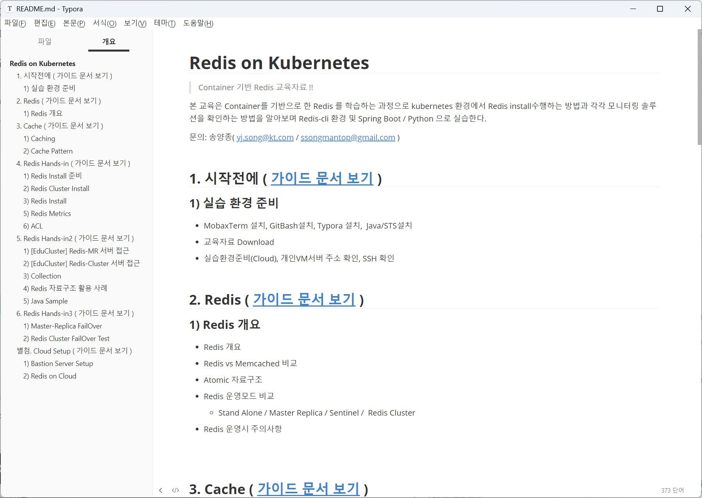
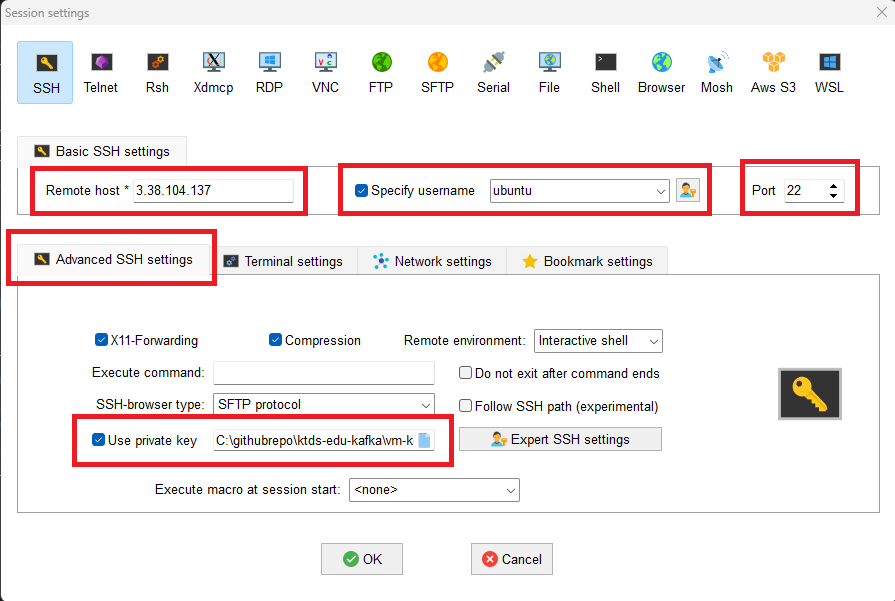

# < 시작전에 >


# 1. 설문 조사

Redis 에 대해서 경험치를 조사할 것이다.  아래 링크를 클릭후 해당하는 영역에 체크 하자.

* 설문조사링크 : https://forms.gle/5M4By8CZcHPm5ArB9

1. 처음 들어봤다.
2. 들어는 봤지만 한번도 사용해보지 않았다.
3. 설치해 본 경험이 있다.
4. Redis를 이용한 개발 경험이 있다.
5. 직접 운영해 본 경험이 있다.


# 2. 실습 환경 준비(개인PC)

우리는 Kubernetes 기반에 Kafka / Redis 설치하는 실습을 진행할 것이다.

Cloud 환경에 Kubernetes가 설치된 VM 이 개인별 하나씩 준비되어 있어 있다.

그러므로 개인 PC에서 VM 접속할 수 있는 Terminal 을 설치해야 한다.


## 1) MobaxTerm 설치

Cloud VM에 접근하기 위해서는 터미널이 필요하다.

CMD / PowerShell / putty 와 같은 기본 터미널을 이용해도 되지만 좀더 많은 기능이 제공되는 MobaxTerm(free 버젼) 을 다운로드 하자.


- 다운로드 위치
  - 링크: https://download.mobatek.net/2362023122033030/MobaXterm_Installer_v23.6.zip

- mobaxterm 실행


## 2) gitBash 설치

교육문서를 다운로드 받으려면 Git Command 가 필요하다. Windows 에서는 기본 제공되지 않아 별도 설치 해야 한다.

- 참조 링크 : https://git-scm.com/
- 다운로드 위치 
  - 링크 : https://github.com/git-for-windows/git/releases/download/v2.44.0.windows.1/Git-2.44.0-64-bit.exe


## 3) Typora 설치

교육자료는 MarkDown 문서로 되어 있으며 MD 파일을 확인하기 위해서  typora를 설치 한다.


### (1) 설치

- 참조 링크: https://typora.io/
- 다운로드 위치
  - 링크 : https://download.typora.io/windows/typora-setup-x64.exe


- Typora 실행


### (2) typora 환경설정

원할한 실습을 위해 코드펜스 옵션을 아래와 같이 변경하자.

- 코드펜스 설정
  - 메뉴 : 파일 > 환경설정 > 마크다운 > 코드펜스
    - 코드펜스에서 줄번호 보이기 - check
    - 긴문장 자동 줄바꿈 : uncheck


- 개요보기 설정
  - 메뉴 : 보기 > 개요
    - 개요 : check


## 4) STS 설치


### (1) java 17 설치

java 17이 설치되어 있지 않은 경우에만 수행한다.

* 참고링크
  * oracle.com 링크 : https://www.oracle.com/java/technologies/downloads/#jdk17-windows
  * 설치관련 문서 : https://jiurinie.tistory.com/131

- jdk 다운로드 주소
  - 링크: https://download.oracle.com/java/17/latest/jdk-17_windows-x64_bin.msi
- 설치완료후 확인

```sh
# CMD 명령 프롬프트 windows에서 ...

C:\Users\ssong>java -version
openjdk version "17.0.5" 2022-10-18
OpenJDK Runtime Environment Temurin-17.0.5+8 (build 17.0.5+8)
OpenJDK 64-Bit Server VM Temurin-17.0.5+8 (build 17.0.5+8, mixed mode, sharing)

```


### (2) STS 설치

- 참고 링크

  - STS 참조 링크: https://spring.io/tools
  - 설치관련 문서 : https://kjchoi.co.kr/17

- 다운로드 주소

  - 링크: https://cdn.spring.io/spring-tools/release/STS4/4.21.1.RELEASE/dist/e4.30/spring-tool-suite-4-4.21.1.RELEASE-e4.30.0-win32.win32.x86_64.self-extracting.jar

- 설치

  - 적당한 위치에 압축 해제 하자.

    - [참고]

      - 다운로드된 파일은 jar 파일이므로 일반적으로 더블클릭만 하면 실행파일로 압축해제 됨

      - 아래와 같이 java 명령으로 압축해지 해도 된다.

        - ```sh
          # 압축해제 전
          $ dir      .
          2024-02-24  오후 01:00       648,346,802 spring-tool-suite-4-4.21.1.RELEASE-e4.30.0-win32.win32.x86_64.self-extracting.jar
          
          # 압축해제
          $ java -jar spring-tool-suite-4-4.21.1.RELEASE-e4.30.0-win32.win32.x86_64.self-extracting.jar
          
          # 압축해제 후
          $ dir      .
          2024-02-24  오후 01:00       648,346,802 spring-tool-suite-4-4.21.1.RELEASE-e4.30.0-win32.win32.x86_64.self-extracting.jar
          2024-02-24  오후 01:02    <DIR>          sts-4.21.1.RELEASE
          ```

- STS 설정

  - Workspace 설정
    - STS 시작시 위치 변경
    - 위치 : C:\workspace\sts-4.21.1 

  - JRE 설정
    - STS 메뉴 :  [Window] - [Prefernces] - [Java] - [Installed JREs]
    - STS 내장된 JRE 에서 jdk-17.x  로 변경 후 apply
    - 없으면 Add 버튼으로 추가
  - Compiler 설정
    - STS 메뉴 :  [Window] - [Prefernces] - [Java] - [Compiler]
    - Compiler complicance level : 17 로 변경
  - 인코딩 변경
    - STS 메뉴 :  [Window] - [Prefernces] - [General] - [Workspace] - [Text file encoding]
    - UTF-8로 변경


# 3. 교육문서 Download

해당 교육문서는 모두 markdown 형식으로 작성되었다.  Chrome Browser 에서 github 문서를 직접 확인해도 된다.

하지만 실습을 따라가다 보면 개인별로 수정해야 할 부분이 있는데 web browser 에서는 수정이 안되기 때문에 수정이 용이한 환경이 훨씬 좋을 것이다.

좀더 효율적인 실습을 위해서 해당 자료를 download 하여 markdown 전용 viewer 인 Typora 로 오픈하여 실습에 참여하자.


## 1) 교육문서 Download

gitbash 실행후 command 명령어로 아래와 같이 임의의 디렉토리를 생성후 git clone 으로 download 하자.

```sh
# GitBash 실행

# 본인 PC에서 아래 디렉토리를 생성
$ mkdir -p /c/githubrepo
 
 
$ cd /c/githubrepo

$ git clone https://github.com/ssongman/ktds-edu-redis.git
Cloning into 'ktds-edu-redis'...
remote: Enumerating objects: 181, done.
remote: Counting objects: 100% (181/181), done.
remote: Compressing objects: 100% (119/119), done.
remote: Total 181 (delta 33), reused 175 (delta 30), pack-reused 0
Receiving objects: 100% (181/181), 7.84 MiB | 6.34 MiB/s, done.
Resolving deltas: 100% (33/33), done.


$ ll /c/githubrepo
drwxr-xr-x 1 ssong 197609 0 Feb 24 12:02 ktds-edu-redis/

```


## 2) Typora 로 readme.md 파일오픈


- typora 로 오픈

```
## typora 에서 아래 파일 오픈

C:\githubrepo\ktds-edu-redis\README.md
```





# 4. 실습 환경 준비(Cloud)


## 1) 개인 VM 서버 주소 확인- ★★★

개인별 VM Server 접속 환경 및 실습을 위한 개인별 Redis Key Prefix를 확인하자.

* 기준일자: 2024.03.11(월)

|  No  |   이름    | 소속            | email               | VM Server | VM Server IP   | Key Prefix | 비고 |
| :--: | :-------: | --------------- | ------------------- | :-------: | -------------- | :--------: | :--: |
|  1   |  송양종   | Cloud성장전략팀 | yj.song@kt.com      | bastion01 | 52.78.167.68   |   user01   |      |
|  2   |  송양종   | Cloud성장전략팀 | yj.song@kt.com      | bastion02 | 3.36.88.60     |   user02   |      |
|  3   |  구도희   | 재무DX개발팀    | dh.gu@kt.com        | bastion03 | 3.36.60.57     |   user03   |      |
|  4   |  권석원   | 유통운영혁신팀  | seokwon.kwon@kt.com | bastion04 | 3.36.97.54     |   user04   |      |
|  5   |  김예영   | 플랫폼CoE팀     | yeyoung.kim@kt.com  | bastion05 | 3.39.227.125   |   user05   |      |
|  6   | (x)김하성 | SI개발팀        | haseong.kim@kt.com  | bastion06 | 13.125.239.65  |   user06   | 미참 |
|  7   |  류대완   | 금융수행팀      | ryudaewan@kt.com    | bastion07 | 3.35.136.10    |   user07   |      |
|  8   |  박선아   | B2C CRM팀       | suna.park@kt.com    | bastion08 | 13.209.85.183  |   user08   |      |
|  9   |  변상진   | 메시징플랫폼팀  | sangjin.byun@kt.com | bastion09 | 43.203.203.223 |   user09   |      |
|  10  |  석미화   | OSS개발2팀      | smh0752@kt.com      | bastion10 | 43.202.60.40   |   user10   |      |
|  11  |  신민진   | SI개발팀        | minjin.shin@kt.com  | bastion11 | 3.39.250.0     |   user11   |      |
|  12  |  유광선   | 플랫폼컨설팅팀  | ksyoo@kt.com        | bastion12 | 3.38.182.217   |   user12   |      |
|  13  |  윤지혜   | CRM사업팀       | jihye.yune@kt.com   | bastion13 | 3.38.151.200   |   user13   |      |
|  14  |  이미소   | SI개발팀        | mi.so.lee@kt.com    | bastion14 | 3.36.55.15     |   user14   |      |
|  15  |  이우성   | 빌링개발팀      | woosung.lee@kt.com  | bastion15 | 43.201.103.154 |   user15   |      |
|  16  |  이화경   | DX인프라팀      | hwakyung.lee@kt.com | bastion16 | 13.209.84.14   |   user16   |      |
|  17  |  임채림   | SI개발팀        | cl.lim@kt.com       | bastion17 | 3.36.119.166   |   user17   |      |
|  18  |  임혜진   | 경영인프라팀    | lim.hyejin@kt.com   | bastion18 | 43.201.252.201 |   user18   |      |
|  19  |  장병훈   | 인프라DX개발팀  | bottle.jang@kt.com  | bastion19 | 3.39.249.54    |   user19   |      |
|  20  |  장진호   | 데이터DX개발팀  | jinhoss.jang@kt.com | bastion20 | 13.124.119.246 |   user20   |      |
|  21  |  조민정   | 고객DX솔루션팀  | hs-cho@kt.com       | bastion21 | 43.200.254.212 |   user21   |      |
|  22  |  최정우   | SI개발팀        | jwoo.choi@kt.com    | bastion22 | 3.35.222.235   |   user22   |      |


## 2) ssh (Mobaxterm) 실행

Mobaxterm 을 실행하여 VM 접속정보를 위한 신규 session 을 생성하자.

- 메뉴
  - Session  : 상단 좌측아이콘 클릭

  - SSH : 팝업창 상단 아이콘 클릭




빨간색 영역을 주의해서 입력한 후 접속하자.


- Romote host
  - 개인별로 접근 주소가 다르므로 위 수강생별  VM  Server IP 주소를 확인하자.
  - ex)  bastion02 : 3.38.104.137

- User
  - Specify username 에 Check
  - User : ubuntu 입력

- Port : 22
- Advanced SSH settings
  - Use private key
    - C:\githubrepo\ktds-edu-redis\vm-key\ktdsedu-employee.pem
    - 교육자료 Download 되는 자료에 위 key가 포함되어 있음


## 3) VM 서버에서 실습자료 download

실습 테스트를 위해서 실습 자료를 받아 놓자.

이미 각자 VM에 해당 교육자료가  git clone 되어 있으므로 git pull 로 최신 데이터로 update 만 진행하자

```sh
# 최신 데이터를 한번 더 받는다.
$ cd ~/githubrepo/ktds-edu-redis

$ git pull


```


## [참고] git repo 삭제후 다시 Clone

만약 pull일 잘 안되는 경우는 모두 삭제후 다시 git clone 받자.

```sh
# git repo 삭제
$ rm -rf ~/githubrepo/ktds-edu-redis/

$ cd ~/githubrepo

## git clone 수행
$ git clone https://github.com/ssongman/ktds-edu-redis.git
Cloning into 'ktds-edu-redis'...
remote: Enumerating objects: 362, done.
remote: Counting objects: 100% (362/362), done.
remote: Compressing objects: 100% (237/237), done.
remote: Total 362 (delta 171), reused 282 (delta 94), pack-reused 0
Receiving objects: 100% (362/362), 3.06 MiB | 3.31 MiB/s, done.
Resolving deltas: 100% (171/171), done.


# 확인
$ cd  ~/githubrepo/ktds-edu-redis

$ ll ~/githubrepo/ktds-edu-redis
drwxrwxr-x  7 ubuntu ubuntu 4096 Mar 10 12:26 ./
drwxrwxr-x  4 ubuntu ubuntu 4096 Mar 10 12:26 ../
drwxrwxr-x  8 ubuntu ubuntu 4096 Mar 10 12:26 .git/
-rw-rw-r--  1 ubuntu ubuntu  389 Mar 10 12:26 .gitignore
-rw-rw-r--  1 ubuntu ubuntu 2060 Mar 10 12:26 README.md
-rw-rw-r--  1 ubuntu ubuntu  461 Mar 10 12:26 SUMMARY.md
drwxrwxr-x  3 ubuntu ubuntu 4096 Mar 10 12:26 beforebegin/
drwxrwxr-x  4 ubuntu ubuntu 4096 Mar 10 12:26 cloud-setup/
drwxrwxr-x 12 ubuntu ubuntu 4096 Mar 10 12:26 redis/
drwxrwxr-x  2 ubuntu ubuntu 4096 Mar 10 12:26 vm-key/


```


## [참고] git repo 초기화 방법

수정된 파일이 존재하여 git pull 이 잘 안될때는 삭제후 다시 Clone 하는 방법도 있지만

내용이 많다거나 다른 사유로 인해 clone 작업이 힘들 경우 아래와 같은 명령어를 사용해도 된다.

```sh
# 1) stash
# stash 는 내가 수행한 작업을 commit 하기전 임시로 저장해 놓는 명령이다.
$ git stash
$ git pull


# 2) 마지막 commit hash 값으로 reset 처리
## 아직 staged 에 올라가지 않은 수정파일,  untracked file 까지 모두 사라진다.
$ git reset --hard HEAD~
$ git pull


# 3) untrackted file 을 초기화 해야 하는 경우
$ git clean -f -d
$ git pull


# 4) 파일단위로 restore 를 원할 경우
$ git restore modified_file
$ git pull


# 참고
## commit log 확인
$ git
```

