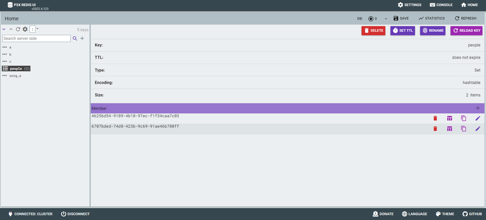
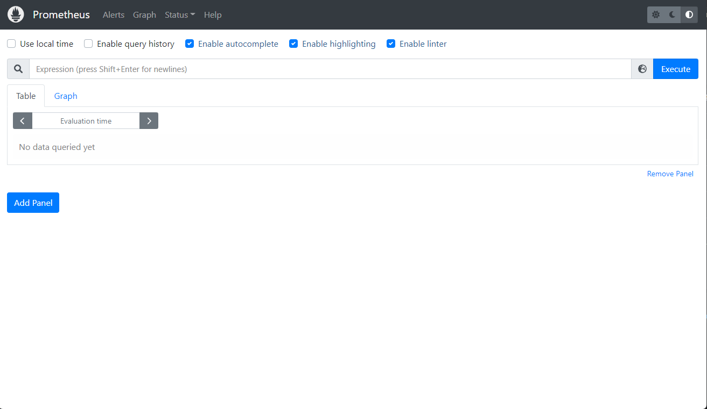

# < Bastion Server Setup >


# 1. K3S 구성(Single mode)


## 1) master node

```sh
# root 권한으로 수행
$ su

$ curl -sfL https://get.k3s.io | sh -s - --write-kubeconfig-mode 644

or

$ curl -sfL https://get.k3s.io | sh -

# 확인
$ kubectl version
WARNING: This version information is deprecated and will be replaced with the output from kubectl version --short.  Use --output=yaml|json to get the full version.
Client Version: version.Info{Major:"1", Minor:"26", GitVersion:"v1.26.5+k3s1", GitCommit:"7cefebeaac7dbdd0bfec131ea7a43a45cb125354", GitTreeState:"clean", BuildDate:"2023-05-27T00:05:40Z", GoVersion:"go1.19.9", Compiler:"gc", Platform:"linux/amd64"}
Kustomize Version: v4.5.7
Server Version: version.Info{Major:"1", Minor:"26", GitVersion:"v1.26.5+k3s1", GitCommit:"7cefebeaac7dbdd0bfec131ea7a43a45cb125354", GitTreeState:"clean", BuildDate:"2023-05-27T00:05:40Z", GoVersion:"go1.19.9", Compiler:"gc", Platform:"linux/amd64"}


# IP/ token 확인
$ cat /var/lib/rancher/k3s/server/node-token
K10f74ce1e1f309271e78114c63d51d5936249e3d379faf1c5c7b2269218f2f9220::server:459b5947077d6e612074e998ff769dd8


# 확인
$ kubectl get nodes -o wide
NAME        STATUS   ROLES                  AGE   VERSION        INTERNAL-IP   EXTERNAL-IP   OS-IMAGE             KERNEL-VERSION    CONTAINER-RUNTIME
bastion03   Ready    control-plane,master   47s   v1.26.5+k3s1   10.158.0.29   <none>        Ubuntu 22.04.2 LTS   5.19.0-1022-gcp   containerd://1.7.1-k3s1


```


## 2) kubeconfig 설정

일반 User가 직접 kubctl 명령 실행을 위해서는 kube config 정보(~/.kube/config) 가 필요하다.

k3s 를 설치하면 /etc/rancher/k3s/k3s.yaml 에 정보가 존재하므로 이를 복사한다. 또한 모든 사용자가 읽을 수 있도록 권한을 부여 한다.

```sh
## root 로 실행
$ su

$ ll /etc/rancher/k3s/k3s.yaml
-rw------- 1 root root 2961 May 14 03:23 /etc/rancher/k3s/k3s.yaml

# 모든 사용자에게 읽기권한 부여
$ chmod +r /etc/rancher/k3s/k3s.yaml

$ ll /etc/rancher/k3s/k3s.yaml
-rw-r--r-- 1 root root 2961 May 14 03:23 /etc/rancher/k3s/k3s.yaml

# 일반 user 로 전환
$ exit


## 사용자 권한으로 실행

$ mkdir -p ~/.kube

$ cp /etc/rancher/k3s/k3s.yaml ~/.kube/config

$ ll ~/.kube/config
-rw-r--r-- 1 song song 2957 May 14 03:44 /home/song/.kube/config

# 자신만 RW 권한 부여
$ chmod 600 ~/.kube/config

$ ls -ltr ~/.kube/config
-rw------- 1 ktdseduuser ktdseduuser 2957 May 13 14:35 /home/ktdseduuser/.kube/config


## 확인
$ kubectl version
Client Version: version.Info{Major:"1", Minor:"26", GitVersion:"v1.26.5+k3s1", GitCommit:"7cefebeaac7dbdd0bfec131ea7a43a45cb125354", GitTreeState:"clean", BuildDate:"2023-05-27T00:05:40Z", GoVersion:"go1.19.9", Compiler:"gc", Platform:"linux/amd64"}
Kustomize Version: v4.5.7
Server Version: version.Info{Major:"1", Minor:"26", GitVersion:"v1.26.5+k3s1", GitCommit:"7cefebeaac7dbdd0bfec131ea7a43a45cb125354", GitTreeState:"clean", BuildDate:"2023-05-27T00:05:40Z", GoVersion:"go1.19.9", Compiler:"gc", Platform:"linux/amd64"}

```

root 권한자가 아닌 다른 사용자도 사용하려면 위와 동일하게 수행해야한다.


## 3) Helm Install

### (1) helm client download

```sh
# 개인 PC WSL
# root 권한으로 수행
$ su


## 임시 디렉토리를 하나 만들자.
$ mkdir -p ~/temp/helm/
  cd ~/temp/helm/

# 다운로드
$ wget https://get.helm.sh/helm-v3.12.0-linux-amd64.tar.gz

# 압축해지
$ tar -zxvf helm-v3.12.0-linux-amd64.tar.gz

# 확인
$ ll linux-amd64/helm
-rwxr-xr-x 1 1001 docker 50597888 May 11 01:35 linux-amd64/helm*

# move
$ mv linux-amd64/helm /usr/local/bin/helm

# 확인
$ ll /usr/local/bin/helm*
-rwxr-xr-x 1 1001 docker 50597888 May 11 01:35 /usr/local/bin/helm*


# 일반유저로 복귀
$ exit


# 확인
$ helm version
version.BuildInfo{Version:"v3.12.0", GitCommit:"c9f554d75773799f72ceef38c51210f1842a1dea", GitTreeState:"clean", GoVersion:"go1.20.3"}


$ helm -n yjsong ls
NAME    NAMESPACE       REVISION        UPDATED STATUS  CHART   APP VERSION

```


### [참고] bitnami repo 추가

- 유명한 charts 들이모여있는 bitnami repo 를 추가해 보자.

```sh
# test# add stable repo
$ helm repo add bitnami https://charts.bitnami.com/bitnami

$ helm repo list

$ helm search repo bitnami
# bitnami 가 만든 다양한 오픈소스 샘플을 볼 수 있다.
NAME                                            CHART VERSION   APP VERSION     DESCRIPTION
bitnami/airflow                                 14.1.3          2.6.0           Apache Airflow is a tool to express and execute...
bitnami/apache                                  9.5.3           2.4.57          Apache HTTP Server is an open-source HTTP serve...
bitnami/appsmith                                0.3.2           1.9.19          Appsmith is an open source platform for buildin...
bitnami/argo-cd                                 4.7.2           2.6.7           Argo CD is a continuous delivery tool for Kuber...
bitnami/argo-workflows                          5.2.1           3.4.7           Argo Workflows is meant to orchestrate Kubernet...
bitnami/aspnet-core                             4.1.1           7.0.5           ASP.NET Core is an open-source framework for we...
bitnami/cassandra                               10.2.2          4.1.1           Apache Cassandra is an open source distributed ...
bitnami/consul                                  10.11.2         1.15.2          HashiCorp Consul is a tool for discovering and ...
...

$ kubectl create ns yjsong

# 설치테스트(샘플: nginx)
$ helm -n yjsong install nginx bitnami/nginx

$ kubectl -n yjsong get all
NAME                         READY   STATUS              RESTARTS   AGE
pod/nginx-68c669f78d-wgnp4   0/1     ContainerCreating   0          10s

NAME            TYPE           CLUSTER-IP    EXTERNAL-IP   PORT(S)        AGE
service/nginx   LoadBalancer   10.43.197.4   <pending>     80:32754/TCP   10s

NAME                    READY   UP-TO-DATE   AVAILABLE   AGE
deployment.apps/nginx   0/1     1            0           10s

NAME                               DESIRED   CURRENT   READY   AGE
replicaset.apps/nginx-68c669f78d   1         1         0       10s

# 간단하게 nginx 에 관련된 deployment / service / pod 들이 설치되었다.


# 설치 삭제
$ helm -n yjsong delete nginx

$ kubectl -n yjsong  get all
No resources found in yjsong namespace.
```


## 4) alias 정의

```sh
# user 권한으로

$ cat > ~/env
alias k='kubectl'
alias kk='kubectl -n kube-system'
alias ky='kubectl -n yjsong'
alias ki='kubectl -n istio-system'
alias kb='kubectl -n bookinfo'
alias kii='kubectl -n istio-ingress'
alias kubectl -n kafka='kubectl -n kafka'
alias krs='kubectl -n redis-system'

## alias 를 적용하려면 source 명령 수행
$ source ~/env

# booting 시 자동인식하게 하려면 아래 파일 수정
$ vi ~/.bashrc
...
source ~/env


```


## 5) K9S Setup

kubernetes Cluster를 관리하기 위한 kubernetes cli tool 을 설치해 보자.

```sh
# root 권한으로

$ mkdir ~/temp/k9s
  cd  ~/temp/k9s

$ wget https://github.com/derailed/k9s/releases/download/v0.27.4/k9s_Linux_amd64.tar.gz
$ tar -xzvf k9s_Linux_amd64.tar.gz

$ ll
-rw-r--r-- 1  501 staff    10174 Mar 22  2021 LICENSE
-rw-r--r-- 1  501 staff    35702 May  7 16:54 README.md
-rwxr-xr-x 1  501 staff 60559360 May  7 17:01 k9s*
-rw-r--r-- 1 root root  18660178 May  7 17:03 k9s_Linux_amd64.tar.gz

$ cp ./k9s /usr/local/bin/

$ ll /usr/local/bin/
-rwxr-xr-x  1 root root 60559360 May 15 13:05 k9s*


# 일반 사용자로 전환
$ exit 

# 실행
$ k9s

```


## 6) Clean up

### (1) node 제거

#### Cordon

현재 노드에 배포된 Pod은 그대로 유지하면서, 추가적인 Pod의 배포를 제한하는 명령어

```
$ kubectl uncordon <node-name>

$ kubectl cordon <node-name>
```

`kubectl drain` 혹은 `kubectl cordon` 명령어를 적용한 노드는 `SechedulingDisabled` 상태가 되어 더 이상 Pod이 scheduling되지 않는다.`kubectl uncordon`은 노드의 이러한 `SchedulingDisabled` 상태를 제거하여 노드에 Pod이 정상적으로 스케쥴링 될 수 있도록 복구하는 명령어이다.


#### Drain

노드에 존재하는 모든 Pod을 제거하여 노드를 비우고, Pod들을 다른 노드에 새롭게 스케쥴링하는 명령어
drain 과정에 cordon이 포함되어 있다고 볼 수 있다.

```sh
$ kubectl get nodes
NAME                   STATUS   ROLES                       AGE    VERSION
ktds-k3s-master-stpc   Ready    control-plane,etcd,master   4h4m   v1.26.4+k3s1
ktds-k3s-master-vlhj   Ready    control-plane,etcd,master   4h2m   v1.26.4+k3s1
ktds-k3s-master-wwfs   Ready    control-plane,etcd,master   4h2m   v1.26.4+k3s1
ktds-k3s-worker-9zmq   Ready    <none>                      171m   v1.26.4+k3s1
ktds-k3s-worker-b47j   Ready    <none>                      171m   v1.26.4+k3s1
ktds-k3s-worker-ncz7   Ready    <none>                      171m   v1.26.4+k3s1
ktds-k3s-worker-w2z4   Ready    <none>                      171m   v1.26.4+k3s1
ktds-k3s-worker-xmpb   Ready    <none>                      171m   v1.26.4+k3s1


$ kubectl drain ktds-k3s-worker-9zmq --ignore-daemonsets 
  kubectl drain ktds-k3s-worker-b47j --ignore-daemonsets 
  kubectl drain ktds-k3s-worker-ncz7 --ignore-daemonsets 
  kubectl drain ktds-k3s-worker-w2z4 --ignore-daemonsets 
  kubectl drain ktds-k3s-worker-xmpb --ignore-daemonsets 


$ kubectl get nodes
NAME                STATUS                     ROLES                       AGE     VERSION
ktds-k3s-master01   Ready                      control-plane,etcd,master   64m     v1.26.4+k3s1
ktds-k3s-master02   Ready                      control-plane,etcd,master   17m     v1.26.4+k3s1
ktds-k3s-master03   Ready                      control-plane,etcd,master   9m37s   v1.26.4+k3s1
ktds-k3s-worker01   Ready,SchedulingDisabled   control-plane,etcd,master   7m51s   v1.26.4+k3s1
ktds-k3s-worker02   Ready,SchedulingDisabled   control-plane,etcd,master   7m37s   v1.26.4+k3s1


```


#### Node Delete

```sh
# drain 작업 이후
$ kubectl delete node ktds-k3s-worker-9zmq
 kubectl delete node ktds-k3s-worker-b47j
 kubectl delete node ktds-k3s-worker-ncz7
 kubectl delete node ktds-k3s-worker-w2z4
 kubectl delete node ktds-k3s-worker-xmpb

```


### (2) k3s uninstall

```sh
## uninstall
$ sh /usr/local/bin/k3s-killall.sh
  sh /usr/local/bin/k3s-uninstall.sh
  
```


# 2. 기타 Tool Setup


## 1) apt install 

```sh
# root 로

$ apt update

$ apt install vim


$ apt install tree


$ apt install iputils-ping

$ apt install net-tools


$ apt install netcat


$ apt install unzip


$ apt install git
 


$ apt install podman
$ podman version
Version:      3.4.2
API Version:  3.4.2
Go Version:   go1.15.2
Built:        Thu Jan  1 09:00:00 1970
OS/Arch:      linux/amd64


```


# < Redis Setup >

Redis 및 Redis Cluster / P3X Redis UI tool  을 Setup 한다.


# 1. Redis Cluster Install

kubernetes 기반에서 Redis 를 설치해보자.

참조link : https://github.com/bitnami/charts/tree/master/bitnami/redis-cluster


## 1) namespace 생성

```sh
$ kubectl create ns redis-cluster

```


## 2) helm chart download


### (1) Repo add

redis-cluster chart 를 가지고 있는 bitnami repogistory 를  helm repo 에 추가한다.

```sh
$ helm repo add bitnami https://charts.bitnami.com/bitnami
$ helm repo list
NAME    URL
bitnami https://charts.bitnami.com/bitnami
```


### (2) Helm Search

추가된 bitnami repo에서 redis-cluster 를 찾는다.

```sh
$ helm repo update


$ helm search repo redis

# 2022-06-26
NAME                                            CHART VERSION   APP VERSION     DESCRIPTION
bitnami/redis-cluster                           8.6.1           6.2.7

# 2023-09-03
NAME                                            CHART VERSION   APP VERSION     DESCRIPTION
bitnami/redis                                   17.11.2         7.0.11          Redis(R) is an open source, advanced key-value ...
bitnami/redis-cluster                           8.6.1           7.0.11          Redis(R) is an open source, scalable, distribut...


# 2024.03.03
bitnami/redis                                   18.17.0         7.2.4           Redis(R) is an open source, advanced key-value ...
bitnami/redis-cluster                           9.7.0           7.2.4           Redis(R) is an open source, scalable, distribut...


```

우리가 사용할 redis-cluster 버젼은 chart version 8.6.1( app version: 7.0.11) 이다.


### (3) Helm Fetch

helm chart 를 fetch 받는다.

```sh
# chart 를 저장할 적당한 위치로 이동
$ cd ~/temp/helm/charts

$ helm fetch bitnami/redis-cluster

$ ll
-rw-r--r-- 1 ktdseduuser ktdseduuser 105291 Jun 11 09:56 redis-cluster-8.6.2.tgz


$ tar -xzvf redis-cluster-8.6.1.tgz
...

$ cd redis-cluster

$ ls -ltr
-rw-r--r-- 1 ktdseduuser ktdseduuser   333 May 17 09:27 .helmignore
-rw-r--r-- 1 ktdseduuser ktdseduuser   225 May 17 09:27 Chart.lock
-rw-r--r-- 1 ktdseduuser ktdseduuser   747 May 17 09:27 Chart.yaml
-rw-r--r-- 1 ktdseduuser ktdseduuser 75295 May 17 09:27 README.md
drwxrwxr-x 3 ktdseduuser ktdseduuser  4096 Jun  4 15:32 charts/
drwxrwxr-x 2 ktdseduuser ktdseduuser  4096 Jun  4 15:32 img/
drwxrwxr-x 2 ktdseduuser ktdseduuser  4096 Jun  4 15:32 templates/
-rw-r--r-- 1 ktdseduuser ktdseduuser 42469 May 17 09:27 values.yaml

```


## 3) Install

> without pv


### (1) helm install

```sh
$ cd  ~/temp/helm/charts/redis-cluster

## dry-run 으로 실행
$ helm -n redis-cluster install ds-redis . \
    --set password=new1234 \
    --set persistence.enabled=false \
    --set metrics.enabled=true \
    --set cluster.nodes=6 \
    --set cluster.replicas=1 \
    --debug --dry-run=true > dry-run_1.yaml

## 실행
$ helm -n redis-cluster install ds-redis . \
    --set password=new1234 \
    --set persistence.enabled=false \
    --set metrics.enabled=true \
    --set cluster.nodes=6 \
    --set cluster.replicas=1 
    
    
    # node port 접속시 - redis cluster  에서는 의미 없다.
    --set service.type=NodePort \
    --set service.nodePorts.redis=32300 \


##
NAME: ds-redis
LAST DEPLOYED: Sat Mar  9 09:59:19 2024
NAMESPACE: redis-cluster
STATUS: deployed
REVISION: 1
TEST SUITE: None
NOTES:
CHART NAME: redis-cluster
CHART VERSION: 9.7.0
APP VERSION: 7.2.4** Please be patient while the chart is being deployed **


To get your password run:
    export REDIS_PASSWORD=$(kubectl get secret --namespace "redis-cluster" ds-redis-redis-cluster -o jsonpath="{.data.redis-password}" | base64 -d)

You have deployed a Redis&reg; Cluster accessible only from within you Kubernetes Cluster.INFO: The Job to create the cluster will be created.To connect to your Redis&reg; cluster:

1. Run a Redis&reg; pod that you can use as a client:
kubectl run --namespace redis-cluster ds-redis-redis-cluster-client --rm --tty -i --restart='Never' \
 --env REDIS_PASSWORD=$REDIS_PASSWORD \
--image docker.io/bitnami/redis-cluster:6.2.7-debian-11-r3 -- bash

2. Connect using the Redis&reg; CLI:

redis-cli -c -h ds-redis-redis-cluster -a $REDIS_PASSWORD


## 확인
$ helm -n redis-cluster ls
NAME            NAMESPACE       REVISION        UPDATED                                 STATUS          CHART                   APP VERSION
ds-redis      redis-cluster    1               2022-06-26 05:45:14.961024747 +0000 UTC deployed        redis-cluster-7.6.3     6.2.7     

NAME            NAMESPACE       REVISION        UPDATED                                 STATUS          CHART                   APP VERSION
ds-redis        redis-cluster   1               2024-03-09 09:59:19.55085239 +0000 UTC  deployed        redis-cluster-9.7.0     7.2.4


$ helm -n redis-cluster status ds-redis
NAME: ds-redis
LAST DEPLOYED: Sun Jun 26 05:45:14 2022
NAMESPACE: redis-cluster
STATUS: deployed
REVISION: 1
TEST SUITE: None
NOTES:
CHART NAME: redis-cluster
CHART VERSION: 7.6.3
APP VERSION: 6.2.7** Please be patient while the chart is being deployed **


To get your password run:
    export REDIS_PASSWORD=$(kubectl get secret --namespace "redis-cluster" ds-redis-redis-cluster -o jsonpath="{.data.redis-password}" | base64 -d)

You have deployed a Redis&reg; Cluster accessible only from within you Kubernetes Cluster.INFO: The Job to create the cluster will be created.To connect to your Redis&reg; cluster:

1. Run a Redis&reg; pod that you can use as a client:
kubectl run --namespace redis-cluster ds-redis-redis-cluster-client --rm --tty -i --restart='Never' \
 --env REDIS_PASSWORD=$REDIS_PASSWORD \
--image docker.io/bitnami/redis-cluster:6.2.7-debian-11-r3 -- bash

2. Connect using the Redis&reg; CLI:

redis-cli -c -h ds-redis-redis-cluster -a $REDIS_PASSWORD

```


### (2) pod/svc 확인

```sh

$ kubectl -n redis-cluster get svc
NAME                              TYPE        CLUSTER-IP     EXTERNAL-IP   PORT(S)              AGE
ds-redis-redis-cluster            ClusterIP   10.43.88.176   <none>        6379/TCP             52s
ds-redis-redis-cluster-headless   ClusterIP   None           <none>        6379/TCP,16379/TCP   52s
ds-redis-redis-cluster-metrics    ClusterIP   10.43.99.194   <none>        9121/TCP             52s


## redis cluster 를 구성하고 있는 pod 를 조회
$ kubectl -n redis-cluster get pod -o wide
NAME                       READY   STATUS    RESTARTS   AGE   IP           NODE          NOMINATED NODE   READINESS GATES
ds-redis-redis-cluster-0   2/2     Running   0          71s   10.42.2.39   master03.c1   <none>           <none>
ds-redis-redis-cluster-1   2/2     Running   0          71s   10.42.1.56   master02.c1   <none>           <none>
ds-redis-redis-cluster-2   2/2     Running   0          71s   10.42.0.49   master01.c1   <none>           <none>
ds-redis-redis-cluster-3   2/2     Running   0          71s   10.42.1.57   master02.c1   <none>           <none>
ds-redis-redis-cluster-4   2/2     Running   0          71s   10.42.0.50   master01.c1   <none>           <none>
ds-redis-redis-cluster-5   2/2     Running   0          71s   10.42.2.40   master03.c1   <none>           <none>


```


### [참고] emptyDir 설정

> Helm chart 버젼이 올라가면서 더이상 신경쓸 필요없다.  emptyDir 이 자동 셋팅된다. - 2023.06.05

chart 의 기본은 pv/pvc 를 참조하도록 설정되어 있다.

아직 pv/pvc 가 준비되어 있지 않다면 emptydir 로 설정한후 install 을 시도해야 한다.  그렇지 않으면 pvc 를 찾지못해 오류 발생한다.

아래 chart 의  파일을 찾아서 일부 내용을 변경해야 한다.

```sh
$ cd ~/temp/helm/charts/redis-cluster/templates

$ ll
-rw-r--r-- 1 root root 90053 Jun 10 16:31 configmap.yaml
-rw-r--r-- 1 root root   117 Jun 10 16:31 extra-list.yaml
-rw-r--r-- 1 root root   903 Jun 10 16:31 headless-svc.yaml
-rw-r--r-- 1 root root  8774 Jun 10 16:31 _helpers.tpl
-rw-r--r-- 1 root root  2599 Jun 10 16:31 metrics-prometheus.yaml
-rw-r--r-- 1 root root  1520 Jun 10 16:31 metrics-svc.yaml
-rw-r--r-- 1 root root  2424 Jun 10 16:31 networkpolicy.yaml
-rw-r--r-- 1 root root  6195 Jun 10 16:31 NOTES.txt
-rw-r--r-- 1 root root   921 Jun 10 16:31 poddisruptionbudget.yaml
-rw-r--r-- 1 root root  1223 Jun 10 16:31 prometheusrule.yaml
-rw-r--r-- 1 root root  1508 Jun 10 16:31 psp.yaml
-rw-r--r-- 1 root root   833 Jun 10 16:31 redis-rolebinding.yaml
-rw-r--r-- 1 root root  1082 Jun 10 16:31 redis-role.yaml
-rw-r--r-- 1 root root   954 Jun 10 16:31 redis-serviceaccount.yaml
-rw-r--r-- 1 root root 22299 Jun 10 16:31 redis-statefulset.yaml          <--- 변경파일
-rw-r--r-- 1 root root  2568 Jun 10 16:31 redis-svc.yaml
-rw-r--r-- 1 root root  3279 Jun 10 16:31 scripts-configmap.yaml
-rw-r--r-- 1 root root   699 Jun 10 16:31 secret.yaml
-rw-r--r-- 1 root root  2055 Jun 10 16:31 svc-cluster-external-access.yaml
-rw-r--r-- 1 root root  1511 Jun 10 16:31 tls-secret.yaml
-rw-r--r-- 1 root root 16247 Jun 10 16:31 update-cluster.yaml

```


- 변경내용 정리

해당 파일 내의 volumeClaimTemplates 부분을 삭제하고 volumes 에 아래와 같이 emptyDir 내용을 추가해야 한다.

        - name: redis-data
          emptyDir: {}


- 변경전

```yaml
      volumes:
        - name: scripts
          configMap:
            name: {{ include "common.names.fullname" . }}-scripts
            defaultMode: 0755
        {{- if .Values.usePasswordFile }}
        - name: redis-password
          secret:
            secretName: {{ include "redis-cluster.secretName" . }}
            items:
              - key: {{ include "redis-cluster.secretPasswordKey" . }}
                path: redis-password
        {{- end }}
        - name: default-config
          configMap:
            name: {{ include "common.names.fullname" . }}-default
        {{- if .Values.sysctlImage.mountHostSys }}
        - name: host-sys
          hostPath:
            path: /sys
        {{- end }}
        - name: redis-tmp-conf
          emptyDir: {}
        {{- if .Values.redis.extraVolumes }}
        {{- include "common.tplvalues.render" ( dict "value" .Values.redis.extraVolumes "context" $ ) | nindent 8 }}
        {{- end }}
        {{- if .Values.tls.enabled }}
        - name: redis-certificates
          secret:
            secretName: {{ include "redis-cluster.tlsSecretName" . }}
            defaultMode: 256
        {{- end }}
  volumeClaimTemplates:
    - metadata:
        name: redis-data
        labels: {{- include "common.labels.matchLabels" . | nindent 10 }}
        {{- if .Values.persistence.annotations }}
        annotations: {{- include "common.tplvalues.render" (dict "value" .Values.persistence.annotations "context" $) | nindent 10 }}
        {{- end }}
      spec:
        accessModes:
        {{- range .Values.persistence.accessModes }}
          - {{ . | quote }}
        {{- end }}
        resources:
          requests:
            storage: {{ .Values.persistence.size | quote }}
        {{- include "common.storage.class" (dict "persistence" .Values.persistence "global" .Values.global) | nindent 8 }}
        {{- if or .Values.persistence.matchLabels .Values.persistence.matchExpressions }}
        selector:
        {{- if .Values.persistence.matchLabels }}
          matchLabels:
          {{- toYaml .Values.persistence.matchLabels | nindent 12 }}
        {{- end -}}
        {{- if .Values.persistence.matchExpressions }}
          matchExpressions:
          {{- toYaml .Values.persistence.matchExpressions | nindent 12 }}
        {{- end -}}
        {{- end }}
{{- end }}

```


- 변경후

```yaml
      volumes:
        - name: scripts
          configMap:
            name: {{ include "common.names.fullname" . }}-scripts
            defaultMode: 0755
        {{- if .Values.usePasswordFile }}
        - name: redis-password
          secret:
            secretName: {{ include "redis-cluster.secretName" . }}
            items:
              - key: {{ include "redis-cluster.secretPasswordKey" . }}
                path: redis-password
        {{- end }}
        - name: default-config
          configMap:
            name: {{ include "common.names.fullname" . }}-default
        {{- if .Values.sysctlImage.mountHostSys }}
        - name: host-sys
          hostPath:
            path: /sys
        {{- end }}
        - name: redis-tmp-conf
          emptyDir: {}
        {{- if .Values.redis.extraVolumes }}
        {{- include "common.tplvalues.render" ( dict "value" .Values.redis.extraVolumes "context" $ ) | nindent 8 }}
        {{- end }}
        {{- if .Values.tls.enabled }}
        - name: redis-certificates
          secret:
            secretName: {{ include "redis-cluster.tlsSecretName" . }}
            defaultMode: 256
        {{- end }}
        - name: redis-data                     <--- 이부분 으로 대체
          emptyDir: {}
{{- end }}
```


### (3) metric 확인

```sh
# curltest pod 생성
$ kubectl -n redis-cluster run curltest --image=curlimages/curl -- sleep 365d


# metric
# metric 이 유효한지 확인 ( metric=true 일때만 )
$ kubectl -n redis-cluster exec -it curltest -- curl ds-redis-redis-cluster-metrics:9121/metrics


# ds-redis-redis-cluster 가 유효한 서비스인지 확인
$ kubectl -n  redis-cluster exec -it curltest -- nc -zv ds-redis-redis-cluster.redis-cluster.svc 6379
ds-redis-redis-cluster.redis-cluster.svc (10.43.88.176:6379) open

```


## 4) Internal Access

redis client를 cluster 내부에서 실행후 접근하는 방법을 알아보자.

### (1) Redis client 실행

먼저 아래와 같이 동일한 Namespace 에 redis-client 를 실행한다.

```sh
## redis-client 용도로 deployment 를 실행한다.
$ kubectl -n redis-cluster create deploy redis-client --image=docker.io/redis:7.2 -- sleep 365d

deployment.apps/redis-client created


## redis client pod 확인
$ kubectl -n redis-cluster get pod
NAME                           READY   STATUS    RESTARTS   AGE
redis-client-9f57dc6d6-zd65p   1/1     Running   0          7s
...


# 약 20초 정도 소요됨

## redis-client pod 내부로 접근한다.
$ kubectl -n redis-cluster exec -it deploy/redis-client -- bash
root@redis-client-9f57dc6d6-zd65p:/data#                # <-- 이런 Prompt가 나오면 정상


```


### (2) Redis-cluster 상태 확인

```sh
## redis-client pod 내부에서...

## service 명으로 cluster mode 접근
$ redis-cli -h ds-redis-redis-cluster -c -a new1234

## cluster node 를 확인
$ ds-redis-redis-cluster:6379> cluster nodes
1957e0cfd35b1641cad26d28b7380a686d20204b 10.42.0.49:6379@16379 master - 0 1709978610000 3 connected 10923-16383
974e5d3bd77a8c91597f4a9d7b90e05c5a5b99fd 10.42.2.39:6379@16379 master - 0 1709978612982 1 connected 0-5460
34c1f9552b063f1df8ab4e44cff5aba5b5aae5b4 10.42.0.50:6379@16379 slave 974e5d3bd77a8c91597f4a9d7b90e05c5a5b99fd 0 1709978611978 1 connected
fa0c6fc1b6d6a84dbded04db9ed4cb3e0be9921f 10.42.1.56:6379@16379 master - 0 1709978613985 2 connected 5461-10922
f342199bd817701d7ebe8e38807c99a2c078c7bb 10.42.1.57:6379@16379 myself,slave 1957e0cfd35b1641cad26d28b7380a686d20204b 0 1709978610000 3 connected
4f14a68348133569c541a166ddcad039a67b6ab3 10.42.2.40:6379@16379 slave fa0c6fc1b6d6a84dbded04db9ed4cb3e0be9921f 0 1709978611000 2 connected

## master 3개, slave가 3개 사용하는 모습을 볼 수가 있다.


## cluster info 확인
ds-redis-redis-cluster:6379> cluster info
cluster_state:ok
cluster_slots_assigned:16384
cluster_slots_ok:16384
cluster_slots_pfail:0
cluster_slots_fail:0
cluster_known_nodes:6
cluster_size:3
cluster_current_epoch:6
cluster_my_epoch:2
cluster_stats_messages_ping_sent:541
cluster_stats_messages_pong_sent:556
cluster_stats_messages_meet_sent:1
cluster_stats_messages_sent:1098
cluster_stats_messages_ping_received:556
cluster_stats_messages_pong_received:542
cluster_stats_messages_received:1098
total_cluster_links_buffer_limit_exceeded:0
## cluster state 가 OK 인 것을 확인할 수 있다.

```


### (3) set / get 확인

```sh
# Redis cli 에서...


## set 명령 수행
ds-redis-redis-cluster:6379> set a 1
-> Redirected to slot [15495] located at 10.42.1.13:6379
sOK
(0.59s)
10.42.1.13:6379> set b 2
-> Redirected to slot [3300] located at 10.42.3.16:6379
OK
10.42.3.16:6379> set c 3
-> Redirected to slot [7365] located at 10.42.4.8:6379
OK
10.42.4.8:6379> set d 4
-> Redirected to slot [11298] located at 10.42.1.13:6379
OK
10.42.1.13:6379> set e 5
OK
## Set 명령수행시 master node 를 변경하면서 set 하는 모습을 확인할 수 있다.


# get 명령 수행
10.42.1.13:6379> get a
"1"
10.42.1.13:6379> get b
-> Redirected to slot [3300] located at 10.42.3.16:6379
"2"
10.42.3.16:6379> get c
-> Redirected to slot [7365] located at 10.42.4.8:6379
"3"
10.42.4.8:6379> get d
-> Redirected to slot [11298] located at 10.42.1.13:6379
"4"
10.42.1.13:6379> get e
"5"
10.42.1.13:6379> get d
"4"
## get 명령을 실행하면 해당 데이터가 존재하는 master pod 로 redirectred 되는 것을 확인할 수 있다.


# 테스트 완료후 
# Ctrl+C ,  Ctrl+D 명령으로 Exit 하자.
```

#### 결론

- External (Cluster 외부) 에서 access 하기 위해서 node port 를 이용해야 함

- 하지만 Redis Cluster 의 경우 접근해야 할 Node 가 두개 이상이며 데이터가 저장된 위치를 찾아 redirect 됨

- 이때 redirect 가 정확히 이루어지려면 Client 가 인식가능한 Node 주소를 알아야 함

- 하지만 Redis Cluster 는 원격지 Client 가 인식가능한 Node 들의 DNS 제공을 지원하지 않음

- 결국 Redis Cluster 는 PRD환경과 같이 Kubernetes Cluster 내에서는 사용가능하지만 

- 개발자 PC에서 연결이 필요한 DEV환경에서 적절치 않음


## 5) External Access(redis-cluster-proxy)

redis-cluster-proxy 를 이용하여 외부 접근을 가능하도록 하고 있다.

redis cluster를  외부에서 접근할 수 있는 방법을 알아보자.

사용해보니 아직까지 불안전 하다.


### (1) redis-cluster-proxy 

* 참조링크

  * 링크1 : https://github.com/RedisLabs/redis-cluster-proxy

  * 링크2: https://yoonbh2714.blogspot.com/2021/01/k8s-redis-cluster.html


```sh
$ mkdir -p ~/temp/redis
  cd ~/temp/redis

$ cat > 11.redis-cluster-proxy.yaml
apiVersion: apps/v1
kind: Deployment
metadata:
  labels:
    app: redis-cluster-proxy
  name: redis-cluster-proxy
spec:
  replicas: 1
  selector:
    matchLabels:
      app: redis-cluster-proxy
  template:
    metadata:
      labels:
        app: redis-cluster-proxy
    spec:
      containers:
        - name: redis-cluster-proxy
          image: ysoftman/redis_cluster_proxy:latest
          imagePullPolicy: Always
          command: ["/bin/sh"]
          args: ["-c",  "/redis-cluster-proxy/src/redis-cluster-proxy --auth new1234 ds-redis-redis-cluster-0.ds-redis-redis-cluster-headless.redis-cluster.svc:6379 ds-redis-redis-cluster-1.ds-redis-redis-cluster-headless.redis-cluster.svc:6379 ds-redis-redis-cluster-2.ds-redis-redis-cluster-headless.redis-cluster.svc:6379 ds-redis-redis-cluster-3.ds-redis-redis-cluster-headless.redis-cluster.svc:6379 ds-redis-redis-cluster-4.ds-redis-redis-cluster-headless.redis-cluster.svc:6379 ds-redis-redis-cluster-5.ds-redis-redis-cluster-headless.redis-cluster.svc:6379"]

---
apiVersion: v1
kind: Service
metadata:
  name: redis-cluster-proxy
  labels:
    app: redis-cluster-proxy
spec:
  # type: ClusterIP
  type: NodePort
  ports:
    - port: 7777
      targetPort: 7777
      nodePort: 32400 # The range of valid ports is 30000-32767
      name: redis-cluster-proxy
  selector:
    app: redis-cluster-proxy
---


# k8s service(+pod) 반영
$ kubectl -n redis-cluster apply -f 11.redis-cluster-proxy.yaml


# 삭제시...
$ kubectl -n redis-cluster delete -f 11.redis-cluster-proxy.yaml


```


### (2) GCP LB 확인

#### LB 셋팅

설명 생략


#### 방화벽 셋팅

설명 생략

* 확인

```sh
$ nc -zv 172.31.14.177 32400
Connection to 172.31.14.177 32400 port [tcp/*] succeeded!


```


### (3) Redis client 확인

#### docker redis client

local pc 에서 access 테스트를 위해 docker redis client 를 설치하자.

```sh
## redis-client 용도로 docker client 를 실행한다.
$ docker run --name redis-client -d --rm --user root docker.io/redis:7.2 sleep 365d


## docker 확인
$ docker ps -a


## docker 내에 진입후
$ docker exec -it redis-client bash

## Local PC IP로 cluster mode 접근
$ redis-cli -h 172.31.14.177 -a new1234 -c -p 32400

```


### (4) set/get 확인

```
172.31.14.177:32400> get a
"1"
172.31.14.177:32400>  get b
"2"
172.31.14.177:32400> get c
"3"
172.31.14.177:32400> get a
"1"
172.31.14.177:32400> get b
"2"
172.31.14.177:32400> get c
"3"
172.31.14.177:32400> get d
(nil)
172.31.14.177:32400>
172.31.14.177:32400> get a
"1"
172.31.14.177:32400> get b
"2"
172.31.14.177:32400> get c
"3"
172.31.14.177:32400>
172.31.14.177:32400> set d 4
OK
172.31.14.177:32400> get d
"4"


```


* 결론

  * redis-cluster-proxy 를 이용하니 local 에서 접속이 가능하다.

  * 하지만 proxy pod 가 core dump 를 남기면서 죽는 현상이 빈번하게 발생한다.

  * 아직 좀 불안하다.

  * info , cluster 명령들이 입력되지 않는다.

    * ```sh
      172.31.14.177:32400> cluster info
      ERR unsupported command `cluster`
      
      172.31.14.177:32400> cluster nodes
      ERR unsupported command `cluster`
      
      172.31.14.177:32400> info
      ERR unsupported command `info`
      
      
      ```

    * 


## 6 Helm Update


node 추가와 같은 helm 기반 update 가 필요할때는 아래와 같은 방식으로 update 를 수행한다.

```sh
## update sample 1
$ helm3 upgrade --timeout 600s ds-redis \
    --set "password=${REDIS_PASSWORD},cluster.nodes=7,cluster.update.addNodes=true,cluster.update.currentNumberOfNodes=6" bitnami/redis-cluster

## update sample 2
$ helm upgrade <release> \
  --set "password=${REDIS_PASSWORD}
  --set cluster.externalAccess.enabled=true
  --set cluster.externalAccess.service.type=LoadBalancer
  --set cluster.externalAccess.service.loadBalancerIP[0]=<loadBalancerip-0>
  --set cluster.externalAccess.service.loadBalancerIP[1]=<loadbalanacerip-1>
  --set cluster.externalAccess.service.loadBalancerIP[2]=<loadbalancerip-2>
  --set cluster.externalAccess.service.loadBalancerIP[3]=<loadbalancerip-3>
  --set cluster.externalAccess.service.loadBalancerIP[4]=<loadbalancerip-4>
  --set cluster.externalAccess.service.loadBalancerIP[5]=<loadbalancerip-5>
  --set cluster.externalAccess.service.loadBalancerIP[6]=
  --set cluster.nodes=7
  --set cluster.init=false bitnami/redis-cluster

---

$ cd  ~/temp/helm/charts/redis-cluster

## 실행
$ helm -n redis-cluster upgrade ds-redis . \
    --set password=new1234 \
    
    --set service.type.redis=NodePort \
    --set service.nodePorts.redis=32300 \
    
    --set persistence.enabled=false \
    --set metrics.enabled=true \
    --set cluster.nodes=6 \
    --set cluster.replicas=1 
    

```


## 7) Clean Up

helm chart 로 설치된 모든 리소스가 한꺼번에 삭제된다.

```sh
# 1) helm 삭제
# helm delete 명령을 이용하면 helm chart 로 설치된 모든 리소스가 한꺼번에 삭제된다.
$ helm -n redis-cluster delete ds-redis
$ helm -n redis-cluster ls


# 2) helm chart 삭제
$ rm -rf ~/temp/helm/charts/redis-cluster/
  rm -rf ~/temp/helm/charts/redis-cluster-8.6.2.tgz


## 3) redis-client 삭제
$ kubectl -n redis-cluster delete deploy/redis-client
  kubectl -n redis-cluster get all

## 4) redis-cluster-proxy
$ cd ~/temp/redis
$ kubectl -n redis-cluster delete -f 11.redis-cluster-proxy.yaml


```


# 2. Redis Install

External (Cluster 외부) 에서 access 하기 위해서 node port 를 이용해야 한다.

하지만 Redis Cluster 의 경우 접근해야 할 Master Node 가 두개 이상이며 해당 데이터가 저장된 위치를 찾아 redirect 된다.

이때 redirect 가 정확히 이루어지려면 Client 가 인식가능한 Node 주소를 알아야 한다.

하지만 Redis Cluster 는 원격지 Client 가 인식가능한 Node 들의 DNS를 지원하지 않는다.

결국 Redis Cluster 는 PRD환경과 같이 Kubernetes Cluster 내에서는 사용가능하지만 

개발자 PC에서 연결이 필요한 DEV환경에서는 적절치 않다.

그러므로 redis-cluster 가 아닌 redis 로 설치 하여 테스트를 진행한다.


## 1) namespace 생성

```sh
$ kubectl create ns redis-mr

```


## 2) helm chart download


### (1)  Helm Search

추가된 bitnami repo에서 redis-cluster 를 찾는다.

```sh
$ helm repo update

$ helm search repo redis
# 2023-09-03
NAME                                            CHART VERSION   APP VERSION     DESCRIPTION
bitnami/redis                                   18.0.1          7.2.0           Redis(R) is an open source, advanced key-value ...
bitnami/redis-cluster                           9.0.1           7.2.0           Redis(R) is an open source, scalable, distribut...
prometheus-community/prometheus-redis-exporter  5.5.0           v1.44.0         Prometheus exporter for Redis metrics

# 2024.03.03
NAME                                            CHART VERSION   APP VERSION     DESCRIPTION
bitnami/redis                                   18.17.0         7.2.4           Redis(R) is an open source, advanced key-value ...
bitnami/redis-cluster                           9.7.0           7.2.4           Redis(R) is an open source, scalable, distribut...


```

bitnami/redis


### (2) helm show values


```sh
$ cd ~/temp/helm/charts

# helm show values [CHART] [flags]

$ helm show values bitnami/redis > bitnami-redis-values.yaml

$ vi bitnami-redis-values.yaml


```


## 3) Redis(Master Replica) Install


### (1) helm install

```sh

# helm install
# master 1, slave 2 실행

# dry-run
$ helm -n redis-mr install ds-redis bitnami/redis \
    --set global.redis.password=new1234 \
    --set image.registry=docker.io \
    --set master.persistence.enabled=false \
    --set master.service.type=NodePort \
    --set master.service.nodePorts.redis=32300 \
    --set replica.replicaCount=2 \
    --set replica.persistence.enabled=false \
    --set replica.service.type=NodePort \
    --set replica.service.nodePorts.redis=32310 \
    --set metrics.enabled=true \
    --dry-run=true


# 실제 설치
$ helm -n redis-mr install ds-redis bitnami/redis \
    --set global.redis.password=new1234 \
    --set image.registry=docker.io \
    --set master.persistence.enabled=false \
    --set master.service.type=NodePort \
    --set master.service.nodePorts.redis=32300 \
    --set replica.replicaCount=2 \
    --set replica.persistence.enabled=false \
    --set replica.service.type=NodePort \
    --set replica.service.nodePorts.redis=32310 \
    --set metrics.enabled=true


NOTES:
CHART NAME: redis
CHART VERSION: 18.17.0
APP VERSION: 7.2.4

** Please be patient while the chart is being deployed **

Redis&reg; can be accessed on the following DNS names from within your cluster:

    ds-redis-master.redis-mr.svc.cluster.local for read/write operations (port 6379)
    ds-redis-replicas.redis-mr.svc.cluster.local for read-only operations (port 6379)


# 확인
$ helm -n redis-mr ls
NAME            NAMESPACE       REVISION        UPDATED                                 STATUS          CHART           APP VERSION
ds-redis      redis-cluster    1               2023-09-03 04:56:27.211798741 +0000 UTC deployed        redis-18.0.1    7.2.0


NAME            NAMESPACE       REVISION        UPDATED                                 STATUS          CHART           APP VERSION
ds-redis      redis-cluster    1               2024-03-03 09:59:31.663193423 +0000 UTC deployed        redis-18.17.0   7.2.4


NAME            NAMESPACE       REVISION        UPDATED                                 STATUS  CHART           APP VERSION
ds-redis        redis-mr        1               2024-03-08 15:45:21.295237546 +0000 UTC failed  redis-18.17.0   7.2.4


```


#### [참고] remote설치가 안될때는 fetch 받아서 수행

설치 과정에서 chart 를 다운 받지 못한다면 Chart 를 fetch 받아서 설치하자.

```sh
# chart 를 저장할 적당한 위치로 이동
$ mkdir -p ~/helm/charts

$ cd ~/helm/charts

$ helm fetch bitnami/redis

$ ll
-rw-r--r-- 1 song song 88772 Jul  3 16:46 redis-16.13.1.tgz

$ tar -xzvf redis-16.13.1.tgz
...

$ cd redis

$ ls -ltr
-rw-r--r-- 1 song song    333 Jun 30 18:13 .helmignore
-rw-r--r-- 1 song song    220 Jun 30 18:13 Chart.lock
-rw-r--r-- 1 song song    773 Jun 30 18:13 Chart.yaml
-rw-r--r-- 1 song song 100896 Jun 30 18:13 README.md
drwxr-xr-x 3 song song   4096 Jul  3 16:46 charts/
drwxr-xr-x 2 song song   4096 Jul  3 16:46 img/
drwxr-xr-x 5 song song   4096 Jul  3 16:46 templates/
-rw-r--r-- 1 song song   4483 Jun 30 18:13 values.schema.json
-rw-r--r-- 1 song song  68559 Jun 30 18:13 values.yaml


$ cd ~/helm/charts/redis

# helm install
$ helm -n redis-mr install ds-redis . \
    --set global.redis.password=new1234 \
    --set image.registry=docker.io \
    --set master.persistence.enabled=false \
    --set master.service.type=NodePort \
    --set master.service.nodePorts.redis=32300 \
    --set replica.replicaCount=2 \
    --set replica.persistence.enabled=false \
    --set replica.service.type=NodePort \
    --set replica.service.nodePorts.redis=32310

##
ds-redis-master .redis-mr.svc.cluster.local for read/write operations (port 6379)
ds-redis-replicas.redis-mr.svc.cluster.local for read-only operations (port 6379)

```


### (2) pod / svc 확인

```sh
$ alias krm='kubectl -n redis-mr'


$ krm get svc

NAME                TYPE        CLUSTER-IP      EXTERNAL-IP   PORT(S)          AGE
ds-redis-headless   ClusterIP   None            <none>        6379/TCP         41s
ds-redis-master     NodePort    10.43.128.193   <none>        6379:32300/TCP   41s
ds-redis-metrics    ClusterIP   10.43.223.137   <none>        9121/TCP         41s
ds-redis-replicas   NodePort    10.43.235.20    <none>        6379:32310/TCP   41s


$ krm get pod
NAME                  READY   STATUS    RESTARTS   AGE
ds-redis-master-0     2/2     Running   0          53s
ds-redis-replicas-0   2/2     Running   0          53s
ds-redis-replicas-1   2/2     Running   0          27s


```

* ds-redis-master 는 read/write 용도로 사용되며 ds-redis-replicas 는 read-only 용도로 사용된다.
* ds-redis-master.redis-mr.svc.cluster.local for read/write operations (port 6379)
  ds-redis-replicas.redis-mr.svc.cluster.local for read-only operations (port 6379)


### (3) metric 확인

```sh

# curltest pod 생성
$ kubectl -n redis-mr run curltest --image=curlimages/curl -- sleep 365d

$ kubectl -n redis-mr exec -it curltest -- sh


# metric
# metric 이 유효한지 확인 ( metric=true 일때만 )
$ kubectl -n redis-mr exec -it curltest -- curl ds-redis-metrics.redis-mr.svc:9121/metrics


# ds-redis-master 가 유효한 서비스인지 확인
$ kubectl -n  redis-mr exec -it curltest -- nc -zv ds-redis-master.redis-mr.svc 6379
ds-redis-master.redis-mr.svc (10.43.131.84:6379) open


```


## 4) Internal Access

redis client를 cluster 내부에서 실행후 접근해 보자.


### (1) Redis client 실행

먼저 아래와 같이 동일한 Namespace 에 redis-client 를 실행한다.

```sh
## redis-client 용도로 deployment 를 실행한다.
$ kubectl -n redis-mr create deploy redis-client --image=docker.io/redis:7.2 -- sleep 365d
deployment.apps/redis-client created


## redis client pod 확인
$ kubectl -n redis-mr get pod
NAME                           READY   STATUS    RESTARTS   AGE
redis-client-9f57dc6d6-5qt8c   1/1     Running   0          13s


## redis-client pod 내부로 접근한다.
$ kubectl -n redis-mr exec -it deploy/redis-client -- bash
root@redis-client-9f57dc6d6-5qt8c:/data#
# <-- 이런 Prompt 가 나오면 정상

```


### (2) Redis Info

```sh
## redis-client pod 내부에서...

$ redis-cli -h ds-redis-master -a new1234

# redis info 
$ ds-redis-master:6379> info

# Server
redis_version:7.2.4
redis_git_sha1:00000000
redis_git_dirty:0
redis_build_id:d7e3021cf535cf9d
redis_mode:standalone
os:Linux 6.5.0-1014-aws x86_64
arch_bits:64
monotonic_clock:POSIX clock_gettime
multiplexing_api:epoll
atomicvar_api:c11-builtin
gcc_version:12.2.0
process_id:1
process_supervised:no
run_id:d76f2e782be499c37f717037950131abd2680e6e
tcp_port:6379
server_time_usec:1709460424322619
uptime_in_seconds:443
uptime_in_days:0
hz:10
configured_hz:10
lru_clock:14961608
executable:/redis-server
config_file:
io_threads_active:0
listener0:name=tcp,bind=*,bind=-::*,port=6379


$ ds-redis-master:6379> Ctrl+D
```


### (3) set / get 확인

```sh
## redis-client pod 내부에서
$ redis-cli -h ds-redis-master -a new1234

## set 명령 수행
ds-redis-master:6379> set a 1
OK
ds-redis-master:6379> set b 2
OK
ds-redis-master:6379> set c 3
OK
ds-redis-master:6379> set d 4
OK
ds-redis-master:6379> set e 5
OK


# get 명령 수행
ds-redis-master:6379> get a
"1"
ds-redis-master:6379> get b
"2"
ds-redis-master:6379> get c
"3"
ds-redis-master:6379> get d
"4"
ds-redis-master:6379> get e
"5"

# keys 조회
$ keys *
1) "e"
2) "c"
3) "f"
4) "aa"
5) "d"
6) "g"
7) "b"
8) "a"

# del 
$ del aa

```


## 5) External Access

redis client를 cluster 외부에서 실행후 접근하는 방법을 알아보자.


### (1) Cloud LB 확인

#### LB 셋팅

#### 방화벽 셋팅

* 확인

```sh
$ nc -zv 43.203.62.69 32300
$ nc -zv 43.203.62.69 32310

43.203.62.69


```


### (2) Redis client 확인

#### docker redis client

local pc 에서 access 테스트를 위해 docker redis client 를 설치하자.

```sh
## redis-client 용도로 docker client 를 실행한다.
$ docker run --name redis-client -d --rm --user root docker.io/redis:7.2 sleep 365d

## docker 내에 진입후
$ docker exec -it redis-client bash

## Local PC IP로 cluster mode 접근
$ redis-cli -h 43.203.62.69 -a new1234 -p 32300


$ info
# Server
redis_version:7.2.0
redis_git_sha1:00000000
redis_git_dirty:0
redis_build_id:2134749ca3475304
...

# Replication
role:master
connected_slaves:3
slave0:ip=ds-redis-replicas-0.ds-redis-redis-headless.redis-mr.svc.cluster.local,port=6379,state=online,offset=462,lag=0
slave1:ip=ds-redis-replicas-1.ds-redis-redis-headless.redis-mr.svc.cluster.local,port=6379,state=online,offset=462,lag=0
slave2:ip=ds-redis-replicas-2.ds-redis-redis-headless.redis-mr.svc.cluster.local,port=6379,state=online,offset=462,lag=1
master_failover_state:no-failover
master_replid:393262d3966ad8201923ecddc1707b96783b71c8
master_replid2:0000000000000000000000000000000000000000
master_repl_offset:462
second_repl_offset:-1
repl_backlog_active:1
repl_backlog_size:1048576
repl_backlog_first_byte_offset:1
repl_backlog_histlen:462

...
```


### (3) set/get 확인

```
43.203.62.69:32300> get a
"1"
43.203.62.69:32300> get b
"2"
43.203.62.69:32300> get c
"3"
43.203.62.69:32300> get d
"4"
43.203.62.69:32300> get e
"5"
43.203.62.69:32300> get f
(nil)
43.203.62.69:32300> set f 6
OK
43.203.62.69:32300> get f
"6"

```


## 6) Clean Up

```sh
# 삭제시
$ helm -n redis-mr delete ds-redis

# 확인
$ helm -n redis-mr ls


# Container 삭제
$ docker rm -rf redis-client

```


# 3. Web UI


## 1) P3X Redis UI

참고링크 : https://github.com/patrikx3/redis-ui/blob/master/k8s/manifests/service.yaml

Redis DB 관리를 위한  편리한 데이터베이스 GUI app이며  WEB  UI 와 Desktop App 에서 작동한다.

P3X Web UI 를 kubernetes 에 설치해 보자.


### (1) p3x install(deploy 방식)

아래 yaml  manifest file을 활용하여 configmap, deployment, service, ingress 를 실행한다.

#### configmap(connection 정보) 설정

```sh
$ mkdir -p ~/temp/redis/redisui/p3x
  cd ~/temp/redis/redisui/p3x

$ cat > 11.p3xredisui-cm.yaml
apiVersion: v1
kind: ConfigMap
metadata:
  name: p3x-redis-ui-settings
data:
  .p3xrs-conns.json: |
    {
      "list": [
        {
          "name": "ds-redis-cluster",
          "host": "ds-redis-redis-cluster.redis-cluster.svc",
          "port": 6379,
          "password": "new1234",
          "cluster": true,
          "nodes": [],
          "id": "unique1"
        },
        {
          "name": "ds-redis-mr",
          "host": "ds-redis-master.redis-mr.svc",
          "port": 6379,
          "password": "new1234",
          "id": "unique2"
        }
      ],
      "license": ""
    }
---

# 설치
$ kubectl -n redis-mon apply -f 11.p3xredisui-cm.yaml

# 확인
$ kubectl -n redis-mon get cm


# 삭제시
$ kubectl -n redis-mon delete -f 11.p3xredisui-cm.yaml


```


#### deploy/svc/ingress 생성

```sh
$ cd ~/temp/redis/redisui/p3x

$ cat > 12.p3xredisui-deploy-svc.yaml
apiVersion: apps/v1
kind: Deployment
metadata:
  name: p3x-redis-ui
spec:
  replicas: 1
  selector:
    matchLabels:
      app.kubernetes.io/name: p3x-redis-ui
  template:
    metadata:
      labels:
        app.kubernetes.io/name: p3x-redis-ui
    spec:
      containers:
      - name: p3x-redis-ui
        image: patrikx3/p3x-redis-ui
        ports:
        - name: p3x-redis-ui
          containerPort: 7843
        volumeMounts:
        - name: p3x-redis-ui-settings
          mountPath: /settings/.p3xrs-conns.json
          subPath: .p3xrs-conns.json
      volumes:
      - name: p3x-redis-ui-settings
        configMap:
          defaultMode: 420
          name: p3x-redis-ui-settings
---
apiVersion: v1
kind: Service
metadata:
  name: p3x-redis-ui-service
  labels:
    app.kubernetes.io/name: p3x-redis-ui-service
spec:
  ports:
  - port: 7843
    targetPort: p3x-redis-ui
    name: p3x-redis-ui
  selector:
    app.kubernetes.io/name: p3x-redis-ui
---
apiVersion: networking.k8s.io/v1
kind: Ingress
metadata:
  name: p3x-redis-ui-ingress
  annotations:
    # kubernetes.io/ingress.class: nginx
    # kubernetes.io/ingress.class: traefik
    # cert-manager support
    # cert-manager.io/cluster-issuer: letsencrypt
    # oauth2-proxy support
    # nginx.ingress.kubernetes.io/auth-url: "https://$host/oauth2/auth"
    # nginx.ingress.kubernetes.io/auth-signin: "https://$host/oauth2/start?rd=$escaped_request_uri"
spec:
  ingressClassName: traefik
  # tls:
  # - hosts: [p3x-redis-ui.example.com]
  #   secretName: p3x-redis-ui-tls
  rules:
  - host: p3x.redis-mon.43.203.62.69.nip.io
    http:
      paths:
      - backend:
          service:
            name: p3x-redis-ui-service
            port:
              number: 7843
        path: /
        pathType: Prefix
---

# install
$ kubectl -n redis-mon apply -f 12.p3xredisui-deploy-svc.yaml

# 확인
$ kubectl -n redis-mon get all


# 삭제시
$ kubectl -n redis-mon delete -f 12.p3xredisui-deploy-svc.yaml


```


#### [참고] connection 정보 추가 및 수정

configmap 을 수정하여 재기동 한다.

```sh
$ cat > 11.p3xredisui-cm.yaml
apiVersion: v1
kind: ConfigMap
metadata:
  name: p3x-redis-ui-settings
data:
  .p3xrs-conns.json: |
    {
      "list": [
        {
          "name": "ds-redis",
          "host": "ds-redis-master",
          "port": 6379,
          "password": "new1234",
          "id": "unique"
        },
        {
          "name": "ds-redis2",
          "host": "ds-redis-master",
          "port": 6379,
          "password": "new1234",
          "id": "unique"
        }
      ],
      "license": ""
    }
---

```


#### [참고] p3x-redis-ui reconnect 현상

```sh
# 
## 아래 메세지와 함께서 30초에 한번씩 reconnect 되는 오류가 있는듯... 

[P3XRS] [PID: 000009]  socket.p3xrs.connectionId unique
[P3XRS] [PID: 000009]  shared disconnectRedisIo try
[P3XRS] [PID: 000009]  shared disconnectRedisIo executed
[P3XRS] [PID: 000009]  socket.io disconnected %s G4NtFObUeq7ABR0YAAeu
[P3XRS] [PID: 000009]  socket.io connected KKi0opa2RuUBbFQyAAew
[P3XRS] [PID: 000009]  shared disconnectRedisIo try
[P3XRS] [PID: 000009]  socket.io connection-connect added new socket.id KKi0opa2RuUBbFQyAAew to unique name with ds-redis-master
[P3XRS] [PID: 000009]  socket.io connection-connect unique ds-redis-master connected
[P3XRS] [PID: 000009]  ds-redis-master instance successfully works the database listing
[P3XRS] [PID: 000009]  ds-redis-master databases got 16
[P3XRS] [PID: 000009]  ds-redis-master instance command listing is available


```

아마도 gcp L4 셋팅이 잘 못된것 같다.


#### [참고] p3x-redis-ui image version

```sh
# v2024.4.133
# patrikx3/p3x-redis-ui:2023.4.102
# patrikx3/p3x-redis-ui:2022.10.111
# patrikx3/p3x-redis-ui:2022.4.126
# patrikx3/p3x-redis-ui:2022.4.116
# patrikx3/p3x-redis-ui:
# patrikx3/p3x-redis-ui:

```


### [참고] p3x install(helm 방식)

> helm chart install 방식은 아직 불완전 하다. - 2023.09.03

```sh
$ helm repo add gin https://fallenangelblog.github.io/charts/

$ helm repo ls
NAME                    URL
bitnami                 https://charts.bitnami.com/bitnami
hashicorp               https://helm.releases.hashicorp.com
prometheus-community    https://prometheus-community.github.io/helm-charts
gin                     https://fallenangelblog.github.io/charts/


$ helm repo update 


$ helm search repo gin/redis-ui
NAME            CHART VERSION   APP VERSION     DESCRIPTION
gin/redis-ui    0.0.1           lastet          redis-ui


$ helm show values gin/redis-ui
...


$ cd ~/temp/helm/charts

$ helm fetch gin/redis-ui

$ ll
...
-rw-r--r-- 1 ktdseduuser ktdseduuser   3055 Jun  6 14:13 redis-ui-0.0.1.tgz

$ tar -xzvf redis-ui-0.0.1.tgz

$ cd redis-ui/

# dry-run
$ helm -n redis-mon install my-redis-ui gin/redis-ui \
    --set ingress.enabled=true \
    --set ingress.hosts=p3x.redis-mon.43.203.62.69.nip.io \
    --set ingress.loadbalancer=traefik \
    --set persistence.enabled=false \
    --set persistence.pvc= \
    --dry-run=true

# 실행
$ helm -n redis-mon install my-redis-ui gin/redis-ui \
    --set ingress.enabled=true \
    --set ingress.hosts=p3x.redis-mon.43.203.62.69.nip.io \
    --set ingress.loadbalancer=traefik \
    --set persistence.enabled=false \
    --set persistence.pvc=


NAME: my-redis-ui
LAST DEPLOYED: Tue Jun  6 14:28:07 2023
NAMESPACE: redis-mon
STATUS: deployed
REVISION: 1
TEST SUITE: None
NOTES:
************************ 部署成功 ***********************


$ helm -n redis-mon ls
NAME            NAMESPACE    REVISION        UPDATED                                 STATUS          CHART           APP VERSION
my-redis-ui     redis-mon    1               2023-06-06 14:28:07.88215691 +0000 UTC  deployed        redis-ui-0.0.1  lastet
ds-redis        redis-mon    1               2023-06-06 08:25:34.461713664 +0000 UTC deployed        redis-17.11.2   7.0.11


$ helm -n redis-mon delete my-redis-ui 


```


```sh

# helm chart 가 완전하지 않다.
# 아래 메세지 나오면서 실행되지 않는다.

no such file or directory, open '/settings/.p3xrs-conns.json'


# configmap 이 미완성인듯...


```


### (2) UI확인

* http://p3x.redis-mon.43.203.62.69.nip.io/




### (3) Clean Up

```sh
$ cd ~/temp/redis/redisui/p3x


$ kubectl -n redis-mon delete deployment p3x-redis-ui
  kubectl -n redis-mon delete Service p3x-redis-ui-service
  kubectl -n redis-mon delete Ingress p3x-redis-ui-ingress
  kubectl -n redis-mon delete cm p3x-redis-ui-settings


# 확인
$ kubectl -n redis-mon get all

# 확인
$ kubectl -n redis-mon get pod

# 삭제시
$ kubectl -n redis-mon delete -f 11.p3xredisui-cm.yaml


```


## 2) RedisInsight (Browser) - 작동하지 않음

[참고] 

* 설치링크1 : https://developer.redis.com/explore/redisinsight/usinghelm
* 설치링크2 : https://docs.redis.com/latest/ri/installing/install-k8s/
* 설치링크3 : https://redis.io/docs/connect/insight/


### (1) RedisInsight deploy


```sh
$ mkdir -p ~/temp/redisui/redisinsight
  cd ~/temp/redisui/redisinsight

$ cat > 11.redisinsight.yaml
# RedisInsight service with name 'redisinsight-service'
apiVersion: v1
kind: Service
metadata:
  name: redisinsight-service       # name should not be 'redisinsight'
                                   # since the service creates
                                   # environment variables that
                                   # conflicts with redisinsight
                                   # application's environment
                                   # variables `REDISINSIGHT_HOST` and
                                   # `REDISINSIGHT_PORT`
spec:
  type: ClusterIP   # LoadBalancer
  ports:
    - port: 80
      targetPort: 8001
  selector:
    app: redisinsight
---
# RedisInsight deployment with name 'redisinsight'
apiVersion: apps/v1
kind: Deployment
metadata:
  name: redisinsight #deployment name
  labels:
    app: redisinsight #deployment label
spec:
  replicas: 1 #a single replica pod
  selector:
    matchLabels:
      app: redisinsight #which pods is the deployment managing, as defined by the pod template
  template: #pod template
    metadata:
      labels:
        app: redisinsight #label for pod/s
    spec:
      containers:
      - name:  redisinsight #Container name (DNS_LABEL, unique)
        image: redislabs/redisinsight:latest #repo/image
        imagePullPolicy: IfNotPresent #Always pull image
        volumeMounts:
        - name: db #Pod volumes to mount into the container's filesystem. Cannot be updated.
          mountPath: /db
        ports:
        - containerPort: 8001 #exposed container port and protocol
          protocol: TCP
      volumes:
      - name: db
        emptyDir: {} # node-ephemeral volume https://kubernetes.io/docs/concepts/storage/volumes/#emptydir
---
apiVersion: networking.k8s.io/v1
kind: Ingress
metadata:
  annotations:
    kubernetes.io/ingress.class: traefik
  name: redisinsight-ingress
  labels:
    helm.sh/chart: redisinsight-chart-0.1.0
    app.kubernetes.io/name: redisinsight-chart
    app.kubernetes.io/instance: redisinsight
    app.kubernetes.io/managed-by: Helm
spec:
  ingressClassName: traefik
  rules:
  - host: redisinsight.redis-mon.43.203.62.69.nip.io
    http:
      paths:
      - backend:
          service:
            name: redisinsight-service
            port:
              number: 80
        path: /
        pathType: Prefix
---


# install
$ kubectl -n redis-mon apply -f ./11.redisinsight.yaml


# 확인
$ kubectl -n redis-mon get pod
NAME                                 READY   STATUS    RESTARTS   AGE
redisinsight-5f4c6477b-zbdc5         1/1     Running   0          3s
...


# 삭제시
$ kubectl -n redis-mon delete -f ./11.redisinsight.yaml


```


### (2) UI확인 

* 링크 : http://redisinsight.redis-mon.43.203.62.69.nip.io


### (3) [참고] helm install

```sh
$ cd ~/temp/helm/charts


$ wget https://docs.redis.com/latest/pkgs/redisinsight-chart-0.1.0.tgz
$ ll
-rw-rw-r-- 1 ubuntu ubuntu  3658 Feb 29 20:39 redisinsight-chart-0.1.0.tgz


$ tar -xzvf redisinsight-chart-0.1.0.tgz

$ cd ~/temp/helm/charts/redisinsight-chart/


# without ingress
$ helm -n redis-mon install redisinsight . \
    --set service.type=ClusterIP \
    --dry-run=true

NAME: redisinsight
LAST DEPLOYED: Tue Jun  6 02:54:17 2023
NAMESPACE: redis-mon
STATUS: deployed
REVISION: 1
NOTES:
1. Get the application URL by running these commands:
  export POD_NAME=$(kubectl get pods --namespace redis-mon -l "app.kubernetes.io/name=redisinsight-chart,app.kubernetes.io/instance=redisinsight" -o jsonpath="{.items[0].metadata.name}")
  echo "Visit http://127.0.0.1:8001 to use your application"
  kubectl --namespace redis-mon port-forward $POD_NAME 8001:8001


# [참고] with ingress

# template/ingress.yaml 을 좀 수정해야 한다.
# apiversion
# backend 등

$ helm -n redis-mon install redisinsight . \
    --set service.type=ClusterIP \
    --set ingress.enabled=true \
    --set ingress.hosts[0].host=redisinsight.redis-mon.43.203.62.69.nip.io \
    --set ingress.hosts[0].paths[0]=/ \
    --dry-run=true

NAME: redisinsight
LAST DEPLOYED: Sun Mar  3 13:28:45 2024
NAMESPACE: redis-mon
STATUS: deployed
REVISION: 1
NOTES:
1. Get the application URL by running these commands:
  http://redisinsight.redis-mon.43.203.62.69.nip.io/


$ helm -n redis-mon list

NAME            NAMESPACE       REVISION        UPDATED                                 STATUS          CHART                           APP VERSION
redisinsight    redis-mon    1               2023-06-06 02:54:17.804212167 +0000 UTC deployed        redisinsight-chart-0.1.0
..

NAME            NAMESPACE       REVISION        UPDATED                                 STATUS          CHART                           APP VERSION
ds-redis      redis-mon    1               2024-03-03 09:59:31.663193423 +0000 UTC deployed        redis-18.17.0                   7.2.4
redisinsight    redis-mon    1               2024-03-03 13:28:45.444522916 +0000 UTC deployed        redisinsight-chart-0.1.0


# 삭제시
$ helm -n redis-mon delete redisinsight


```

* 작동하지 않음


### (4) Clean Up

```sh

# yaml 삭제시
$ kubectl -n redis-mon delete Service redisinsight-service
  kubectl -n redis-mon delete Deployment redisinsight
  kubectl -n redis-mon delete Ingress redisinsight-ingress


# helm 삭제시
$ helm -n redis-mon delete redisinsight


# 확인
$ kubectl -n redis-mon get all
  

# 확인
$ helm -n redis-mon ls
```


## 3) [참고] curltest


```sh
# curltest pod 생성
$ kubectl -n redis-mon run curltest --image=curlimages/curl -- sleep 365d

$ kubectl -n redis-mon exec -it curltest -- sh


$ curl redisinsight-service.redis-mon.svc:80 -i

$ curl redisinsight.redis-mon.43.203.62.69.nip.io:80 -i


```


# 4. ACL

Redis 6.0 이상부터는 계정별 access 수준을 정의할 수 있다.  

이러한 ACL 기능을 이용해서 아래와 같은 계정을 관리 할 수 있다.

- 읽기전용 계정생성도 가능

- 특정 프리픽스로 시작하는 Key 만 access 가능하도록 하는 계정 생성


## 1) ACL 기본명령


```sh
# redis-client pod 내에서 수행
$ krs exec -it deploy/redis-client -- bash

$ redis-cli -h ds-redis-master -a new1234


# 계정 목록
ds-redis-master:6379> acl list
1) "user default on #65fd3b5c243ea857f91daef8e3d5c203fa045f33e034861998b9d74cc42ceb24 ~* &* +@all"


# 계정 추가
ds-redis-master:6379> acl setuser supersong on >new1234 allcommands allkeys
OK

ds-redis-master:6379> acl setuser tempsong on >new1234 allcommands allkeys
OK


ds-redis-master:6379> acl list
1) "user default on #65fd3b5c243ea857f91daef8e3d5c203fa045f33e034861998b9d74cc42ceb24 ~* &* +@all"
2) "user supersong on #65fd3b5c243ea857f91daef8e3d5c203fa045f33e034861998b9d74cc42ceb24 ~* resetchannels +@all"
3) "user tempsong on #65fd3b5c243ea857f91daef8e3d5c203fa045f33e034861998b9d74cc42ceb24 ~* resetchannels +@all"


# 계정 전환
ds-redis-master:6379> acl whoami
"default"
ds-redis-master:6379> auth supersong new1234
OK
ds-redis-master:6379> acl whoami
"supersong"
ds-redis-master:6379>  auth default new1234
OK


# 계정 삭제
ds-redis-master:6379> acl deluser tempsong
(integer) 1
ds-redis-master:6379>  acl list
1) "user default on #65fd3b5c243ea857f91daef8e3d5c203fa045f33e034861998b9d74cc42ceb24 ~* &* +@all"
2) "user supersong on #65fd3b5c243ea857f91daef8e3d5c203fa045f33e034861998b9d74cc42ceb24 ~* resetchannels +@all"


```


## 2) 읽기전용 계정 생성

- 읽기전용 계정 테스트

```sh
# 계정생성
ds-redis-master:6379> acl setuser readonlysong on >new1234 allcommands allkeys -set +get
OK
ds-redis-master:6379> acl list
1) "user default on #65fd3b5c243ea857f91daef8e3d5c203fa045f33e034861998b9d74cc42ceb24 ~* &* +@all"
2) "user readonlysong on #65fd3b5c243ea857f91daef8e3d5c203fa045f33e034861998b9d74cc42ceb24 ~* resetchannels +@all -set"
3) "user supersong on #65fd3b5c243ea857f91daef8e3d5c203fa045f33e034861998b9d74cc42ceb24 ~* resetchannels +@all"

# 계정 전환
ds-redis-master:6379> auth readonlysong new1234
OK
ds-redis-master:6379> acl whoami
"readonlysong"


# 읽기는 가능
ds-redis-master:6379> get a
"1"

# 쓰기는 불가능
ds-redis-master:6379> set a 1
(error) NOPERM this user has no permissions to run the 'set' command

```


## 3) 특정 key만 접근 허용

- song으로 로그인 하면 song으로 시작하는 key 만 get/set 가능하도록 설정

```sh
# song 으로 시작하는 key 만 접근가능하도록 설정


211.254.212.105:32200> acl setuser song on >new1234 allcommands allkeys
OK
211.254.212.105:32200> acl list
1) "user default on #65fd3b5c243ea857f91daef8e3d5c203fa045f33e034861998b9d74cc42ceb24 ~* &* +@all"
2) "user readonlysong on #65fd3b5c243ea857f91daef8e3d5c203fa045f33e034861998b9d74cc42ceb24 ~* &* +@all -set"
3) "user song on #65fd3b5c243ea857f91daef8e3d5c203fa045f33e034861998b9d74cc42ceb24 ~* &* +@all"
4) "user supersong on #65fd3b5c243ea857f91daef8e3d5c203fa045f33e034861998b9d74cc42ceb24 ~* &* +@all"


211.254.212.105:32200> acl setuser song resetkeys ~song*
OK


211.254.212.105:32200> acl list
1) "user default on #65fd3b5c243ea857f91daef8e3d5c203fa045f33e034861998b9d74cc42ceb24 ~* &* +@all"
2) "user readonlysong on #65fd3b5c243ea857f91daef8e3d5c203fa045f33e034861998b9d74cc42ceb24 ~* &* +@all -set"
3) "user song on #65fd3b5c243ea857f91daef8e3d5c203fa045f33e034861998b9d74cc42ceb24 ~song* &* +@all"
4) "user supersong on #65fd3b5c243ea857f91daef8e3d5c203fa045f33e034861998b9d74cc42ceb24 ~* &* +@all"


211.254.212.105:32200> auth song new1234
OK

211.254.212.105:32200> acl whoami
"song"


# set 명령 테스트
211.254.212.105:32200> set a 1
(error) NOPERM this user has no permissions to access one of the keys used as arguments

211.254.212.105:32200> set song_a 1
OK

# get 명령 테스트
211.254.212.105:32200> get a
(error) NOPERM this user has no permissions to access one of the keys used as arguments


211.254.212.105:32200> get song_a
"1"

```


# 5. Monitoring(Grafana)


모니터링이 필요할 경우 exporter 를 설치후 promtheus와 연동할 수 있다. 


## 1) metric

모니터링이 필요할 경우 아래와 같이 exporter 를 설치후 promtheus와 연동할 수 있다. 


- exporter 기능은 redis helm chart에서 제공.   

  - --set metrics.enabled= true

- prometheus / grafana 는 일반적인 내용과 동일함.

- grafana 에서는 dashboard(ID: 11835) 를 import 한다.

  


### (1) helm upgrade for exporter 

```sh
# helm 기존 셋팅에서 아래 내용으로 upgrade


$ helm -n redis-mon upgrade --install ds-redis bitnami/redis \
    --set ...
    --set metrics.enabled=true \

```


- exporter pod 생성 여부 확인

```sh
# 확인
$ kubectl -n kafka get pod
NAME                                          READY   STATUS              RESTARTS      AGE
...
my-cluster-kafka-exporter-79b8c986f8-wg259    0/1     ContainerCreating   0             0s
...


## my-cluster-kafka-exporter 가 추가된다.
# strimzi 가 인식하는 시간이 소요되므로 약 3분정도 후 반영된다.

```


### (2) exporter service 확인

```sh
$ kubectl -n redis-mon get svc

NAME                TYPE        CLUSTER-IP      EXTERNAL-IP   PORT(S)          AGE
ds-redis-metrics    ClusterIP   10.43.223.137   <none>        9121/TCP         12m
...
```


### (3) metric 확인

#### redis-mr

```sh
# curltest pod 생성
$ kubectl -n redis-mon run curltest --image=curlimages/curl -- sleep 365d

$ kubectl -n redis-mr exec -it curltest -- sh


# metric
# metric 이 유효한지 확인 ( metric=true 일때만 )
$ kubectl -n redis-mr exec -it curltest -- curl ds-redis-metrics.redis-mr.svc:9121/metrics
...
redis_tracking_clients 0
# HELP redis_tracking_total_items tracking_total_items metric
# TYPE redis_tracking_total_items gauge
redis_tracking_total_items 0
# HELP redis_tracking_total_keys tracking_total_keys metric
# TYPE redis_tracking_total_keys gauge
redis_tracking_total_keys 0
# HELP redis_tracking_total_prefixes tracking_total_prefixes metric
# TYPE redis_tracking_total_prefixes gauge
redis_tracking_total_prefixes 0
# HELP redis_unexpected_error_replies unexpected_error_replies metric
# TYPE redis_unexpected_error_replies counter
redis_unexpected_error_replies 0
# HELP redis_up Information about the Redis instance
# TYPE redis_up gauge
redis_up 1
# HELP redis_uptime_in_seconds uptime_in_seconds metric
# TYPE redis_uptime_in_seconds gauge
redis_uptime_in_seconds 829


```

- exporter pod 에서 metric 정상 수집 여부 확인


#### redis-cluster

```sh

ds-redis-redis-cluster-metrics.redis-cluster.svc:9121/metrics


```


## 2) prometheus(helm방식)


### (1) namespace 생성

```sh
$ kubectl create ns redis-mon

```


### [참고]권한부여

- openshift 에서 수행시 anyuid 권한이 필요하다.

```sh
# 권한부여시
oc adm policy add-scc-to-user    anyuid -z prometheus-server -n redis-mon

# 권한삭제시
oc adm policy remove-scc-from-user anyuid  -z prometheus-server -n redis-mon

```


### (2) helm deploy

```sh
# repo추가
$ helm repo add prometheus-community https://prometheus-community.github.io/helm-charts
$ helm repo list
$ helm repo update


# 설치전 기설치여부 확인
$ helm -n redis-mon list
NAME            NAMESPACE       REVISION        UPDATED                                 STATUS          CHART           APP VERSION
ds-redis        redis-mr        1               2024-03-08 15:55:37.870706803 +0000 UTC deployed        redis-18.17.0   7.2.4


$ helm search repo prometheus
...
prometheus-community/prometheus                         25.13.0         v2.49.1         Prometheus is a monitoring system and time seri...
...

# 2024.03.09
prometheus-community/prometheus                         25.16.0         v2.50.1         Prometheus is a monitoring system and time seri...


# Fetch
$ mkdir -p ~/temp/helm/charts/
  cd ~/temp/helm/charts/


$ helm fetch prometheus-community/prometheus

$ ll
-rw-r--r-- 1 ubuntu ubuntu 75161 Mar  9 10:43 prometheus-25.16.0.tgz


$ tar -zxvf prometheus-25.16.0.tgz

$ cd ~/temp/helm/charts/prometheus

# helm 실행 dry-run
$ helm -n redis-mon install prometheus . \
  --set configmapReload.prometheus.enabled=true \
  --set server.enabled=true \
  --set server.image.repository=quay.io/prometheus/prometheus \
  --set server.namespaces[0]=redis-mon \
  --set server.ingress.enabled=true \
  --set server.ingress.hosts[0]=prometheus.redis-mon.43.203.62.69.nip.io \
  --set server.persistentVolume.enabled=false \
  --set alertmanager.enabled=false \
  --set kube-state-metrics.enabled=false \
  --set prometheus-node-exporter.enabled=false \
  --set prometheus-pushgateway.enabled=false \
  --dry-run=true > dry-run.yaml


##

NAME: prometheus
LAST DEPLOYED: Sat Mar  9 10:44:58 2024
NAMESPACE: redis-mon
STATUS: deployed
REVISION: 1
TEST SUITE: None
NOTES:
The Prometheus server can be accessed via port 80 on the following DNS name from within your cluster:
prometheus-server.redis-mon.svc.cluster.local


# 확인
$ helm -n redis-mon list
NAME            NAMESPACE       REVISION        UPDATED                                 STATUS          CHART                   APP VERSION
ds-redis        redis-mon        1               2024-03-08 15:55:37.870706803 +0000 UTC deployed        redis-18.17.0           7.2.4
prometheus      redis-mon        1               2024-03-08 16:14:27.710019552 +0000 UTC deployed        prometheus-25.16.0      v2.50.1


NAME            NAMESPACE       REVISION        UPDATED                                 STATUS          CHART                   APP VERSION
prometheus      redis-mon       1               2024-03-09 10:29:21.214696704 +0000 UTC deployed        prometheus-25.16.0      v2.50.1


## 확인
$ helm -n redis-mon status prometheus
$ helm -n redis-mon get all prometheus

```


#### [Troble Shooting] CRB 추가 생성

- 권한 오류가 발생하여 확인하니 helm chart 에 의해서 당연히  설치되어야 할 권한이 생기지 않았다.
- helm chart 오류인듯 하다.
- 아래와 같이 수동으로 생성한다.

```sh
$ kubectl -n redis-mon apply -f - <<EOF
apiVersion: rbac.authorization.k8s.io/v1
kind: ClusterRoleBinding
metadata:
  labels:
    component: "server"
    app: prometheus
    release: prometheus
    heritage: Helm    
    helm.sh/chart: prometheus-25.16.0
  name: prometheus-server
subjects:
  - kind: ServiceAccount
    name: prometheus-server
    namespace: redis-mon
roleRef:
  apiGroup: rbac.authorization.k8s.io
  kind: ClusterRole
  name: prometheus-server
EOF


$ kubectl -n redis-mon get ClusterRoleBinding | grep prometheus
prometheus-server                                      ClusterRole/prometheus-server                                      5s

```


권한을 주지 않으면 prometheus pod 에서 아래와 같은오류 발생한다.

```
ts=2024-03-08T16:21:29.835Z caller=klog.go:108 level=warn component=k8s_client_runtime func=Warningf msg="pkg/mod/k8s.io/client-go@v0.28.6/tools/cache/reflector.go:229: failed to list *v1.Service: services is forbidden: User \"system:serviceaccount:redis-mon:prometheus-server\" cannot list resource \"services\" in API group \"\" at the cluster scope"                 │
ts=2024-03-08T16:21:29.835Z caller=klog.go:116 level=error component=k8s_client_runtime func=ErrorDepth msg="pkg/mod/k8s.io/client-go@v0.28.6/tools/cache/reflector.go:229: Failed to watch *v1.Service: failed to list *v1.Service: services is forbidden: User \"system:serviceaccount:redis-mon:prometheus-server\" cannot list resource \"services\" in API group \"\" at th │
ts=2024-03-08T16:21:34.145Z caller=klog.go:108 level=warn component=k8s_client_runtime func=Warningf msg="pkg/mod/k8s.io/client-go@v0.28.6/tools/cache/reflector.go:229: failed to list *v1.Service: services is forbidden: User \"system:serviceaccount:redis-mon:prometheus-server\" cannot list resource \"services\" in API group \"\" at the cluster scope"                 │
ts=2024-03-08T16:21:34.145Z caller=klog.go:116 level=error component=k8s_client_runtime func=ErrorDepth msg="pkg/mod/k8s.io/client-go@v0.28.6/tools/cache/reflector.go:229: Failed to watch *v1.Service: failed to list *v1.Service: services is forbidden: User \"system:serviceaccount:redis-mon:prometheus-server\" cannot list resource \"services\" in API group \"\" at th │
ts=2024-03-08T16:21:35.251Z caller=klog.go:108 level=warn component=k8s_client_runtime func=Warningf msg="pkg/mod/k8s.io/client-go@v0.28.6/tools/cache/reflector.go:229: failed to list *v1.Endpoints: endpoints is forbidden: User \"system:serviceaccount:redis-mon:prometheus-server\" cannot list resource \"endpoints\" in API group \"\" at the cluster scope"             │
ts=2024-03-08T16:21:35.251Z caller=klog.go:116 level=error component=k8s_client_runtime func=ErrorDepth msg="pkg/mod/k8s.io/client-go@v0.28.6/tools/cache/reflector.go:229: Failed to watch *v1.Endpoints: failed to list *v1.Endpoints: endpoints is forbidden: User \"system:serviceaccount:redis-mon:prometheus-server\" cannot list resource \"endpoints\" in API group 

```


### (3) prometheus 확인 

```sh
# pod 확인
$ kubectl -n redis-mon get pod 
NAME                                          READY   STATUS    RESTARTS      AGE
prometheus-server-5b5d787f8d-rb8zz            1/1     Running   0             4m36s
---
prometheus-server-6676478584-cdqlc            2/2     Running   0          87s


# pod log 확인
$ kubectl -n redis-mon logs -f deploy/prometheus-server


# svc 확인
$ kubectl -n redis-mon get svc
NAME                                  TYPE        CLUSTER-IP       EXTERNAL-IP   PORT(S)                               AGE
...
prometheus-server                     ClusterIP   10.43.124.104   <none>        80/TCP                                117s
---
prometheus-server                     ClusterIP   10.43.3.91      <none>        80/TCP                                         118s


# ClusterRoleBinding 확인
$ kubectl -n redis-mon get ClusterRoleBinding prometheus-server
NAME                ROLE                            AGE
prometheus-server   ClusterRole/prometheus-server   36s


$ kubectl -n redis-mon get ClusterRoleBinding | grep prometheus
prometheus                                             ClusterRole/prometheus                                             6d5h


```


### (4) ingress

````sh

````

- 확인
  - URL : http://prometheus.redis-mon.43.203.62.69.nip.io





#### [참고] Openshift Route

openshift 환경일때는 route 를 생성한다.

````sh
$ cd ~/githubrepo/ktds-edu-kafka

$ cat ./kafka/strimzi/monitoring/22.prometheus-route.yaml
---
kind: Route
apiVersion: route.openshift.io/v1
metadata:
  name: prometheus-route
  namespace: kafka-system
  labels:
    app: prometheus
    app.kubernetes.io/managed-by: Helm
    chart: prometheus-15.8.4
    component: server
    heritage: Helm
    release: prometheus
spec:
  host: prometheus.kafka.43.203.62.69.nip.io
  to:
    kind: Service
    name: prometheus-server
    weight: 100
  port:
    targetPort: http
    
$ kubectl -n kafka apply -f ./kafka/strimzi/monitoring/22.prometheus-route.yaml
````


### (5) configmap 정리

- 기존에 존재하는 모든 job_name 을 삭제하고
- kafka-exporter jobname 만 추가하자.

````sh
$ kubectl -n redis-mon edit configmap prometheus-server
---
kind: ConfigMap
apiVersion: v1
metadata:
  name: prometheus-server
  namespace: kafka
  ...
data:
  ...
  prometheus.yml: |
    global:
      evaluation_interval: 1m
      scrape_interval: 1m
      scrape_timeout: 10s
    rule_files:
    - /etc/config/recording_rules.yml
    - /etc/config/alerting_rules.yml
    - /etc/config/rules
    - /etc/config/alerts
    scrape_configs: 
    
    #### 아래 부분 추가 ####
    - job_name: redis-cluster-exporter
      metrics_path: /metrics
      scrape_interval: 10s
      scrape_timeout: 10s
      static_configs:
      - targets:
        - ds-redis-redis-cluster-metrics.redis-cluster.svc:9121
    - job_name: redis-mr-exporter
      metrics_path: /metrics
      scrape_interval: 10s
      scrape_timeout: 10s
      static_configs:
      - targets:
        - ds-redis-metrics.redis-mr.svc:9121
     ...
````

- 추가후 prometheus server 재기동

```sh
$ kubectl -n redis-mon get pod
NAME                                          READY   STATUS    RESTARTS      AGE
...
prometheus-server-5dc67b6855-cdm54            1/1     Running   0             24m
...


$ kubectl -n redis-mon delete pod prometheus-server-5dc67b6855-cdm54
pod "prometheus-server-5dc67b6855-cdm54" deleted


$ kubectl -n redis-mon get pod
NAME                                          READY   STATUS    RESTARTS      AGE
my-cluster-kafka-exporter-79b8c986f8-wg259    1/1     Running   1 (60m ago)   60m
prometheus-server-5dc67b6855-67xts            0/1     Running   0             9s

```


- target 확인 
  - URL : http://prometheus.redis-mon.43.203.62.69.nip.io
  - 메뉴 : status / target 에서 아래와 같이 kafka-exporter 가 추가된것을 확인한다.


- metric 확인
  - 메뉴 : Graph

```
redis_memory_used_bytes

```


```
sum(rate(redis_commands_total{cmd="info"}[1m])) by (cmd)

```


### (6) clean up

```sh
## helm 삭제시...
$ helm -n redis-mon delete prometheus 

$ helm -n redis-mon list


# crb 확인
$ kubectl get ClusterRoleBinding prometheus-server
NAME                ROLE                            AGE
prometheus-server   ClusterRole/prometheus-server   18h


# crb 삭제
$ kubectl delete ClusterRoleBinding prometheus-server
 
  
```


## 3) Grafana Install(helm)

### (1) helm install

```sh
$ helm repo add grafana https://grafana.github.io/helm-charts

$ helm repo update

$ helm search repo grafana
NAME                                            CHART VERSION   APP VERSION             DESCRIPTION
bitnami/grafana                                 9.13.0          10.3.3                  Grafana is an open source metric analytics and ...
grafana/grafana                                 7.3.3           10.3.3                  The leading tool for querying and visualizing t...


$ mkdir -p ~/temp/helm/charts/
  cd ~/temp/helm/charts/


# Fetch
$ helm fetch grafana/grafana

$ ll
-rw-r--r-- 1 ubuntu ubuntu 42406 Mar  8 16:35 grafana-7.3.3.tgz


$ tar -zxvf grafana-7.3.3.tgz

$ cd ~/temp/helm/charts/grafana


# helm 실행 dry-run
$ helm -n redis-mon install grafana . \
  --set ingress.enabled=true \
  --set ingress.hosts[0]=grafana.redis-mon.43.203.62.69.nip.io \
  --set persistence.enabled=false \
  --set adminUser=admin \
  --set adminPassword=adminpass \
  --dry-run=true > dry-run.yaml
  
  
  
  
  
# helm 실행


# 확인
$ helm -n redis-mon list
NAME            NAMESPACE       REVISION        UPDATED                                 STATUS          CHART                   APP VERSION
ds-redis        redis-mr        1               2024-03-08 15:55:37.870706803 +0000 UTC deployed        redis-18.17.0           7.2.4
grafana         redis-mr        1               2024-03-08 16:41:51.302136762 +0000 UTC deployed        grafana-7.3.3           10.3.3
prometheus      redis-mr        1               2024-03-08 16:14:27.710019552 +0000 UTC deployed        prometheus-25.16.0      v2.50.1

NAME            NAMESPACE       REVISION        UPDATED                                 STATUS          CHART                   APP VERSION
grafana         redis-mon       1               2024-03-09 11:01:25.827741189 +0000 UTC deployed        grafana-7.3.3           10.3.3
prometheus      redis-mon       1               2024-03-09 10:44:58.161555808 +0000 UTC deployed        prometheus-25.16.0      v2.50.1


$ kubectl -n redis-mon get pods
grafana-d9f889c9d-48fk7              1/1     Running   0          21s


```


### (2) clean up

```sh
$ helm -n redis-mon delete grafana


$ helm -n redis-mon list

```


## [참고] Grafana deploy

- deploy

```sh
$ cd ~/githubrepo/ktds-edu-kafka

$ cat ./kafka/strimzi/monitoring/31.grafana-deployment.yaml
---
apiVersion: apps/v1
kind: Deployment
metadata:
  name: grafana
  namespace: kafka
  labels:
    app: strimzi
spec:
  replicas: 1
  selector:
    matchLabels:
      name: grafana
  template:
    metadata:
      labels:
        name: grafana
    spec:
      containers:
      - name: grafana
        image: docker.io/grafana/grafana:10.2.4
        ports:
        - name: grafana
          containerPort: 3000
          protocol: TCP
        volumeMounts:
        - name: grafana-data
          mountPath: /var/lib/grafana
        - name: grafana-logs
          mountPath: /var/log/grafana
        readinessProbe:
          httpGet:
            path: /api/health
            port: 3000
          initialDelaySeconds: 5
          periodSeconds: 10
        livenessProbe:
          httpGet:
            path: /api/health
            port: 3000
          initialDelaySeconds: 15
          periodSeconds: 20
      volumes:
      - name: grafana-data
        emptyDir: {}
      - name: grafana-logs
        emptyDir: {}


$ kubectl -n kafka apply -f ./kafka/strimzi/monitoring/31.grafana-deployment.yaml
deployment.apps/grafana created

```


- service

```sh
$ cd ~/githubrepo/ktds-edu-kafka

$ cat ./kafka/strimzi/monitoring/32.grafana-svc.yaml
---
apiVersion: v1
kind: Service
metadata:
  name: grafana
  namespace: kafka
  labels:
    app: strimzi
spec:
  ports:
  - name: grafana
    port: 3000
    targetPort: 3000
    protocol: TCP
  selector:
    name: grafana
  type: ClusterIP


$ kubectl -n kafka apply -f ./kafka/strimzi/monitoring/32.grafana-svc.yaml
service/grafana created


```


- ingress

```sh
$ cat ./kafka/strimzi/monitoring/33.grafana-ingress.yaml
---
apiVersion: networking.k8s.io/v1
kind: Ingress
metadata:
  name: grafana-ingress
  #annotations:
  #  kubernetes.io/ingress.class: "traefik"
spec:
  ingressClassName: traefik
  rules:
  - host: "grafana.kafka.43.203.62.69.nip.io"
    http:
      paths:
      - path: /
        pathType: Prefix
        backend:
          service:
            name: grafana
            port:
              number: 3000


$ kubectl -n kafka apply -f ./kafka/strimzi/monitoring/33.grafana-ingress.yaml
ingress.networking.k8s.io/grafana-ingress created

```


- [참고] Openshift Route
  - openshift 환경에서만 사용

```yaml
$ cat ./kafka/strimzi/monitoring/34.grafana-route.yaml
---
kind: Route
apiVersion: route.openshift.io/v1
metadata:
  name: grafana-kafka-route
  namespace: kafka
  labels:
    app: strimzi
spec:
  host: grafana.kafka.43.203.62.69.nip.io
  to:
    kind: Service
    name: grafana
    weight: 100
  port:
    targetPort: grafana
  wildcardPolicy: None
$ kubectl -n kafka apply -f ./kafka/strimzi/monitoring/34.grafana-route.yaml
```


- 로그인

기본 Grafana 사용자 이름과 암호는 모두 admin 이다.


 


## 4) Grafana Prometheus

### (1) Grafana 접속

- URL : http://grafana.redis-mon.43.203.62.69.nip.io

- User : admin

- Pass :  adminpass


### (2) promehteus 연동

- 메뉴 : Data Sources / Promehteus 
- URL
  - http://prometheus-server:80


### (3) redis exporter dashboard import

- 메뉴: Dashboards / Manage
- import : 11835 입력
- 참고링크 : https://grafana.com/grafana/dashboards/11835-redis-dashboard-for-prometheus-redis-exporter-helm-stable-redis-ha/
- or
- strimzi 에서 제공하는 dashboard 
  - examples/metrics/grafana-dashboards


#### 확인

http://grafana.redis-mon.43.203.62.69.nip.io/d/xDLNRKUWz/6befa04a-320b-56a8-bbf9-33ea65a2ea36?orgId=1&refresh=30s&from=now-15m&to=now

- 메뉴 위치 : Dashboards > Manage > Redis Dashboard


## 5) Grafana redis DB전용

metric 을 prometheus 가 아닌 redis 에서 직접 읽도록 한다.

redis server 에 부하가 있을 수 있음으로 주의하자.


### (1) redis plugin 추가

* 메뉴 : Home > Connections > Add new connection
* redis plugin 추가


### (2) data sources 추가

#### redis-cluster

* 메뉴 : Home > Connections > Data sources

* name
  * redis-cluster
* Type
  * Cluster                                  <---- 여기가 중요
* address
  * redis://ds-redis-redis-cluster.redis-cluster.svc:6379
* password
  * new1234


#### redis-mr

* 메뉴 : Home > Connections > Data sources

* name
  * redis-master
* Type
  * Standalone                          <---- 여기가 중요
* address
  * redis://ds-redis-master.redis-mr.svc:6379
* password
  * new1234


### (2) Dashboard import

#### redis-cluster

* 메뉴: Home > Dashboards / Manage

- import : 12776 입력
- 참고링크 : https://grafana.com/grafana/dashboards/12776-redis/
- Name
  - Redis-cluster
- UID
  - Redis-cluster
- Redis src
  - redis-cluster

### 

#### redis-master

* 메뉴: Home > Dashboards / Manage

- import : 12776 입력

- 참고링크 : https://grafana.com/grafana/dashboards/12776-redis/

- Name

  - Redis-cluster

- Redis src

  - redis-cluster

  


## 6) Clean Up

```sh
## 1) Grafana 삭제
$ helm -n redis-mon delete grafana

## 2) Prometheus 삭제
$ helm -n redis-mon delete prometheus
$ kubectl -n redis-mon delete ClusterRoleBinding prometheus-server
  
  
  
## 3) 확인
$ helm -n redis-mon ls


```


