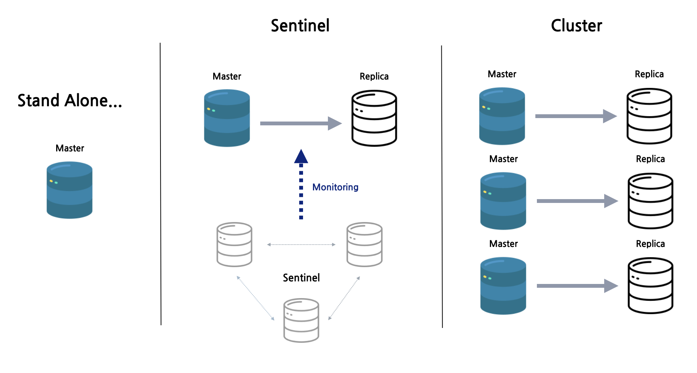
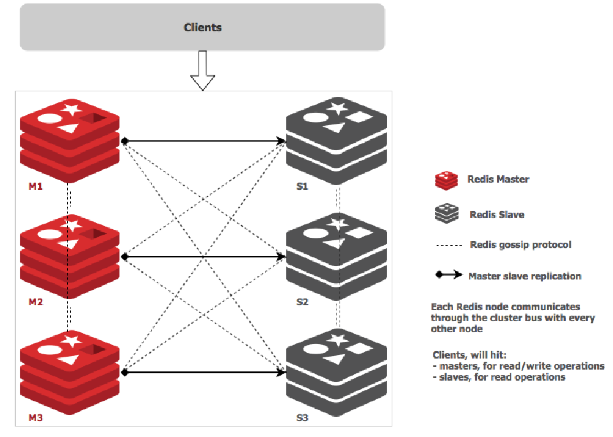

# Redis

# 1. Redis

## 1) Redis 개요

- [Redis](https://redis.io/) (REmote DIctionary Server의 약자)는 데이터베이스, 캐시 또는 메시지 브로커로 자주 사용되는 **오픈 소스 인메모리 DB** 

- list, map, set, and sorted set 과 같은 고급 데이터 유형을 저장하고 조작할 수 있음
- Redis는 다양한 형식의 키를 허용하고 서버에서 직접 수행되므로 클라이언트의 작업 부하를 줄일 수 있음 

- 기본적으로 DB 전체를 메모리에 보유하며 Disk 는 지속성을 위해서만 사용됨 

- Redis는 인기 있는 데이터 스토리지 솔루션이며 **GitHub, Pinterest, Snapchat, Twitter, StackOverflow, Flickr 등과 같은 거대 기술 기업에서 사용됨**

### (1) Redis를 사용하는 이유

- **아주 빠름.** ANSI C로 작성되었으며 Linux, Mac OS X 및 Solaris와 같은 POSIX 시스템에서 실행됨
- Redis는 종종 가장 인기 있는 키/값 데이터베이스 및 컨테이너와 함께 사용되는 **가장 인기 있는 NoSQL 데이터베이스로 선정**됨
- 캐싱 솔루션은 클라우드 데이터베이스 백엔드에 대한 호출 수를 줄임
- 클라이언트 API 라이브러리를 통해 애플리케이션에서 액세스할 수 있음
- Redis는 인기 있는 모든 프로그래밍 언어에서 지원됨
- **오픈 소스이며 안정적임**

### (2) 실제 세계에서 Redis 사용

- Twitter는 Redis 클러스터 내의 모든 사용자에 대한 타임라인을 저장함
- Pinterest는 데이터가 수백 개의 인스턴스에 걸쳐 샤딩되는 Redis Cluster에 사용자 팔로어 그래프를 저장함
- Github은 Redis를 대기열로 사용함

# 2. Redis vs Memcached

https://loosie.tistory.com/803#1._%EC%98%81%EC%86%8D%EC%84%B1_(Redis)

Amazon ElastiCache는 Redis 및 Memcached를 제공한다. Memcached와 Redis는 모두 캐시 시스템으로서 동일한 캐시 기능을 제공하지만 여러 차이점이 존재한다. 그 중 대표적으로 다음 4가지를 꼽아봤다. ([자세한 내용 참고](https://aws.amazon.com/ko/elasticache/redis-vs-memcached/)) 

 

## **1. 영속성 (Redis)**

Memcached의 경우 데이터가 메모리에만 저장되기 때문에 프로세스가 재기동되면 메모리상의 데이터는 모두 유실된다. 하지만 redis의 경우 기본적으로 disk persistence가 설정되어있기 때문에, 프로세스를 재시작 하더라도 셧다운 되기 전의 마지막 상태와 거의 동일한 (약간의 손실은 있을 수 있다) 상태로 돌려 놓을 수 있다.

 

## **2. 멀티 스레드 (Memcached) vs 싱글 스레드 (Redis)**

Memcached는 다중 스레드이므로 다중 처리 코어를 사용할 수 있다. 즉, 컴퓨팅 용량을 확장하여 더 많은 작업을 처리할 수 있다. Redis는 다중 처리가 어렵지만 싱글 스레드인데다가 자료구조 자체가 Atomic하기 때문에 Race Condition에서 유리하다.

 

## **3. Pub/Sub (Redis)**

Redis는 고성능 채팅방, 실시간 댓글 스트림, 소셜 미디어 피드 및 서버 상호 통신에 사용할 수 있는 패턴 일치로 Pub/Sub 메시징을 지원한다.

 

## **4. 다양한 데이터 구조 (Redis)**

Redis는 여기서 추가로 영속성, 다양한 데이터 구조(컬렉션)을 지원하고 있다. 라이브러리를 많이 제공해주는 프로그래밍 언어가 생산성이 좋은 것처럼 컬렉션이 있으면 개발의 편의성과 난이도가 달라지기 때문에 이 기능의 유무는 중요하다. 예를 들어 Redis Sorted Sets를 사용하여 순위별로 정렬된 플레이어 목록을 유지하는 게임 리더보드를 쉽게 구현할 수 있다. 다양한 데이터 구조가 주는 장점을 예제로 살펴보자.

 

### **4-1) 만약 랭킹 서버를 구현한다면? - \**개발 편의성 증가\****

가장 간단한 방법은 DB에 유저의 Score를 저장하고 Score로 order by 정렬해서 읽어오는 방법이다. 그러나 이러한 방법은 개수가 많아지면 속도에 문제가 발생할 수 있다. 결국은 속도가 느린 디스크를 사용하기 때문이다.

 

그래서 In-Memory 기준으로 랭킹 서버의 구현이 필요하다. 고수라면 직접 만들어도 되겠지만 보통은 Redis의 Sorted Set을 이용하면 랭킹 서버를 쉽게 구현할 수 있다. 추가로 Replication도 가능하다. 다만 가져다 쓰면 해당 서버는 Redis의 한계에 종속적이게 되기 때문에 주의해야 한다. 랭킹에 저장해야 할 id가 1개당 100byte라고 했을 때 천만명을 1G로 감당할 수 있으므로 메모리에 대해서도 큰 고민이 필요 없다.

- 10명 1k
- 10,000 명 1M
- 10,000,000명 1G
- ...

 

### **4-2) 친구 리스트 관리하기 - \**개발 난이도 감소\**** 

친구 리스트를 만약 Key-Value 형태로 저장해야 한다면 다음과 같은 상황이 발생할 수 있다.

- 현재 A라는 친구 123이라는 Key(friend:123) 안에 A의 친구 리스트 목록이 있다.
- 거기다 1명은 B를 추가하겠다고 트랜잭션이 발생하고 다른 1명은 C를 추가하겠다고 트랜잭션이 발생하여 동시성 문제에 직면하게 된다.

| **T1**                                                       | **T2**                                                       |
| ------------------------------------------------------------ | ------------------------------------------------------------ |
| 1. 친구 리스트 friend:123을 읽는다.        2. friend:123의 끝에 친구 B를 추가한다.        3. 해당 값을 friend:123에 저장한다. | 1. 친구 리스트 friend:123을 읽는다.        2. friend:123의 끝에 친구 C를 추가한다.        3. 해당 값을 friend:123에 저장한다. |

 

트랜잭션은 기본적으로 ACID(원자성, 일관성, 고립성, 지속성)을 보장해서 다음과 같은 결과가 이뤄져야 한다.

 

| **시간 순서** | **T1**          | **T2**          | **최종 상태** |
| ------------- | --------------- | --------------- | ------------- |
| 1             | friend:123 읽기 |                 | A             |
| 2             | 친구 B 추가     |                 | A             |
| 3             | friend:123 쓰기 |                 | A, B          |
| 4             |                 | friend:123 읽기 | A, B          |
| 5             |                 | 친구 C 추가     | A, B          |
| 6             |                 | friend:123 쓰기 | A, B, C       |

 

실제로는 위 같은 상황에서 다음과 같은 문제가 발생할 수 있다.

- Race Condition으로 동시성 문제를 해결하지 못한 상황이다.
- 아니면 컨텍스트 스위칭이 발생하여 A, B 상태가 되는 상황도 발생할 수 있다.

| **시간 순서** | **T1**          | **T2**          | **최종 상태** |
| ------------- | --------------- | --------------- | ------------- |
| 1             | friend:123 읽기 |                 | A             |
| 2             |                 | friend:123 읽기 | A             |
| 3             | 친구 B 추가     |                 | A             |
| 4             |                 | 친구 C 추가     | A             |
| 5             | friend:123 쓰기 |                 | A, B          |
| 6             |                 | friend:123 쓰기 | A, C          |

 

 

그러나 **Redis의 경우 자료구조가 Atomic하기 때문에 해당 Race Condition을 피할 수 있다는 장점이 있다.** 

- 물론 잘못 설계하면 발생할 수 있다. (빠르게 두 번 요청하면 데이터 두 개 발생 등)

 

이렇게 Redis 컬렉션을 제공해주기 떄문에 개발자는 비즈니스 로직에만 집중할 수 있다. 개발 시간을 단축시켜 생산성을 향상시키고 위와 같이 Atomic한 특성이 있어 Race Condition을 피할 수 있는 등 여러 문제를 줄여줄 수 있기 때문에 Collection이 중요하다.

# 2. Redis 운영모드 비교

Redis는 단일 인스턴스(Stand Alone)만으로도 충분히 운영이 가능하지만, 물리 머신이 가진 메모리의 한계를 초과하는 데이터를 저장하고 싶거나, failover에 대한 처리를 통해 HA를 보장하려면 센티넬이나 클러스터 등의 운영 모드를 선택해서 사용해야 한다.

## 1) Stand Alone

- HA(High availibilty) 지원 안됨

## 2) Redis Sentinel

- HA 지원
- master/slave replication
- sentinel process
  - redis와 별도의 process
  - 여러개의 독립적인 sentinel process들이 서로 협동하여 운영된다 (SPOF 아님)
  - 안정적 운영을 위해서는 최소 3개 이상의 sentinel instance 필요 (fail over를 위해 과반수 이상 vote 필요)
    - redis process가 실행되는 각 서버마다 각각 sentinel process를 띄워놓는 방법
    - redis process가 실행되는 서버와 별개로 redis에 액세스를 하는 application server들에 sentinel process를 띄워놓는것도 가능
    - 등등 다양한 구성이 가능
  - 지속적으로 master/slave 가 제대로 동작을 하고있는지 모니터링
  - master에 문제가 감지되면 자동으로 failover 수행
- 클라이언트는 어떻게 redis server에 연결해서 데이터를 조회하나?
  - 먼저 sentinel에 연결해서 현재 master를 조회해야 한다.

## 3) **Redis Cluster**

- HA, sharding 지원
  - Sentinel과 동시에 사용하는 것이 아님! 완전히 별도의 솔루션.
  - dataset을 자동으로 여러 노드들에 나눠서 저장해준다.
  - Redis Cluster 기능을 지원하는 client를 써야만 데이터 액세스 시에 올바른 노드로 redirect가 가능하다.
- Cluster node들의 동작 방식
  - serve clients 6379 (data port)
  - cluster bus 16379 (data port + 10000)
    - 자체적인 바이너리 프로토콜을 통해 node-to-node 통신을 한다.
    - failure detection, configuration update, failover authorization 등을 수행
  - 각 노드들은 클러스터에 속한 다른 노드들에 대한 정보를 모두 갖고있다.
- Sharding 방식
  - 최대 1000개의 노드로 샤딩해서 사용. 그 이상은 추천하지 않음
  - consistent hashing을 사용하지 않는대신 hashslot이라는 개념을 도입
  - hashslot
    - 결정방법 CRC16(key) mod 16384를
      - CRC16을 이용하면 16384개의 슬롯에 균일하게 잘 분배됨
    - 노드별로 자유롭게 hash slot을 할당 가능
    - 예)
      - Node A contains hash slots from 0 to 5500.
      - Node B contains hash slots from 5501 to 11000.
      - Node C contains hash slots from 11001 to 16383.
  - 운영 중단 없이 hash slots을 다른 노드로 이동시키는 것이 가능
    - add/remove nodes
    - 노드별 hashslot 할당량 조정
  - multiple key operations 을 수행하려면 모든 키값이 같은 hashslot에 들어와야 한다.
    - 이를 보장하기위해 hashtag 라는 개념 도입
      - {} 안에있는 값으로만 hash 계산
      - {foo}_my_key
      - {foo}_your_key
- Replication & failover
  - failover를 위해 클러스터의 각 노드를 N대로 구성가능
  - master(1대) / slave(N-1대)
  - async replication (master → slave replication 과정에서 ack을 받지 않음)
    - 데이터 손실 가능성 존재
    - master가 client요청을 받아서 ack을 완료한 후, 해당 요청에 대한 replication이 slave로 전파되기 전에 master가 죽는 경우 존재
- 클라이언트는 클러스터에 어떻게 연결해서 데이터를 조회하나?
  - redis client는 클러스터 내의 어떤 노드에 쿼리를 날려도 된다(슬레이브에도 가능).
    - ex) GET my_key
  - 쿼리를 받은 노드가 해당 쿼리를 분석
    - 해당 키를 자기 자신이 갖고있다면 바로 찾아서 값을 리턴
    - 그렇지 않은경우 해당 키를 저장하고 있는 노드의 정보를 리턴 (클라이언트는 이 정보를 토대로 쿼리를 다시 보내야함)
    - ex) MOVED 3999 127.0.0.1:6381

* 장점
  * 자체적인 primary, Secondary FailOVer 처리(sentinel 이 필요없음)
  * slot 단위 데이터관리 (특정 key 를 특정 위치로 보낼 수 있음)
* 단점
  * 메모리 사용량이 더 많음
  * Migration 자체는 관리자가 시점을 결정해야 함
  * Library 구현이 필요함
    * redis-cli 를 사용해보면  Cluster mode 로 접근하면 

### (1) Redis Cluster

- [Redis 클러스터](https://redis.io/topics/cluster-tutorial) 는 **DB를 분할/확장**하여 복원력을 향상시키도록 설계된 **Redis Instance 들의 집합임**

- **만약 Master에 연결할 수 없으면 해당 Slave가 Master로 승격됨** 
- 3개의 Master노드로 구성된 최소 Redis 클러스터에서 각 Master 노드에는 단일 Slave 노드가 있습니다(최소 장애 조치 허용)
- 각 Master노드에는 0에서 16,383 사이의 해시 슬롯 범위가 할당됨 
- 노드 A는 0에서 5000까지의 해시 슬롯, 노드 B는 5001에서 10000까지, 노드 C는 10001에서 16383까지 포함됨 

- **클러스터 내부 통신은 internal bus를 통해 이루어지며** 클러스터에 대한 정보를 전파하거나 **새로운 노드를 발견하기 위해 gossip protocol을 사용.** 

- 데이터는 여러 노드 간에 자동으로 분할되므로 노드의 하위 집합에 장애가 발생하거나 클러스터의 나머지 부분과 통신할 수 없는 경우에도 안정적인 서비스 제공

### (2) Redis 와 Redis-cluster 와의 차이점

| Redis                                                       | Redis Cluster                                                |
| ----------------------------------------------------------- | ------------------------------------------------------------ |
| 여러 데이터베이스 지원                                      | 한개의 데이터베이스 지원                                     |
| Single write point (single master)                          | Multiple write points (multiple masters)                     |
|  |  |

# 3. Redis 운영

* 메모리 관리 주의
* O(N) 관련 명령어는 주의
* Replication
* 권장설정 TiP
* 

## 1) 메모리 관리

* Redis in-memory Data Store
* 물리 메모리 이상을 사용하면 문제가 발생
  * Swap 이 있다면 Swap 사용으로 해당 메모리 Page 접근시 마다 늦어짐
  * Swap 이 없다면 OOM 등으로 Down 될 수 있음
* Maxmemory 설정하더라도 더 사용할 가능성이 있음
* RSS 값을 모니터링 해야 함.

# 4. Redis Replication

## 1) Async replication

* redis 5.0 부터는 slave 라는 용어에서 Replica 라는 용어를 사용한다.

* replicaof or slaveof 명령으로 설정가능하다.

* DBMS 로 보면 statement replicastion 가 유사함.
  * query 기준으로 복제되므로 데이터 값이 틀려질 수 있음(currnet date 등)

* Replicastion 설정과정
  * Secondary 에 replicasof 명령을 전달
  * 

## 2) 주의할점

* fork 가 발생하므로 메모리 부족으로 down 될 수 있다.
* redis-cli  --rdb 명령은 스냅샷을 가져옴 동일한 문제를 발생시킴

# 5. 권장설정

redis.conf 파일 설정값

* Maxclient 설정 50000
* RDB / AOF 설정 off
  * 성능이나 안정성이 좋음
  * 굳이 백업한다면 Master off 하고 replica 만 설정하는 경우도 있음
* 특정 Command disable
  * keys
  * all  등
* 전체 장애의 90% 이상이 keys 와 save 설정 사용으로 발생
* 철저한 ziplist 설정

# 6. Redis 데이터 분산

Cache / Persistent  등 용도에 따라 Redis 관리 수준이 다르다.

## 1) Consistent Hashing

## 2) Sharding

데이터를 어떻게 나눌것인가?

하나의 데이터를 모든 서버에서 찾아야 한다면 서버에 부담이 많을 것이다.

### (1) Range Sharding 방식

key ID 에 대한 Range별로 할당하는 방식

* 단점
  * 서버당 놀고있는서버와 바쁜 서버가 발생할 수 있다.
* 장점
  * 

### (2) Modular Sharding 방식

나눠서 나머지 값으로 서버를 찾아가는 방식

* Modular 0 서버
* Modular 1 서버
* Modular 2 서버
* Modular 3 서버

* 단점
  * 서버가 변경되면 rebalancing 이 발생한다.
* 장점
  * 옮겨가는 규칙이 있음

### Modular Sharding 방식

나눠서 나머지 값으로 서버를 찾아가는 방식

# 9. Redis FailOver

* Coordinator 기반 Failover
* VIP/DNS 기반 Failover
* Redis Cluster사용

## 1) Coordinator

zookeeper, etcd, consul 등으로 Coordinator 사용

## 2) VIP/DNS 기반

api Server 는 IP 하나로 접속후 VIP를 유효한 Server 로만 할당해주는 방식

* client 가 재접속해야 한다.
* spring redis 의 경우 retry 를 한다.

# 10.Monitoring Factor

* Redis info 를 통한 정보
  * RSS
    * 실제 메모리 확인
  * Used Memory
  * Connection 수
    * Single Thread 이므로 connection 을 유지하는 방식이다.
  * 초당 처리 요청수
    * CPU 에 영향이 준다.
* System
  * CPU
  * Disk
  * Network

# 11. Redis 운영시 주의해야 할 점

>  redis.conf 권장설정

## 1) 사용하면 안되는 O(n) 커맨드

Redis는 Single Thread로 동작한다. 그래서 한 사용자 오래걸리는 커맨드를 실행하면 나머지 요청은 수행할 수 없고 대기하게 되어 장애가 빈번하게 발생한다. 참고로 단순한 get/set의 경우, 초당 10만 TPS 이상이 가능하다. (CPU 속도 영향받음) 그런데 만약 하나의 명령어가 1초가 걸리는 작업을 해버리면 9만 9999개의 명령어는 1초동안 대기하게 되는데 모두 timout이 발생하면서 서비스가 터진다. (보통 timeout = 200~300ms)

#### **keys (x) → scan (o)**

모든 키를 보여주는 커맨드인데 데이터가 많을수록 조회가 매우 오래 걸린다. 이 커맨드는 재귀적으로 key를 호출할 수 있는 scan으로 대체하여 사용하는 게 좋다.

#### **키 나누기**

Hash나 Sorted Set 자료구조는 내부에 여러 아이템을 저장할 수 있는데 내부 아이템이 많아질수록 성능이 저하된다. 그래서 적절하게 최대 100만개 정도만 저장해주는 게 좋다.

#### **delete (x) → unlink (o)**

키에 많은 데이터가 들어있을 때 delete로 지우면 그 키를 지우는 동안 아무런 동작을 할 수 없다. unlink를 사용하면 백그라운드로 키를 지울 수 있기 때문에 이를 사용하는 게 좋다. 

 

이 외에도 **Get All Collections**와 같은 O(n) 명령어들도 최대한 사용하면 안된다. **FLUSHALL, FLUSHDB**도 마찬가지인데 이 명령어들은 모든 데이터를 삭제하는 거라 꼭 필요한 경우에는 어쩔 수 없이 사용해야 한다.

 

## 2) 자동으로 데이터 비우기

#### **MAXMEMORY-POLICY = ALLKEYS-LRU or ALLKEYS-LFU**

Redis를 캐시로 사용할 때는 Key에 대한 Expire Time 설정하는 것이 권장된다. 아무래도 인메모리 DB 크기는 한정되어 있기 때문에 이 값을 설정하지 않는다면 금방 MAXMEMORY가 가득차게 되기 때문이다. Redis는 데이터가 가득찼을 때 MAXMEMORY-POLICY 정책에 의해 데이터가 삭제된다.

- noeviction(default): 메모리가 가득차면 더 이상 Redis에 새로운 키를 저장하지 않는다. 즉 메모리가 가득차면 새로운 데이터 입력이 불가능하기 때문에 장애가 발생할 수 있다.
- volatile: 가장 최근에 사용하지 않았던 키부터 삭제하는 정책. expire 설정에 있는 키값만 삭제한다. 만약 메모리에 expire 설정이 없는 키들만 남아있다면 이 설정에서 위와 똑같은 장애가 발생할 수 있다.
- **allkeys(권장)**: allkeys-lru는 모든 키에 대해 LRU방식으로 데이터를 삭제한다. allkeys-lfu는 사용 빈도수가 가장 적은 데이터부터 삭제해준다. 이 설정은 적어도 데이터가 MAXMEMORY로 인해 장애가 발생할 가능성은 없다.

 

## 3) TTL 값은 능동적으로 설정

대규모 트래픽 환경에서 TTL값을 너무 작게 설정할 경우 Cache Stampede 현상이 발생할 수 있다. Look-Aside 패턴에서는 Redis에 데이터가 없다는 응답을 받은 서버가 직접 DB에서 읽은 뒤 다시 Redis에 저장하는 과정을 거친다. 그런데 키가 만료되는 순간 많은 서버에서 이 키를 같이 보고 있었다면 모든 앱 서버들이 DB에서 같은 데이터를 찾게되는 Duplicate Read가 발생한다. 또 읽어온 값을 Redis에 각각 저장하는 Duplicate Write도 발생한다. 이러한 경우에 상황에 맞춰 TTL 값을 능동적으로 설정해주는 게 좋다.

 

## 4) Memory 관리

아무래도 Redis는 메모리를 사용하는 저장소이기 때문에 메모리 관리가 매우 중요하다. 모니터링할 때도 유의해야 할 점이 있다. 모니터링할 때 used_memory가 아닌 used_memory_rss 값을 보는 것이 더 중요하다.

- used_memory: 논리적으로 Redis가 사용하는 메모리
- used_memory_rss: OS가 실제로 Redis에 할당하기 위해 사용한 물리적 메모리 양

 

실제 저장된 데이터는 적은데 rss 값이 큰 경우는 fragmentation이 크다고 말한다. 주로 삭제된 키가 많을 때 이 fragmentation이 증가한다. 특정 시점에 피크를 찍고 다시 삭제되는 경우 혹은 TTL로 인한 eviction이 많이 발생하는 경우에 주로 발생한다. 이때 activedefrag 기능을 잠시 켜두면 도움이 된다. 공식문서에서도 이 기능을 fragmentation이 발생했을 때 켜두는 것을 권장하고 있다.

- CONFIG SET activedefrag yes

