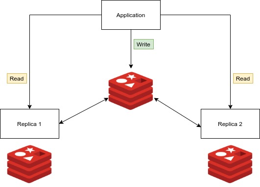
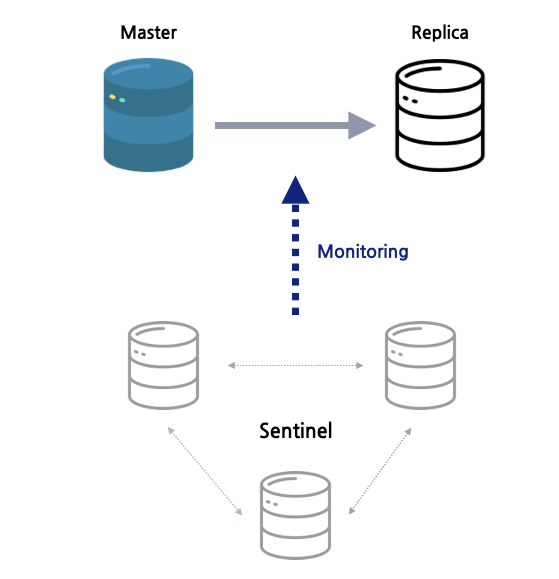
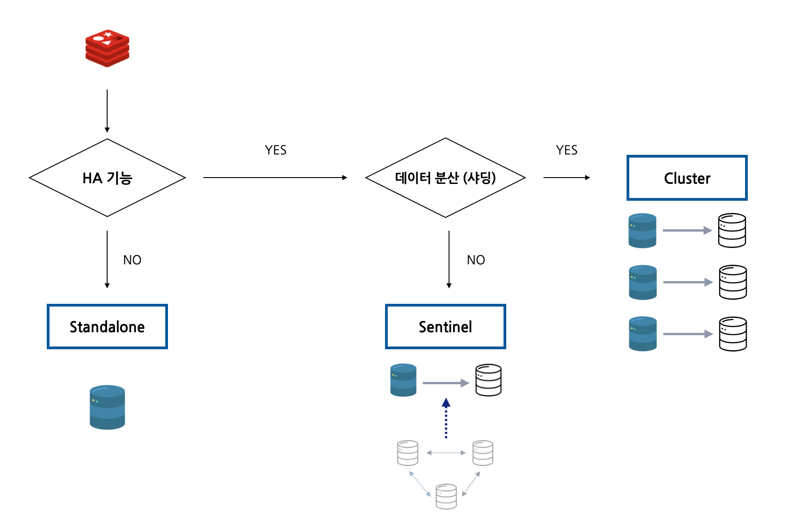

# Redis


# 1. Redis


## 1) Redis 개요

- [Redis](https://redis.io/) (REmote DIctionary Server의 약자)는 캐시, 데이터베이스 또는 메시지 브로커로 자주 사용되는 **오픈 소스 인메모리 DB** 


- list, map, set, and sorted set 과 같은 고급 데이터 유형을 저장하고 조작할 수 있음
- Redis는 다양한 형식의 키를 허용하고 서버에서 직접 수행되므로 클라이언트의 작업 부하를 줄일 수 있음 

- 기본적으로 DB 전체를 메모리에 보유하며 Disk 는 지속성을 위해서만 사용됨 

- Redis는 인기 있는 데이터 스토리지 솔루션이며 **GitHub, Pinterest, Snapchat, Twitter, StackOverflow, Flickr 등과 같은 거대 기술 기업에서 사용됨**


### (1) Redis를 사용하는 이유

- **아주 빠름.** ANSI C로 작성되었으며 Linux, Mac OS X 및 Solaris와 같은 POSIX 시스템에서 실행됨
- Redis는 종종 가장 인기 있는 key / value DB 및 Container 와 함께 사용되는 **가장 인기 있는 NoSQL 데이터베이스로 선정**됨
- 캐싱 솔루션은 클라우드 데이터베이스 백엔드에 대한 호출 수를 줄임
- 클라이언트 API 라이브러리를 통해 애플리케이션에서 액세스할 수 있음
- Redis는 인기 있는 모든 프로그래밍 언어에서 지원됨
- **오픈 소스이며 안정적임**


### (2) 실제 세계에서 Redis 사용

- Twitter는 Redis 클러스터 내의 모든 사용자에 대한 타임라인을 저장함
- Pinterest는 데이터가 수백 개의 인스턴스에 걸쳐 샤딩되는 Redis Cluster에 사용자 팔로어 그래프를 저장함
- Github은 Redis를 대기열로 사용함


# 2. Redis vs Memcached 비교

Memcached 와 비교하여 Redis 를 알아보자.


Amazon ElastiCache는 Redis 및 Memcached를 제공한다. Memcached와 Redis는 모두 캐시 시스템으로서 동일한 캐시 기능을 제공하지만 여러 차이점이 존재한다. 그 중 대표적으로 다음 4가지를 꼽아봤다.

 

## 1) 영속성(Redis)

* Memcached는 데이터가 메모리에만 저장되기 때문에 재기동시 데이터 유실됨
* redis의 경우 기본적으로 disk persistence가 설정 옵션이 있으므로 재기동시 데이터 유실없음
  * RDB/AOF 옵션에 따라 차이는 있지만 약간의 손실은 있을 수 있음

 

## 2) 멀티스레드(Memcached) vs 싱글스레드(Redis)

* Memcached는 다중 스레드이므로 다중 처리 코어 사용 가능
  * 컴퓨팅 용량을 확장하여 더 많은 작업 처리 가능
* Redis는 다중 처리가 어려우며 싱글 스레드임
  * 자료구조 자체가 Atomic하기 때문에 Race Condition에서 유리

 

## 3) Pub/Sub(Redis)

* Redis는 고성능 채팅방, 실시간 댓글 스트림, 소셜 미디어 피드 및 서버 상호 통신에 사용할 수 있는 Pub/Sub 메시징을 지원

 

## 4) 다양한 데이터 구조 (Redis)

* Memcached 는 key-value만 지원
* Redis는 다양한 데이터 구조(key-value, list, hash, set, sorted set )을 지원하여 개발의 편의성 증대

 


# 3. Atomic 자료구조

Redis 의 자료구조는 Atomic 특성이 있어 Race Condition을 피할 수 있 장점 존재


아래 트랜잭션 샘플을 살펴보자.

- 현재 friend 라는 key에  A가 존재
- 아래 2 개의 Transaction 이 발생함
  - Transaction 1
    - B 추가

  - Transaction 2
    - C 추가

- 동시성 문제에 직면하게 된다.

| **T1**                                                       | **T2**                                                       |
| :----------------------------------------------------------- | ------------------------------------------------------------ |
| 1. 친구 리스트 friend을 읽는다. <br />2. friend의 끝에 친구 B를 추가한다.<br />3. 해당 값을 friend에 저장한다. | 1. 친구 리스트 friend을 읽는다. <br />2. friend의 끝에 친구 C를 추가한다. <br />3. 해당 값을 friend에 저장한다. |

 

* 트랜잭션은 기본적으로 ACID(원자성, 일관성, 고립성, 지속성)을 보장해야 함
* 다음과 같은 결과가 이뤄져야 함 

| **시간 순서** | **T1**      | **T2**      | **최종 상태** |
| :-----------: | ----------- | ----------- | ------------- |
|       1       | friend읽기  |             | A             |
|       2       | 친구 B 추가 |             | A             |
|       3       | friend쓰기  |             | A, B          |
|       4       |             | friend읽기  | A, B          |
|       5       |             | 친구 C 추가 | A, B          |
|       6       |             | friend쓰기  | A, B, C       |

 

실제로는 다음과 같은 문제가 발생할 수 있다.

- Race Condition으로 동시성 문제를 해결하지 못한 상황이다.
- 아니면 컨텍스트 스위칭이 발생하여 A, B 상태가 되는 상황도 발생할 수 있다.

| **시간 순서** | **T1**      | **T2**      | **최종 상태** |
| :-----------: | ----------- | ----------- | :-----------: |
|       1       | friend읽기  |             |       A       |
|       2       |             | friend읽기  |       A       |
|       3       | 친구 B 추가 |             |       A       |
|       4       |             | 친구 C 추가 |       A       |
|       5       | friend쓰기  |             |     A, B      |
|       6       |             | friend쓰기  |     A, C      |

  

* **Redis의 경우 자료구조가 Atomic하기 때문에 해당 Race Condition을 피할 수 있음**

 


# 4. Redis 운영모드 비교

Redis는 단일 인스턴스(Stand Alone)만으로도 충분히 운영이 가능하지만, 물리 머신이 가진 메모리의 한계를 초과하는 데이터를 저장하고 싶거나, failover에 대한 처리를 통해 HA를 보장하려면 센티넬이나 클러스터 등의 운영 모드를 선택해서 사용해야 한다.


## 1) Stand Alone

- HA(High availibilty) 지원 안됨
- 로컬이나 dev 환경에서 사용하기에 적합
- HA 기능이 없으므로 장애 상황시 수동 복구 필요


## 2) Master Replica

HA를 위해서 Master / Replica 구조이며 일반적으로 Master는 쓰기를 담당하고 Replicas 는 읽기를 담당하여 부하 분산하는 구조이다.





- redis 5.0 부터는 Slave 라는 용어에서 Replica 라는 용어를 사용
- DBMS로 보면 statement replicastion 가 유사함
  * Data가 아닌 Query 기준으로 복제되므로 데이터 값이 틀려질 수 있음(currnet date 등)
- 비동기 방식의 복제이므로 Replication Lag에 주의
  - Master 의 데이터를 Replica 가 복제할 경우 데이터의 시간차가 발생
  - 데이터 복제는 Eventual Consistency 를 제공
    - 시간이 지나면 같아지지만 특정 기간동안 다를 수  있음을 고려
    - 읽기와 쓰기가 같아야 한다면 반드시 Master 로만 처리해야 함.
      - ex). 좌석예약, 송금, 주문 등
- Master Replica 구조에서는 Master 백업(AOF 나 RDB 파일) 필수
  - Master 서버 백업 없이 Replica 서버만 구성중 Master서버 다운/재기동시 데이터가 없는 상태로 구동됨
  - Master 서버의 empty 상태가 Replica  서버로 동기화됨
  - Replica 서버는 데이터 사라짐
- Master 가 장애 발생시 Slave가 자동으로 승격되지 않음


## 3) Redis Sentinel



- HA 지원
- Master/Replica replication
- Sentinel process
  - redis와 별도의 process
  - 여러개의 독립적인 sentinel process들이 서로 협동하여 운영된다 (SPOF 아님)
  - 안정적 운영을 위해서는 최소 3개 이상의 sentinel instance 필요 (fail over를 위해 과반수 이상 vote 필요)
  - 지속적으로 Master/Replica  가 제대로 동작을 하고있는지 모니터링
  - Master에 문제가 감지되면 자동으로 Failover 수행
- Client가 redis server 연결하는 방법
  - Client는 Sentinel에 연결해서 현재 Master위치 파악후 접속


## 4) **Redis Cluster**

[Redis 클러스터](https://redis.io/topics/cluster-tutorial) 는 **DB를 분할/확장**하여 복원력을 향상시키도록 설계된 **Redis Instance 들의 집합임**


- HA, sharding 지원
  - Sentinel과 동시에 사용하는 것이 아님! 완전히 별도의 솔루션
  - dataset을 자동으로 여러 노드들에 나눠서 저장
  - Redis Cluster 기능을 지원하는 Client를 써야만 데이터 액세스 시에 올바른 노드로 redirect가 가능
  - 특정 노드 장애 발생하거나 클러스터의 나머지 부분과 통신할 수 없는 경우에도 안정적인 서비스 제공

- Cluster node들의 동작 방식
  - 내부통신은 internal bus를 통해 이루어지며 클러스터에 대한 정보를 전파하거나 새로운 노드를 발견하기 위해 gossip protocol을 사용. 
  - serve clients 6379 (data port)
  - cluster bus 16379 (data port + 10000)
    - 자체적인 바이너리 프로토콜을 통해 node-to-node 통신(gossip protocol)
    - failure detection, configuration update, failover authorization 등을 수행
  - 각 노드들은 클러스터에 속한 다른 노드들에 대한 정보를 모두 가지고 있음

- Sharding 방식
  - 최대 1000개의 노드로 샤딩해서 사용. 그 이상은 추천하지 않음
  - consistent hashing을 사용하지 않는대신 hashslot이라는 개념을 도입
  - hashslot
    - 결정방법 CRC16(key) mod 16384를
      - CRC16을 이용하면 16384개의 슬롯에 균일하게 잘 분배됨
    - 노드별로 자유롭게 hash slot을 할당 가능
    - 예)
      - Node A contains hash slots from 0 to 5500.
      - Node B contains hash slots from 5501 to 11000.
      - Node C contains hash slots from 11001 to 16383.
  - 운영 중단 없이 hash slots을 다른 노드로 이동시키는 것이 가능
  - multiple key operations 을 수행하려면 모든 키값이 같은 hashslot에 들어와야 한다.
    - 이를 보장하기위해 hashtag 라는 개념 도입
      - {} 안에있는 값으로만 hash 계산
      - {foo}_my_key
      - {foo}_your_key

- Replication & failover
  - failover를 위해 클러스터의 각 노드를 N대로 구성가능
  - master(1대) / slave(N-1대)
  - async replication (master → slave replication 과정에서 ack을 받지 않음)
    - 데이터 손실 가능성 존재
    - master가 client요청을 받아서 ack을 완료한 후, 해당 요청에 대한 replication이 slave로 전파되기 전에 master가 죽는 경우 존재

- Client가 redis server 연결하는 방법

  - Redis Client는 클러스터 내의 어떤 노드에 접속가능(Salve도 가능)

  - 쿼리를 받은 노드가 해당 쿼리를 분석
    - 해당 키를 자기 자신이 갖고있다면 바로 찾아서 값을 리턴
    - 그렇지 않은경우 해당 키를 저장하고 있는 노드의 정보를 리턴 (클라이언트는 이 정보를 토대로 쿼리를 다시 보내야함)

* 장점
  * 자체적인 primary, Secondary FailOVer 처리가 가능 (Sentinel 이 필요없음)
  * slot 단위 데이터관리 (특정 key 를 특정 위치로 보낼 수 있음)
* 단점
  * 메모리 사용량이 더 많음
  * Migration 자체는 관리자가 시점을 결정해야 함


## 5) Redis 와 Redis-cluster 와의 차이점

| Redis                                                    | Redis Cluster                                                |
| -------------------------------------------------------- | ------------------------------------------------------------ |
| 여러 데이터베이스 지원                                   | 한개의 데이터베이스 지원                                     |
| Single write point (single master)                       | Multiple write points (multiple masters)                     |
|  |  |


## 6) Redis 운영모드 선택 기준

* Redis는 단일 인스턴스(Stand Alone)만으로도 충분히 운영이 가능
* 복제나 자동 failover에 대한 처리를 통해 HA를 보장하려면 Sentinel 모드를 사용하는 것이 좋음
* 대량의 데이터나 분산(샤딩)이 필요하다면 Cluster 모드를 사용하는 것이 좋음





# 5. Redis 운영시 주의사항


## 1) 사용하면 안되는 O(n) 커맨드

* Redis는 Single Thread로 동작하므로 Long Term Command 는 DB 전체에 많은 영향 초래
* 단순한 get/set의 경우, 초당 10만 TPS 이상이 가능함
* 그러므로 O(n) 명령을 가능한 지양 해야 함


### (1) keys (x) → scan (o)

* Keys 모든 키를 리턴하는 Command 이므로 데이터가 많을 수록 조회속도가 느림
* Keys 대신 재귀적으로 key를 호출할 수 있는 scan으로 대체하여 사용하는 게 좋음


### (2) key 나누기

* Hash나 Sorted Set 자료구조는 내부에 여러 아이템을 저장할 수 있음
* 내부 아이템이 많아질수록 성능이 저하됨
* 적절하게 Item 갯수를 유지 필요(최대 100만개)


### (3) delete (x) → unlink (o)

* Key에 많은 데이터가 들어있을 때 delete로 지우면 그 키를 지우는 동안 아무런 동작을 할 수 없음
* unlink를 사용하면 백그라운드로 삭제가능

  


## 2) 자동으로 데이터 비우기


* Redis를 캐시로 사용할 때는 Key에 대한 Expire Time 설정하는 것이 권장됨
* In-Memory DB  Size의 한계로 인해서 TTL 을 설정하지 않으면 금방 MAXMEMORY가 가득차게 됨
* Redis는 데이터가 가득찼을 때 MAXMEMORY-POLICY 정책에 의해 데이터가 삭제됨


### maxmemory-policy(Eviction Policy)

- noeviction(default)
  - maxmemory에 도달하면 쓰기/삭제 작업시 오류를 반환
  - 새로운 데이터 입력이 불가능으로 장애 발생 가능성 존재
- allkeys-lru
  - 새로 추가된 데이터의 용량을 확보하기 위해 최근에 사용하지 않은 키를 제거
  - Session Cache 용도로 적합한 옵션
- allkeys-lfu
  - 새로 추가된 데이터의 용량을 확보하기 위해 사용빈도수가 가장 적은 키를 제거
  - 최근 저장된 키라도 사용 빈도수가 적다면 대상이 될 수 있음
- allkeys-random
  - 새로 추가된 데이터의 용량을 확보하기 위해 무작위로 키를 제거
- volatile-lru
  - 새로 추가된 데이터의 용량을 확보하기 위해 TTL이 설정된 키들 중 최근에 사용하지 않은 키를 제거
- volatile-lfu
  - 새로 추가된 데이터의 용량을 확보하기 위해 TTL이 설정된 키들 중 사용빈도 수가 적은 키를 제거
  - 최근 저장된 키라도 사용 빈도수가 적다면 대상이 될 수 있음
- volatile-random
  - 새로 추가된 데이터의 용량을 확보하기 위해 TTL이 설정된 키들 중 무작위로 키를 제거
- volatile-ttl
  - 새로 추가된 데이터의 용량을 확보하기 위해 TTL이 짧은 키를 제거


#### volatile 주의점

* 가장 최근에 사용하지 않았던 키부터 삭제하는 정책으로 expire 설정에 있는 키값만 삭제함
* 만약 메모리에 expire 설정이 없는 키들만 남아있다면 이 설정에서 위와 똑같은 장애가 발생할 수 있음


#### allkeys(권장)

* 이 설정은 적어도 데이터가 MAXMEMORY로 인해 장애가 발생할 가능성은 없음


 

## 3) TTL 값은 능동적으로 설정

* 대규모 트래픽 환경에서 TTL값을 너무 작게 설정할 경우 Cache Stampede 현상이 발생할 수 있음
  *  Cache Stampede는 대량의 key들의 TTL, Eviction, Shard 삭제, 재배치 등의 이유로 Lazy Loading(DB직접 조회) 되는 문제
* Look-Aside 패턴에서는 Redis에 데이터가 없다는 응답을 받은 서버가 직접 DB에서 읽은 뒤 다시 Redis에 저장함
* 키가 만료되는 순간 많은 서버에서 이 키를 같이 보고 있었다면 모든 앱 서버들이 DB에서 같은 데이터를 찾게되는 Duplicate Read가 발생
* 또 읽어온 값을 Redis에 각각 저장하는 Duplicate Write도 발생함
* 이러한 경우에 상황에 맞춰 TTL 값을 능동적으로 설정해주는 게 좋음

 

## 4) Memory 관리

* Redis In-memory DB 이므로 Memory 관리가 매우 중요

* used_memory가 아닌 used_memory_rss 값을 모니터링 하는 것이 중요

  - used_memory
    - 논리적으로 Redis가 사용하는 메모리


  - used_memory_rss
    - OS가 실제로 Redis에 할당하기 위해 사용한 물리적 메모리 양


### Memory fragmentation(파편화)

* 실제 저장된 데이터는 적은데 rss 값이 큰 경우는 fragmentation이 큰 경우

* 주로 삭제된 키가 많을 때 이 fragmentation이 증가함

* 특정 시점에 피크를 찍고 다시 삭제되는 경우 혹은 TTL로 인한 eviction이 많이 발생하는 경우에 주로 발생

* 이때 activedefrag (활성조각모음) 기능을 잠시 켜두면 도움 됨

* 공식문서에서도 이 기능을 fragmentation이 발생했을 때 켜두는 것을 권장하고 있음

  - ```
    CONFIG SET activedefrag yes
    ```

    

