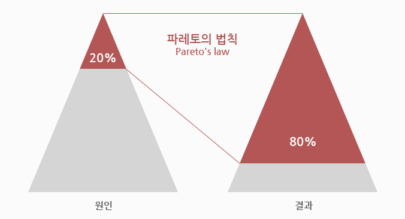

# 1. Caching

Redis 를 사용하는 가장 큰 목적은 Caching이다.  Caching 이 무엇이고 주의사항 등에 대해 알아보자.


## 1) 정의

### (1) Caching 정의

- Caching 
  - 조회 비용이 많이 드는 데이터를 속도가 빠른 임시 공간에 저장해둠으로써 애플리케이션 처리속도를 높이는 방식임


## 2) Cache 사용


### 파레토의 법칙(Pareto's Law)




* 파레토의 법칙
  * 많은 성과에 있어서 80% 결과가 20% 원인으로 부터 나온다는 법칙
* 캐시에 적용
  * 자주 사용되는 약 20% 의 데이터를 미리 캐싱해둔다면 효과적인 성능향상을 볼 수 있음


## 3) Cache Hit & Miss


### (1) 일반적인 Caching 프로세스


```
1. 데이터를 요청
2. 캐시에 있는지 확인
3. 캐시에 있다면 캐시에서 데이터를 가지고 오고 없다면 실제 저장공간에서 데이터를 Get
4. 실 저장공간에서 데이터를 가지고 왔다면 해당 데이터를 캐시에 저장함
```


### (2) hit 관련 용어

- cache hit

  - 참조하려는 데이터가 캐시에 존재할 때 cache hit라 함

- cache miss 

  - 참조하려는 데이터가 캐시에 존재 하지 않을 때 cache miss라 함

- cache hit ratio(캐시 히트율)

  - ```
    (cache hit 횟수)/(전체참조횟수) = (cache hit 횟수)/(cache hit 횟수 + cache miss 횟수)
    ```


### (3) cache hit ratio 높이기 위한 방안

- 자주 참조되며 수정이 잘 발생하지 않는 데이터들로 구성되어야 한다.
- 데이터의 수정이 잦은 경우 데이터베이스 접근 및 캐시  데이터 일관성 처리 과정이 필요함.


### (4) Cache 사용시 주의사항

- **cache miss가 발생하는 경우 실제 저장공간에서 데이터를 가져와야하기 때문에 비효율적**이라고 할 수 있음
- 캐싱의 활용도를 높이기 위해서는 **캐시 히트율을 높이는것이 중요함**


# 2. Cache Pattern

일반적으로 데이터 공유의 목적으로 활용되며, 데이터유형, 사용 목적 등에 따라 다양한 적용 패턴이 있다.

Cache-Aside 를 기반으로 한 Pattern 들에 대해서 살펴보자.


## 1) Pattern 1 : 코드성 데이터 캐싱


### (1) 패턴상세

- 적용사례
  - 공통 코드 조회

- 예시 표준 흐름도


 ### (2) 장/단점

- 장점
  - 하나의 통합 게이트웨이에서 공통/비지니스 업무를 개발 관리할 수 있음
  - 자주 사용되는 데이터만 Cache하여 메모리 량을 최소화 할 수 있음
  - 메모리 데이터 Expired 시간을 각 업무 마다 달리 할 수 있음
  - 시스템 장애 관리의 최소화 할 수 있음
- 단점
  - 업무별로 개발 로직이 추가 되어야 함


## 2) Pattern 2 : 주기적 생성 데이터 캐싱

### (1) 패턴상세

- 적용사례
  - 일일 통계/집계 내역 캐싱

- 예시 표준 흐름도


 ### (2) 장/단점

- 장점
  - AP에서는 Cache에 Data를 push하는 로직이 필요없음
  - 통계, 집계 테이블 등 1개의 테이블에서 조회하는 업무에서 효율적임
- 단점
  - 테이블 단위의 전체 데이터를 로딩하므로 조회시점의 필요한 데이터 외 데이터가 메모리에 지속적으로 적재됨


## 3) Pattern  3 : E2E 구간 성능 향상

> Frontend - Microservice - DB ) with Kafka

### (1) 패턴상세

- 적용사례
  - E2E 구간의 대량 요청 캐싱 with Kafka

  - Cache 전송시 데이터 유실없이 데이터 영구 저장이 꼭 필요한 경우(Persitent 성격의 데이터) 에 한해서 사용함 

- 예시 표준 흐름도


### (2) 장/단점

- 장점
  - 대량의 데이터를 효율적으로 Cache 입력할때 좋음
  - Cache 전송시 데이터 유실이 없음

- 단점
  - 추가적인 Kafka 리소스가 필요함
  - 업무별로 개발 로직이 추가되어야 함
  - 개발 편의성을 위해 공통 Cache 라이브러리를 제공해야 함

