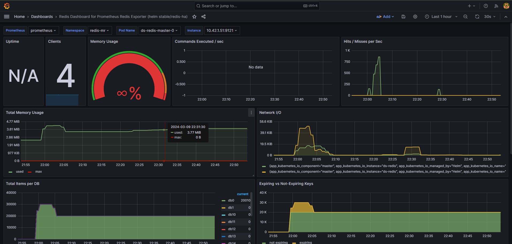
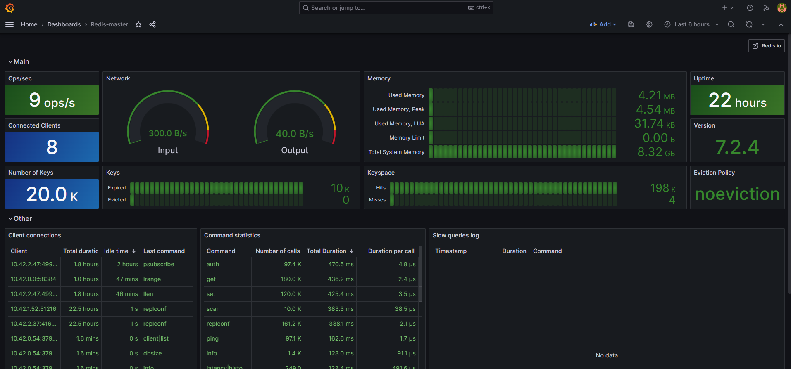
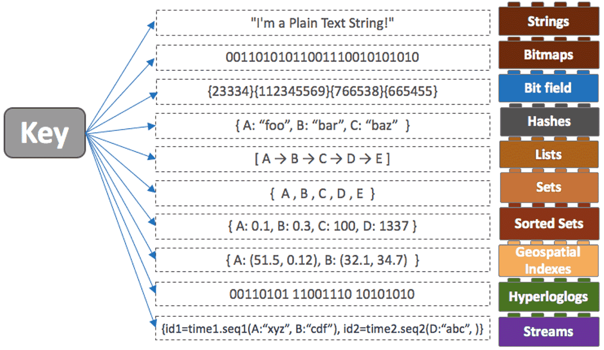

# Redis Hands-in 2

> Redis On Kubernetes


아래 부터는 실습은 Edu Cluster 서버에서 수행한다.


# 1. 실습 사전 준비

## 1) key prefix 변경

실습을 위해서 개인별로 Redis Key Prefix 를 부여 받았을 것이다.

본 문서에서는 user01번으로 설정한 script 들이 존재한다.

개인별 실습을 원할히 하기 위해서 아래처럼 개인별 Key Prefix 로 변경하자.

typora 를 사용하고 있다면 아래처럼 Ctrl+H 명령으로 일괄 변경하자.

```
Ctrl + H  전체 변경하기

user01 --> (자신의 번호로 변경, 예를들면 user02)   > 모두 변경
```


## 2) [EduCluster] Monitoring 확인

이미 설치되어 있는 Monitoring tool 을 함께 보면서 실습을 할 것이다.


### (1) P3X

* 링크 : http://p3x.redis-mon.43.203.62.69.nip.io/
* Redis DB 관리를 위한  편리한 데이터베이스 GUI app이며  WEB  UI 와 Desktop App 에서 작동한다.


### (2) Grafana

* 링크 : http://grafana.redis-mon.43.203.62.69.nip.io/
* 메뉴 : Home > Dashboards > Redis Dashboard




* 메뉴 : Home > Dashboards > Redis-master




## 3) K8s Cluster 접속정보 변경

기존에는 개인별로 존재하는 Bastion k8s Cluster을 이용하였다.

k8s 접속정보를 EDU k8s Cluster 로 변경해 보자.


env 파일에서 localcluster는 주석처리하고 ktdseducluster를 연결시킨다.

```sh
# ubuntu terminal 에서


$ vi ~/env
...
export KUBECONFIG=~/.kube/config-ktdseducluster    # <-- 주석해지
#export KUBECONFIG=~/.kube/config-localcluster     # <-- 주석처리

# 저장후 종료


## 반드시 exit 후 terminal 재접속 할것
## 모든 terminal을 exit후 재접속
$ exit


# 재접속후
# 확인
$ cat ~/env
...
export KUBECONFIG=~/.kube/config-ktdseducluster
#export KUBECONFIG=~/.kube/config-localcluster


# ktdseducluster 로 연결여부 확인
$ kubectl get nodes
NAME          STATUS   ROLES                       AGE    VERSION
master01.c1   Ready    control-plane,etcd,master   7d9h   v1.28.6+k3s2
master02.c1   Ready    control-plane,etcd,master   7d9h   v1.28.6+k3s2
master03.c1   Ready    control-plane,etcd,master   7d9h   v1.28.6+k3s2
worker01      Ready    <none>                      31h    v1.28.6+k3s2
worker02      Ready    <none>                      31h    v1.28.6+k3s2
worker03      Ready    <none>                      31h    v1.28.6+k3s2


# 위와 같이 6개 node 가 보인다면 성공
```


# 2. [EduCluster] Redis-MR 서버 접근


## 1) 접속정보 확인


### (1) Redis-MR

* 확인

```sh
# Bastion Server 에서...

# master node
$ nc -zv 43.203.62.69 32300
Connection to 43.203.62.69 32300 port [tcp/*] succeeded!


# slave node
$ nc -zv 43.203.62.69 32310
Connection to 43.203.62.69 32310 port [tcp/*] succeeded!

```


## 3) Docker Redis-cli

### (1) Docker Redis-CLI 접근

```sh
# Bastion Server 에서...

## 확인
$ docker ps -a

## redis-client 용도로 docker client 를 실행한다.
$ docker run --name redis-client -d --user root docker.io/redis:7.2 sleep 365d

## Container 내에 진입후
$ docker exec -it redis-client bash

```


### (2) Master 접근

개인 bastion Server 에서 공용서버 Redis access 테스트를 위해 redis client  Container 를 설치하자.

```sh
# Docker Redis-cli container 에서 ...

## Master redis 로 접근
$ redis-cli -h 43.203.62.69 -a new1234 -p 32300

# set
43.203.62.69:32300> set user01:a 1
43.203.62.69:32300> set user01:b 2
43.203.62.69:32300> set user01:c 3


# get
43.203.62.69:32300> get user01:a
"1"
43.203.62.69:32300> get user01:b
"2"
43.203.62.69:32300> get user01:c
"3"


# 테스트 완료시
# Ctrl+D,   Ctrl+D 로   Exit 하자.

```


### (3) Replica 접근

```sh
# Docker Redis-cli container 에서 ...


## Replica redis 로 접근 (readonly 만 가능)
$ redis-cli -h 43.203.62.69 -a new1234 -p 32310

43.203.62.69:32310> set user01:a 1
(error) READONLY You can't write against a read only replica.


43.203.62.69:32300> get user01:a
"1"
43.203.62.69:32300> get user01:b
"2"
43.203.62.69:32300> get user01:c
"3"


# 테스트 완료시
# Ctrl+D,   Ctrl+D 로   Exit 하자.
```


### (4) Monitoring


#### p3x 

* p3x 를 통해서 각자 입력한 값을 확인해 보자.
* connection
  * 좌측 하단 Connection 선택 : ds-redis-mr
* Home
  * Search serverside
    * user01*   입력후 검색


#### Grafana 

Grafana 를 통해서 확인해 보자.

* 메뉴 : Home > Dashboards > Redis Dashboard

Grafana 를 통해서 확인해 보자.

* redis dashbaord
  * 메뉴 : Home > Dashboards > Redis dashbaord
  * namespace
    * redis-mr
  * pod Name
    * ds-redis-master-0 선택
* redis-master dashbaord

  * 메뉴 : Home > Dashboards > Redis-master


### (4) Clean Up

```sh
# Bastion Server 에서...

# 1) redis-client 삭제
$ docker rm -f redis-client

# 확인
$ docker ps -a

```


## 4) Docker Python-cli


### (1) Docker Python-CLI 접근

Cluster 외부에서 redis 접근하기 위해 docker로 python 을 설치후 redis 에 connect 해 보자.

```sh
# Bastion Server 에서...

## 확인
$ docker ps -a

## redis-client 용도로 docker client 를 실행한다.
$ docker run --name python -d --user root docker.io/python:3.9 sleep 365d

## Container 내에 진입후
$ docker exec -it python bash

root@fa11e2cd3729:/#                      <-- 이런 prompt 가 정상


```


#### python library install

kafka 에 접근하기 위해서 kafka-python 을 설치해야 한다.

```bash
# python container 내부에서...

$ pip install redis

Collecting redis
  Downloading redis-5.0.0-py3-none-any.whl (250 kB)
     ━━━━━━━━━━━━━━━━━━━━━━━━━━━━━━━━━━━━━━━━ 250.1/250.1 kB 6.6 MB/s eta 0:00:00
Collecting async-timeout>=4.0.2
  Downloading async_timeout-4.0.3-py3-none-any.whl (5.7 kB)
Installing collected packages: async-timeout, redis
Successfully installed async-timeout-4.0.3 redis-5.0.0


```


#### [참고] redis host 확인

```sh
# internal 접근을 위한 host 확인
# nc 명령으로 접근가능여부를 확인할 수 있다.

$ apt update
  apt install netcat-openbsd

$ nc -zv 43.203.62.69 32300

Connection to 43.203.62.69 32300 port [tcp/*] succeeded!


```


#### Redis 확인

consumer 실행을 위해서 python cli 환경으로 들어가자.

```sh
# python container 내부에서...


$ python


Python 3.9.18 (main, Feb 13 2024, 10:54:04)
[GCC 12.2.0] on linux
Type "help", "copyright", "credits" or "license" for more information.
>>>


```


CLI 환경에서 아래  Python 명령을 하나씩 실행해 보자.

```python
# python Prompt 에서

import redis

# redis 연결
rd = redis.Redis(host='43.203.62.69', port=32300, db=0, password="new1234")

 

'''
# [참고] sample connection
rd = redis.StrictRedis(host='ds-redis-master', port=6379, db=0, password="new1234")
rd = redis.Redis(host='localhost', port=6379, decode_responses=True)
rc = RedisCluster(host='ds-redis-redis-mr', port=6379)

rd = redis.Redis(
    host="my-redis.cloud.redislabs.com", port=6379,
    username="default", # use your Redis user. More info https://redis.io/docs/management/security/acl/
    password="secret", # use your Redis password
    ssl=True,
    ssl_certfile="./redis_user.crt",
    ssl_keyfile="./redis_user_private.key",
    ssl_ca_certs="./redis_ca.pem",
)
'''


# redis get
rd.get("a")
rd.get("b")
rd.get("c")


# redis set
rd.set("d", "python4")

# redis get
rd.get("d")


# delete key
rd.delete("d")

# CTRL + D
# CTRL + D  로 터미널을 빠져나온다.
```


### (2) 성능테스트(Python )

#### 소스 받기

```sh
# python container 내부에서...

# 소스 받기

# 처음이라면 git clone
$ mkdir ~/githubrepo
  cd ~/githubrepo

$ git clone https://github.com/ssongman/ktds-edu-redis.git


# 이미 받았다면 git pull
$ cd ~/githubrepo/ktds-edu-redis
  git pull


```


#### 1만건 쓰기 테스트

```sh
# python container 내부에서...

# 소스 확인
$ cat ~/githubrepo/ktds-edu-redis/redis/PythonSample/15.spt-redis-mr-set.py


# 성능테스트
# arg1 : host
# arg2 : port
# arg3 : keyprefix
# arg4 : 건수

# 실행
$ cd ~/githubrepo/ktds-edu-redis/redis/PythonSample
  python 15.spt-redis-mr-set.py 43.203.62.69 32300 user01 10000

[key 1] duration time : 11.168412208557129
[key 2] duration time : 21.529680967330933
[key 3] duration time : 33.04685688018799


```

* 소요시간 :  ??? 
  * 싱글쓰레드 이므로 동시에 수행될땐 얼마나 소요될지 모름
* 3개의 키를 쓸때는 약 3배수 정도 소요됨
* 마지막 [key 3] 에서는 TTL 까지 셋팅하여 시간이 좀더 많이 소요됨.


#### 1만건 읽기 테스트 - Master

```sh
# python container 내부에서...

# 소스 확인
$ cat ~/githubrepo/ktds-edu-redis/redis/PythonSample/16.spt-redis-mr-get.py


# 실행
$ cd ~/githubrepo/ktds-edu-redis/redis/PythonSample
  python 16.spt-redis-mr-get.py 43.203.62.69 32300 user01 10000

[key 1] duration time : 10.300625801086426
[key 2] duration time : 21.367680549621582
[key 3] duration time : 31.190789699554443


```

* 약 2초 정도 소요됨
* 3개의 키를 읽어올때는 3배수 정도 소요됨


#### 1만건 읽기 테스트 - Slave

```sh
# python container 내부에서...

# 소스 확인
$ cat ~/githubrepo/ktds-edu-redis/redis/PythonSample/16.spt-redis-mr-get.py


# 실행
$ cd ~/githubrepo/ktds-edu-redis/redis/PythonSample
  python 16.spt-redis-mr-get.py 43.203.62.69 32310 user01 10000

[key 1] duration time : 10.68404221534729
[key 2] duration time : 21.490564346313477
[key 3] duration time : 33.12504243850708


```

* 약 2초 정도 소요됨
* 3개의 키를 읽어올때는 3배수 정도 소요됨


### (3) Monitoring


#### p3x 

* p3x 를 통해서 각자 입력한 값을 확인해 보자.


#### Grafana 

Grafana 를 통해서 확인해 보자.


# 3. [EduCluster] Redis-Cluster 서버 접근

Redis Cluster 는 Kubernetes Cluster 내부에서 접근해야 한다.

그러므로 EDU Cluster 로 접속후 내부에서 테스트를 진행해 보자. 


## 1) 접속정보 확인

Cluster 내부에서 ds-redis-redis-cluster.redis-cluster.svc:6379 으로 접근 할 것이다.

```sh

# K8s Cluster 내부에서의 접속정보

ds-redis-redis-cluster.redis-cluster.svc 6379 

```


## 2) 개인 client  namespace 생성 - ★★

개인별 redis-client  namespace 를 만든다.


```sh

$ kubectl create ns redis-client-user01

$ kubectl -n redis-client-user01 get pod


# alias 생성
$ alias ku='kubectl -n redis-client-user01'

$ ku get pod

```


## 3) Redis Container 준비


### (1) Redis client 실행

먼저 아래와 같이 동일한 Namespace 에 redis-client 를 실행한다.

```sh
## redis-client 용도로 deployment 를 실행한다.
$ ku create deploy redis-client --image=docker.io/redis:7.2 -- sleep 365d
deployment.apps/redis-client created


## redis client pod 확인
$ ku get pod
NAME                           READY   STATUS    RESTARTS   AGE
redis-client-9f57dc6d6-7kffv   1/1     Running   0          7s


# 약 20초 정도 소요됨


## redis-client pod 내부로 접근한다.
$ ku exec -it deploy/redis-client -- bash
root@redis-client-9f57dc6d6-7kffv:/data#                    # <-- 이런 Prompt가 나오면 정상


```


### (2) Redis-cli 으로 확인

#### Redis-cli 실행

```sh
## redis-client pod 내부에서...


## service 명으로 cluster mode 접근
$ redis-cli -h ds-redis-redis-cluster.redis-cluster.svc -p 6379 -c -a new1234


# 특정 pod 로 직접 접근 시도시
# redis-cli -h ds-redis-redis-cluster-0.ds-redis-redis-cluster-headless.redis-cluster.svc -c -a new1234
# redis-cli -h ds-redis-redis-cluster-1.ds-redis-redis-cluster-headless.redis-cluster.svc -c -a new1234
# redis-cli -h ds-redis-redis-cluster-2.ds-redis-redis-cluster-headless.redis-cluster.svc -c -a new1234
# redis-cli -h ds-redis-redis-cluster-3.ds-redis-redis-cluster-headless.redis-cluster.svc -c -a new1234
# redis-cli -h ds-redis-redis-cluster-4.ds-redis-redis-cluster-headless.redis-cluster.svc -c -a new1234
# redis-cli -h ds-redis-redis-cluster-5.ds-redis-redis-cluster-headless.redis-cluster.svc -c -a new1234


## cluster node 를 확인
$ ds-redis-redis-cluster:6379> cluster nodes
d3d0831adef812640c1cbc638863d65563746b7d 10.42.2.72:6379@16379 slave 761736a05e1d63c699cdd8cc14b8773f6c025086 0 1709966406610 2 connected
0f1b5b465fa911d3b74b6b9de5f64c4dfcdace85 10.42.2.71:6379@16379 myself,slave 9110f576743a5799771ae9098e6366698ef94cf5 0 1709966404000 3 connected
761736a05e1d63c699cdd8cc14b8773f6c025086 10.42.2.69:6379@16379 master - 0 1709966405608 2 connected 5461-10922
b7db18fba19071ee431141abae6d0ba86fe31735 10.42.2.68:6379@16379 master - 0 1709966403000 1 connected 0-5460
9110f576743a5799771ae9098e6366698ef94cf5 10.42.2.70:6379@16379 master - 0 1709966405000 3 connected 10923-16383
6fdb1e6ab1366cc61dc806dae56df4212d1459d5 10.42.2.73:6379@16379 slave b7db18fba19071ee431141abae6d0ba86fe31735 0 1709966406000 1 connected

## master 3개, slave가 3개 사용하는 모습을 볼 수가 있다.


## cluster info 확인
ds-redis-redis-cluster:6379> cluster info

cluster_state:ok
cluster_slots_assigned:16384
cluster_slots_ok:16384
cluster_slots_pfail:0
cluster_slots_fail:0
cluster_known_nodes:6
cluster_size:3
cluster_current_epoch:6
cluster_my_epoch:1
cluster_stats_messages_ping_sent:236
cluster_stats_messages_pong_sent:233
cluster_stats_messages_sent:469
cluster_stats_messages_ping_received:228
cluster_stats_messages_pong_received:236
cluster_stats_messages_meet_received:5
cluster_stats_messages_received:469
total_cluster_links_buffer_limit_exceeded:0

## cluster state 가 OK 인 것을 확인할 수 있다.


# set
10.42.2.39:6379> set user01:a 1
-> Redirected to slot [10728] located at 10.42.1.56:6379
OK

10.42.1.56:6379> set user01:b 2
OK

10.42.1.56:6379> set user01:c 3
-> Redirected to slot [2474] located at 10.42.2.39:6379
OK


# get
10.42.2.39:6379> get user01:a
-> Redirected to slot [10728] located at 10.42.1.56:6379
"1"

10.42.1.56:6379> get user01:b
"2"

10.42.1.56:6379> get user01:c
-> Redirected to slot [2474] located at 10.42.2.39:6379
"3"


# 테스트 완료시
# Ctrl+D,   Ctrl+D 로   Exit 하자.


```


### (4) Monitoring


#### p3x 

* p3x 를 통해서 각자 입력한 값을 확인해 보자.
* connection
  * 좌측 하단 Connection 선택 : ds-redis-cluster

* Home
  * Search serverside
    * user01*   입력후 검색


#### Grafana 

Grafana 를 통해서 확인해 보자.

* redis dashbaord
  * 메뉴 : Home > Dashboards > Redis dashbaord
  * namespace
    * redis-cluster
  * pod Name
    * node 선택
* redis-cluster dashbaord

  * 메뉴 : Home > Dashboards > Redis-cluster


### (5) [참고] Clean Up

```sh
# Bastion Server 에서...

# 확인
$ ku get deploy redis-client 

# 삭제
$ ku delete deploy redis-client 

```


## 4) Python 으로 확인


### (1) Python POD 접근

Cluster 외부에서 redis 접근하기 위해 docker로 python 을 설치후 redis 에 connect 해 보자.

```sh
# Bastion Server 에서...

# python deploy
$ ku create deploy python --image=python:3.9 -- sleep 365d


# 설치진행 확인
$ ku get pod
...
python-fb57f7bd4-4w6pz                       1/1     Running   0              32s
...

## READY 상태가 1/1 로 변할때까지 대기...
## 약 1분 소요


# python pod 내부로 진입( bash 명령 수행)
$ ku exec -it deploy/python -- bash

root@python-7d59455985-ml8vw:/#                  <-- 이런 prompt 가 정상


```


#### python library install

kafka 에 접근하기 위해서 kafka-python 을 설치해야 한다.

```bash
# python container 내부에서...

$ pip install redis-py-cluster

Collecting redis-py-cluster
  Downloading redis_py_cluster-2.1.3-py2.py3-none-any.whl (42 kB)
     ━━━━━━━━━━━━━━━━━━━━━━━━━━━━━━━━━━━━━━━━ 42.6/42.6 kB 3.2 MB/s eta 0:00:00
Collecting redis<4.0.0,>=3.0.0
  Downloading redis-3.5.3-py2.py3-none-any.whl (72 kB)
     ━━━━━━━━━━━━━━━━━━━━━━━━━━━━━━━━━━━━━━━━ 72.1/72.1 kB 5.3 MB/s eta 0:00:00
Installing collected packages: redis, redis-py-cluster
  Attempting uninstall: redis
    Found existing installation: redis 5.0.2
    Uninstalling redis-5.0.2:
      Successfully uninstalled redis-5.0.2
Successfully installed redis-3.5.3 redis-py-cluster-2.1.3


```


#### [참고] redis host 확인

```sh
# internal 접근을 위한 host 확인
# nc 명령으로 접근가능여부를 확인할 수 있다.

$ apt update
  apt install netcat-openbsd

$ nc -zv ds-redis-redis-cluster.redis-cluster.svc 6379 
Connection to ds-redis-redis-cluster.redis-cluster.svc (10.43.88.176) 6379 port [tcp/redis] succeeded!

```


#### Redis 확인

consumer 실행을 위해서 python cli 환경으로 들어가자.

```sh
# python container 내부에서...


$ python


Python 3.9.18 (main, Feb 13 2024, 10:54:04)
[GCC 12.2.0] on linux
Type "help", "copyright", "credits" or "license" for more information.
>>>


```


CLI 환경에서 아래  Python 명령을 하나씩 실행해 보자.

```python
# python Prompt 에서

from rediscluster import RedisCluster

# redis 연결

startup_nodes = [{"host":"ds-redis-redis-cluster.redis-cluster.svc", "port":"6379"}]
rc = RedisCluster(startup_nodes=startup_nodes, 
                  decode_responses=True, 
                  skip_full_coverage_check=True,
                  password="new1234")

 

'''
# [참고] sample connection
rd = redis.StrictRedis(host='ds-redis-master', port=6379, db=0, password="new1234")
rd = redis.Redis(host='localhost', port=6379, decode_responses=True)
rc = RedisCluster(host='ds-redis-redis-mr', port=6379)

rd = redis.Redis(
    host="my-redis.cloud.redislabs.com", port=6379,
    username="default", # use your Redis user. More info https://redis.io/docs/management/security/acl/
    password="secret", # use your Redis password
    ssl=True,
    ssl_certfile="./redis_user.crt",
    ssl_keyfile="./redis_user_private.key",
    ssl_ca_certs="./redis_ca.pem",
)
'''


# redis set
rc.set("user01:a", 1)
rc.set("user01:b", 2)
rc.set("user01:c", 3)

# redis get
rc.get("user01:a")
rc.get("user01:b")
rc.get("user01:c")

# CTRL + D
# CTRL + D  로 터미널을 빠져나온다.
```


### (2) 성능테스트(Python )

#### 소스 받기

```sh
# python container 내부에서...

# 소스 받기

# 처음이라면 git clone
$ mkdir ~/githubrepo
  cd ~/githubrepo

$ git clone https://github.com/ssongman/ktds-edu-redis.git


# 이미 받았다면 git pull
$ cd ~/githubrepo/ktds-edu-redis
  git pull


```


#### 1만건 쓰기 테스트

```sh
# python pod 내부에서

# 소스 확인
$ cat ~/githubrepo/ktds-edu-redis/redis/PythonSample/11.spt-cluster-set.py


# 성능테스트
# arg1 : host
# arg2 : port
# arg3 : keyprefix
# arg4 : 건수


# 실행
$ cd ~/githubrepo/ktds-edu-redis/redis/PythonSample
  python 11.spt-cluster-set.py ds-redis-redis-cluster.redis-cluster.svc 6379 user01 10000

[key 1] duration time : 4.987692594528198
[key 2] duration time : 9.387916088104248
[key 3] duration time : 14.449841976165771


```

* 소요시간 :  ??? 
  * 싱글쓰레드 이므로 동시에 수행될땐 얼마나 소요될지 모름

* 3개의 키를 쓸때는 약 3배수 정도 소요됨
* 마지막 3개의 키에서 c는 TTL 까지 셋팅하여 시간이 좀더 많이 소요됨.


#### 1만건 읽기 테스트

```sh
# python pod 내부에서

# 소스 확인
$ cat ~/githubrepo/ktds-edu-redis/redis/PythonSample/12.spt-cluster-get.py


# 실행
$ cd ~/githubrepo/ktds-edu-redis/redis/PythonSample
  python 12.spt-cluster-get.py ds-redis-redis-cluster.redis-cluster.svc 6379 user01 10000


[key 1] duration time : 4.49605917930603
[key 2] duration time : 8.666507482528687
[key 3] duration time : 12.982078075408936


```

* 3개의 키를 읽어올때는 3배수 정도 소요됨


### (3) Monitoring


#### p3x 

p3x 를 통해서 각자 입력한 값을 확인해 보자.

http://p3x.redis-mon.43.203.62.69.nip.io/


#### Grafana 

Grafana 를 통해서 확인해 보자.

http://grafana.redis-mon.43.203.62.69.nip.io/d/xDLNRKUWz/6befa04a-320b-56a8-bbf9-33ea65a2ea36?orgId=1&refresh=30s

http://grafana.redis-mon.43.203.62.69.nip.io/d/Redis-cluster/redis-cluster?orgId=1&refresh=5s


### (4) [참고] Clean Up

```sh
# Bastion Server 에서...

# 확인
$ ku get deploy

# 삭제
$ ku delete deploy python

```


# 4. Collection

Redis 에서 제공하는 다양한 자료구조를 알아보자.

Redis 는 `String`, `Set`, `Sorted Set`, `Hash`, `List` 등 다양한 타입을 지원한다.





## 1) 실습 환경준비


### (1) Docker Redis-CLI 접근 - ★★

```sh
# Bastion Server 에서...

## 확인
$ docker ps -a

## redis-client 용도로 docker client 를 실행한다.
$ docker run --name redis-client -d --user root docker.io/redis:7.2 sleep 365d


## Container 내에 진입후
$ docker exec -it redis-client bash


root@2ab11d7c8a62:/data#


## Master redis 로 접근
$ redis-cli -h 43.203.62.69 -a new1234 -p 32300

43.203.62.69:32300>

```


### (2) p3x 모니터링 

p3x 를 통해서 각자 입력한 값을 확인해 보자.

http://p3x.redis-mon.43.203.62.69.nip.io/


## 2) String

- 일반적인 문자열
- value 최대 512MB
- 단순 증감 연산에 좋음


### (1) Strings 명령어 리스트

- SET: SET, SETNX, SETEX, SETPEX, MSET, MSETNX, APPEND, SETRANGE
- GET: GET, MGET, GETRANGE, STRLEN
- INCR: INCR, DECR, INCRBY, DECRBY, INCRBYFLOAT
- Enterprise: SETS, DELS, APPENDS (subquery)


### (2) 사용법


```sql
# 한개 조회
set <key> <value>
get <key> <value>

# 여러개 조회
mset <key> <value> <key> <value> ...
mget <key> <key> <key> ...
```


### (3) 사례


```sql

43.203.62.69:32300> set user01:count 50
OK

43.203.62.69:32300> incr user01:count
(integer) 51

43.203.62.69:32300> get user01:count
"51"

43.203.62.69:32300> incrby user01:count 100
(integer) 151

43.203.62.69:32300> decr user01:count
(integer) 150

43.203.62.69:32300> decrby user01:count 500
(integer) -350

43.203.62.69:32300> mset user01:a "hello" user01:b "world"
OK

43.203.62.69:32300> mget user01:a user01:b
1) "hello"
2) "world"

# mget/mset 명령은 cluster mode 에서는 제한적으로 사용된다.(동일 slot 에서만 작동)
```


### (4) key 구성

key 를 어떻게 구성하는가가 중요함

간단한 SQL 을 대체 하는 부분을 살펴보자.

```sql
Insert into user01(username, email) values ('song', 'song@b.c');
Insert into user01(username, email) values ('lee', 'lee@b.c');
```


* case1

```sql

set user01:song 'song@b.c'
set user01:lee 'lee@b.c'


get user01:song
get user01:lee

```


## 2) List

- array 형식의 데이터 구조. 데이터를 순서대로 저장 
- 추가 / 삭제 / 조회하는 것은 O(1)의 속도를 가지지만, 중간의 특정 index 값을 조회할 때는 O(N)의 속도를 가지는 단점이 있다.
- 즉, 중간에 추가/삭제가 느리다. 따라서 head-tail에서 추가/삭제 한다. (push / pop 연산)
- 메세지 queue로 사용하기 적절하다.


### (1) Lists 명령어 리스트

- SET (PUSH): LPUSH, RPUSH, LPUSHX, RPUSHX, LSET, LINSERT, RPOPLPUSH
- GET: LRANGE, LINDEX, LLEN
- POP: LPOP, RPOP, BLPOP, BRPOP
- REM: LREM, LTRIM
- BLOCK: BLPOP, BRPOP, BRPOPLPUSH
- Enterprise: LREVRANGE, LPUSHS, RPUSHS (subquery)


### (2) 사용법

#### [List 명령어 페이지](http://redisgate.kr/redis/command/lists.php)


#### push (삽입)

```sh
$ lush <key> <A>    # key: (A)
$ rpush <key> <B>    # key: (A, B)
$ lpush <key> <C>    # key: (C, A, B)
$ rpush <key> <D,A>  # key : (C, A, B, D, A)
```


#### pop (삭제)

```sh
# key : (C, A, B, D, A)
$ lpop <key>     # pop C,  key: (A, B, D, A)
$ rpop <key>     # pop A,  key: (A, B, D)
$ rpop <key>     # pop D,  key: (A, B)
```


### (3) 사례

```sql

# LPUSH를 통한 list 생성
> LPUSH user01:myList "a"
(integer) 1
> LRANGE user01:myList 0 -1       # list 에 모든 값 확인
1) "a"

# LPUSH , RPUSH를 통한 요소 삽입 결과.
> LPUSH user01:myList "b"
(integer) 2
> RPUSH user01:myList "c"
(integer) 3
> LRANGE user01:myList 0 -1
1) "b"
2) "a"
3) "c"

# LPUSHX 는 존재하는 Key 에만 입력할 수 있다.
# 존재하지 않는 key를 사용할 땐 0을 리턴한다.
> LPUSHX user01:myList2 "d"
(integer) 0

> LPUSH user01:myList "d"
(integer) 4


# 기존에 있던 myList요소들은 [ d , b , a , c ] 순으로 되어있음.
# LPOP , RPOP을 통해 맨 좌 우측 요소 한개씩 제거 
> LPOP user01:myList
"d"
> RPOP user01:myList
"c"
> LRANGE user01:myList 0 -1
1) "b"
2) "a"

# 현재 List의 요소 길이를 출력.
> LLEN user01:myList
(integer) 2

# LREM을 통해 해당 요소 삭제, count를 0 으로 해서 요소중에 "a"랑 매칭되는 값을 삭제
> LREM user01:myList 0 "a"
(integer) 1
> LRANGE user01:myList 0 -1
1) "b"

# 해당 key에 해당되는 index값을 입력받은 값을 수정.
# 현재 b로 남아있던 요소값을 z로 변경
> LSET user01:myList 0 "z"
OK
> LRANGE user01:myList 0 -1
1) "z"

# RPOPLPUSH 
> RPOPLPUSH user01:myList user01:hello     # myList 에서 rpop 하여 hello 에 lpush 한다.
"z"
> LRANGE user01:hello 0 -1
1) "z"
```


### 참고

* LPUSH
  * http://redisgate.kr/redis/command/lpush_ani.php
* RPOP
  * http://redisgate.kr/redis/command/rpop_ani.php
* LRANGE
  * http://redisgate.kr/redis/command/lrange_ani1.php
* LREM
  * http://redisgate.kr/redis/command/lrem_ani1.php
* LTRIM
  * http://redisgate.kr/redis/command/ltrim_ani1.php


## 3) Set

list 와 유사하지만 중복된 value 를 허용하지 않는다.

- `중복된 데이터`를 담지 않기 위해 사용하는 자료구조 (js의 set이라고 생각하면 된다)
- 유니크한 key값
- 정렬되지 않은 집합
- 중복된 데이터를 여러번 저장하면 최종 한번만 저장된다.
- Set간의 연산을 지원. 교집합, 합집합, 차이를 매우 빠른 시간내에 추출할 수 있다.
- **단, 모든 데이터를 전부 다 갖고올 수 있는 명령이 있으므로 주의**해서 사용해야 한다.


### (1) Sets 명령어 리스트

- SET: SADD, SMOVE
- GET: SMEMBERS, SCARD, SRANDMEMBER, SISMEMBER, SSCAN
- POP: SPOP
- REM: SREM
- 집합연산: SUNION, SINTER, SDIFF, SUNIONSTORE, SINTERSTORE, SDIFFSTORE
- Enterprise: SLS, SRM, SLEN, SADDS (subquery)


### (2) 사용법

```sql
$ sadd <key> <value>       # value 가 이미 key에 있으면 추가되지 않음
$ smembers <key>           # 모든 value 리턴
$ sismember <key> <value>  # value가 존재하면 1, 없으면 0
$ scard  <key>             # key에 속한 멤버 개수를 리턴
```


* 유니크한 데이터를 저장할때 유용하다.
  * 예를들면 특정 유저를 follow 하는 목록을 저장


### (3) 사례

```sql
#  member 추가, 추가된 갯수 반환
> sadd user01:myset a
(integer) 1

> sadd user01:myset a
(integer) 0

> sadd user01:myset b
(integer) 1

> sadd user01:myset c
(integer) 1

# member 삭제, 삭제된 갯수 반환
> srem user01:myset c 
(integer) 1

> smembers user01:myset
1) "b"
2) "a"

# 해당 키에 속한 멤버 갯수를 리턴
> scard user01:myset
(integer) 2

# 여러 member 삽입 가능
> sadd user01:myset c d e f 
(integer) 4

> smembers user01:myset
1) "a"
2) "b"
3) "c"
4) "d"
5) "e"
6) "f"

# 랜덤 member 읽기 및 삭제
> spop user01:myset 3
1) "c"
2) "d"
3) "f"

# member 를 리턴
> smembers user01:myset
1) "a"
2) "b"
3) "e"
```


## 4) Sorted Sets

score에 따라 순서가 보장된다.

- set에 score라는 필드가 추가된 데이터 형 (score는 일종의 가중치)
- 일반적으로 set은 정렬이 되어있지않고 insert 한 순서대로 들어간다.그러나 Sorted Set은 Set의 특성을 그대로 가지며 추가적으로 저장된 member들의 순서도 관리한다. 
- 데이터가 저장될때부터 score 순으로 정렬되며 저장
- sorted set에서 데이터는 오름차순으로 내부 정렬
- value는 중복 불가능, score는 중복 가능
- 만약 score 값이 같으면 사전 순으로 정렬되어 저장 


### (1) Sorted Sets 명령어 리스트

- SET: ZADD
- GET: ZRANGE, ZRANGEBYSCORE, ZRANGEBYLEX, ZREVRANGE, ZREVRANGEBYSCORE, ZREVRANGEBYLEX, ZRANK, ZREVRANK, ZSCORE, ZCARD, ZCOUNT, ZLEXCOUNT, ZSCAN
- POP: ZPOPMIN, ZPOPMAX
- REM: ZREM, ZREMRANGEBYRANK, ZREMRANGEBYSCORE, ZREMRANGEBYLEX
  INCR: ZINCRBY
- 집합연산: ZUNIONSTORE, ZINTERSTORE
- Enterprise: ZISMEMBER, ZLS, ZRM, SLEN, SADDS (subquery)


### (2) 사용법

#### [Sorted Sets 명령어 페이지](http://redisgate.kr/redis/command/zsets.php)

```sql
$ zadd   <key> <score> <value>          # value 가 이미 key에 있으면 score 값으로 변경된다.
$ zrange <key> <StartIndex> <EndIndex>  # 해당 Index 범위 값을 리턴


$ zrange rank 10 30
# select * from rank order by score limit 10,20;

$ zrevrange rank 10 30
# select * from rank order by score desc limit 10,20;

```

* 유저 랭킹 보드로 사용
* score는 정수형이 아닌 실수형이다.


### (3) 사례

```sql
# ZADD : key에 score-member를 추가
> zadd user01:fruit 2 apple
(integer) 1

> zadd user01:fruit 10 banana
(integer) 1

# 복수개의 score-member를 추가할 수 있음
> zadd user01:fruit 8 melon 4 orange 6 watermelon
(integer) 3

# 이미 추가 된 member를 add 시 score가 업데이트
> zadd user01:fruit 15 apple
(integer) 0

# ZSCORE : member에 해당하는 score 값 리턴
> zscore user01:fruit apple
"15"

# ZRANK : member에 해당하는 rank(순위) 값 리턴
> zrank user01:fruit melon
(integer) 2

# ZRANGE : key에 해당하는 start - stop 내가 출력하고 싶은 요소를 추출
> zrange user01:fruit 0 -1
1) "orange"
2) "watermelon"
3) "melon"
4) "banana"
5) "apple"


# ZINCRBY : score 증가
>zscore user01:fruit apple
"15"

>ZINCRBY user01:fruit 20 apple
"20"

>zscore user01:fruit apple
"35"

```


## 5) Hash

* key, value 중 value 내에서 다시 key value 를 가질 수 있다.

- `field-value`로 구성 되어있는 전형적인 hash의 형태 (파이썬의 딕셔너리나 js객체 정도로 이해하면 된다)
- key 하위에 subkey를 이용해 추가적인 Hash Table을 제공하는 자료구조
- 메모리가 허용하는 한, 제한없이 field들을 넣을 수가 있다.


### (1) Hashes 명령어 리스트

- SET: HSET, HMSET, HSETNX
- GET: HGET, HMGET, HLEN, HKEYS, HVALS, HGETALL, HSTRLEN, HSCAN, HEXISTS
- REM: HDEL
- INCR: HINCRBY, HINCRBYFLOAT


### (2) 사용법

[Hashes 명령어 페이지](http://redisgate.kr/redis/command/hashes.php)

```sh
$ hmset <key> <subkey1> <value1> <subkey2> <value2>
$ hgetall <key>            # 해당 key의 모든 subkey와 value를 가져온다.

$ hget <key> <subkey>      # 해당 key의 특정 subkey의 value를 가져온다.
$ hmget <key> <subkey1> <subkey2> ... <subkeyN>


```


```sql
# 한개 값 삽입 및 삭제
hset <key> <subkey> <value>
hget <key> <subkey>

# 여러 값 삽입 및 삭제
hmset <key> <subkey> <value> <subkey> <value> ...
hnget <key> <subkey> <subkey> <subkey> ... 

# 모든 subkey와 value 가져오기, Collection에 너무 많은 key가 있으면 장애의 원인이 됨
hgetall <key>

# 모든 value값만 가져오기
hvlas <key>
```


### (3) 사례


```sql

# Hash Table형식으로 Data 입력
# field:value : name:song / year:1975 / month:1

> hset user01:hh name song year 1975 month 1
(integer) 3

> hget user01:hh name
"song"

> hget user01:hh year
"1975"

> hdel user01:hh year
(integer) 1

> hlen user01:hh
(integer) 2

> hset user01:hh year 1974

> hgetAll user01:hh
1) "name"
2) "song"
3) "year"
4) "1974"
5) "month"
6) "1"


> hkeys user01:hh
1) "name"
2) "year"
3) "month"


> hvals user01:
1) "song"
2) "1974"
3) "1"


```


### (4) sql 문과 비교

```sql

# Insert into user01(id, name, email) values(111, 'song', 'song@b.c');
$ hmset user01:111 name song email song@b.c

```


## 6) Bit

* bitmaps은 string의 변형
* bit 단위 연산 가능하다.
* String이 512MB 저장 할 수 있듯이 2^32 bit까지 사용 가능하다.
* 저장할 때, 저장 공간 절약에 큰 장점이 있다.


### (1) Bit 명령어 리스트

[bits 명령어 페이지](http://redisgate.kr/redis/command/bits.php)

- SET: SETBIT
  - key offset value
  - bit 값 조정

- GET: GETBIT
  - key offset
  - bit 값 조회

- BITCOUNT
  - key [start end]
  - 1인 bit 수를 센다

- BITOP 
  - key operation destkey key [key ...]
  - bit 연산( AND, OR, XOR, NOT) 실행

- BITPOS 
  - key bit [start [end]]
  - 지정한 bit의 위치를 구한다

- BITFIELD
  - key [GET type offset] [SET type offset value]
  - Perform arbitrary bitfield integer operations on strings


### (2) 사례

```sql


43.203.62.69:32300> set user01:bit A
OK

43.203.62.69:32300> get user01:bit
"A"

43.203.62.69:32300> getbit  user01:bit 6
(integer) 0

# bit값조정
# 6번째 bit를 1로 변경
43.203.62.69:32300> setbit user01:bit 6 1
(integer) 0

43.203.62.69:32300> get user01:bit
"C"

43.203.62.69:32300> getbit  user01:bit 6
(integer) 1


# BITCOUNT
43.203.62.69:32300> set user01:bit ABC
OK

43.203.62.69:32300> BITCOUNT user01:bit 1 2
(integer) 5

43.203.62.69:32300> BITCOUNT user01:bit
(integer) 7

```


### (3) 참고 링크

* SETBIT
  * http://redisgate.kr/redis/command/setbit_ani.php

* GETBIT
  * http://redisgate.kr/redis/command/getbit_ani.php
* BITCOUNT
  * http://redisgate.kr/redis/command/bitcount_ani.php


## 9) Collection 주의사항

* 하나의 컬렉션에 너무 많은 아이템을 담으면 좋지 않음

  * 10000개 이하 수준으로 유지하는 것이 좋음

* Expire 는 Collection 의 아이템 개별로 걸리지 않고 전체 Collection key 에 대해서 유효함

  * 10000개의 subkey 가 존재하는 key 라면 expire 시 10000개가 모두 삭제 됨

  


# 5. Redis 자료구조 활용 사례


https://devs0n.tistory.com/92


## 1) 1일 1회 참여가능 이벤트

하루에 한 번만 참여 가능한 이벤트의 경우 Redis의 **[SET](https://redis.io/docs/data-types/sets/)** 자료구조를 활용할 수 있다.

* **awesome-event:{yyyyMMdd}**와 같은 패턴으로 key를 사용
* **User ID**를 member로 사용

유저가 특정 날짜에 이벤트에 참여했는지를 알 수 있다.

```sh
> SADD user01:awesome-event:20240310 user_1
(integer) 1 # SET에 새로 추가된 member인 경우 1

> SADD user01:awesome-event:20240310 user_1
(integer) 0 # SET에 이미 존재하는 member인 경우 0
 
> SADD user01:awesome-event:20240310 user_2
(integer) 1

> SADD user01:awesome-event:20240310 user_3
(integer) 1


# 해당 키에 속한 멤버 리턴
> smembers user01:awesome-event:20240310
1) "user_1"
2) "user_2"
3) "user_3"


# 해당 키에 속한 멤버 갯수를 리턴
> scard user01:awesome-event:20240310
(integer) 3


```

위 코드에서 처럼 SADD를 실행했을 때 리턴되는 값을 확인하면
하나의 커맨드를 통해 이전에 이벤트를 참여하였는지 아닌지를 확인할 수 있어 I/O나 Race Condition 측면에서 효율성을 가질 수 있다.


## 2) 인증문자 대기시간

인증 문자를 받고나서 다음 인증 문자를 받으려면 1분의 대기시간을 주기 기능


Redis의 [**SET**](https://redis.io/commands/set/) 커맨드의 option인 **NX**, **EXPIRE**를 활용한다.

* **auth-text:{User ID}**와 같은 패턴으로 key를 사용하고, 
* **NX**(Key가 존재하지 않으면 저장)와 **EXPIRE**(TTL 기능)를 사용하면
* 특정 시간 내에 유저가 인증 문자를 받았는지 확인할 수 있다.

```sh
> SET user01:auth-text:user_1 1 NX EX 60
OK # 새로 저장된 Key인 경우 OK

> SET user01:auth-text:user_1 1 NX EX 60
(nil) # 기존에 저장된 Key인 경우 nil(null)
 
> SET user01:auth-text:user_2 1 NX EX 60
OK

> SET user01:auth-text:user_3 1 NX EX 60
OK
```


* SET 커맨드 실행 시 리턴되는 값을 통해 하나의 커맨드를 통해 시간 내에 인증 문자를 받았는지 여부를 확인할 수 있다.
* 물론 RDBMS와 같은 Database에 내역에 대한 저장하고 확인할 수 있지만 너무 많은 데이터가 쌓일 수 있고 Race Condition도 생길 여지가 있다.
* Redis의 자료구조와 EXPIRE(TTL) 기능을 사용하면 계속해서 쌓이는 데이터의 압박과 Race Condition의 걱정을 줄이면서 쉽고 빠르게 Rate Limit 기능을 구현할 수 있다.

 


## 3) 실시간 랭킹 시스템

실시간 랭킹 시스템은 Redis의 가장 잘 알려진 유스케이스 중 하나이다.

- Redis: [Real-Time Leaderboard & Ranking Solutions](https://redis.com/solutions/use-cases/leaderboards/)
- AWS: [Build a real-time gaming leaderboard with Amazon ElastiCache for Redis](https://aws.amazon.com/blogs/database/building-a-real-time-gaming-leaderboard-with-amazon-elasticache-for-redis/)

실시간 랭킹 시스템은 Redis의 **Sorted Set(ZSET)** 자료구조를 활용하면 쉽게 구현 가능하다.

```sh
# user_1이 100점을 얻음
> ZINCRBY user01:ranking 100 user_1
"100"


# user_1이 50점을 얻음
> ZINCRBY user01:ranking 50 user_1
"150"

# user_2가 60점을 얻음
> ZINCRBY user01:ranking 60 user_2
"60"

# user_3이 200점을 얻음
> ZINCRBY user01:ranking 200 user_3
"200"

# user_4가 20점을 얻음
> ZINCRBY user01:ranking 20 user_4
"20"

# user_5가 20점을 얻음
> ZINCRBY user01:ranking 20 user_5
"20"
 
# 상위 3등의 데이터를 가져옴
> ZREVRANGE user01:ranking 0 2 WITHSCORES
1) "user_3"
2) "200"
3) "user_1"
4) "150"
5) "user_2"
6) "60"
```

 

또한 특정 유저의 등수를 파악하는 것도 커맨드 하나로 확인가능하다.

```sh
> ZREVRANK user01:ranking user_3
(integer) 0 # 1등
 
> ZREVRANK user01:ranking user_2
(integer) 2 # 3등
 
> ZREVRANK user01:ranking user_1
(integer) 1 # 2등
```

(score가 높은 순으로(역순)으로 확인하기 때문에 *ZREVRANK*를 사용한다)

 

추가적으로 Redis에서는 확률적 자료구조인 **Top-K**도 지원하기 때문에 수백만 이상의 데이터를 다뤄야하는 경우 **Top-K**의 사용을 고려할 수 있다.

참고: [Sorted Set vs Top-K for Real-time Ranking System](https://devs0n.tistory.com/82)


## 4) 좋아요 기능

* 좋아요는 SNS나 커뮤니티에서 자주 사용되는 기능으로써 특정 게시물 등에 **좋아요 하기/취소하기**
* 누가 좋아요를 했는지**, **좋아요 총 개수가 몇개인지
* 이 기능은 Redis에서 제공하는 **SET** 자료구조를 사용하면 쉽게 구현가능하다.
* SET을 사용하는 이유는 SET 자료구조 특성 상 중복 데이터를 허용하지 않기 때문에
* 짧은 시간에 요청이 두 번 가더라도 한 명의 유저가 같은 대상에 두 번 이상 좋아요를 하지 않게 막을 수 있기 때문이다.

 

***좋아요 하기/취소하기***

**like:{resource_type}:{resource_id}**와 같은 패턴으로 key를 사용하는 SET에, **User ID**를 member로 사용하면 간단한 좋아요 기능을 구현할 수 있다.

```sh
# 좋아요 하기
# 1번 게시물에 user_1이 좋아요를 함
> SADD user01:like:post:1 user_1
(integer) 1

# 1번 게시물에 user_3이 좋아요를 함
> SADD user01:like:post:1 user_3
(integer) 1

# 1번 게시물에 user_3이 좋아요를 함
> SADD user01:like:post:1 user_3
(integer) 0 # 중복 값인 경우 0을 리턴한다


# 좋아요 취소하기
# 2번 게시물에 user_1이 좋아요를 함
> SADD user01:like:post:2 user_1
(integer) 1

# 2번 게시물에 user_1이 좋아요를 취소함
> SREM user01:like:post:2 user_1
(integer) 1

# 2번 게시물에 user_1이 좋아요를 취소함
> SREM user01:like:post:2 user_1
(integer) 0 # 해당 key에 존재하지 않는 값인 경우 0을 리턴한다
```

위 커맨드에서 볼 수 있듯 **SET** 자료구조는 중복 처리를 막아주는 역할을 하기 때문에 데이터 정합성 측면에서 보다 안전하게 기능을 구현할 수 있다.

 

***누가 좋아요를 했는지 확인하기***

누가 좋아요를 했는지는 단순하게 **SMEMBERS** 커맨드를 통해 확인하면 된다.

```sh
# 유저들의 좋아요 입력

> 
SADD user01:like:post:1 user_1
SADD user01:like:post:1 user_2
SADD user01:like:post:1 user_5
SADD user01:like:post:1 user_344


 
# 좋아요를 한 유저 조회
> SMEMBERS user01:like:post:1
1) "user_1"
2) "user_3"
3) "user_2"
4) "user_5"
5) "user_344"

```

 

**SMEMBERS**를 통해 누가 좋아요를 눌렀는지 확인할 수 있지만 하지만 순서를 보장해주지 않는다.

만약 좋아요를 누른 유저를 **시간 순으로 나열**해야한다면 **Sorted Set(ZSET)**을 사용하는 것을 고려할 수 있다.

아래와 같이 **score**를 좋아요를 한 **timestamp**로 저장한다면 좋아요를 누른 유저를 시간 순으로 나열할 수 있다.

물론 SET을 사용한 중복 데이터 방지의 이점 또한 그대로 가질 수 있다.

```sh
# 2번 게시물에 유저들의 좋아요 입력
> 
ZADD user01:like:post:2 20240310213905 user_1
ZADD user01:like:post:2 20240310213915 user_2
ZADD user01:like:post:2 20240310214045 user_42

(integer) 1
 
# 좋아요를 누른 멤버들 조회
> ZRANGE like:post:2 0 -1
1) "user_1"
2) "user_2"
3) "user_42"
```

 

## 5) ***좋아요를 한 개수 조회하기***

특정 대상이 얼마나 좋아요를 받았는지 확인하기 위해서는 **SCARD**를 사용하면된다.

(Sorted Set의 경우 **ZCARD**)

```sh

# 3번 게시물에 유저들의 좋아요 입력
> 
SADD user01:like:post:3 user_1
SADD user01:like:post:3 user_2
SADD user01:like:post:3 user_5
SADD user01:like:post:3 user_344


# 3번 게시물의 좋아요 개수 조회
> SCARD user01:like:post:3
(integer) 4

```

 


## 6) 최근 본 상품 목록

* 유튜브 검색창에 `최근 검색한 목록`이 드롭다운 메뉴로 보여지게 만들고 싶다. 

* 만일 ID필드가 user_1 사용자가 최근 검색한 사용자 목록을 보고 싶다면, RDBMS로는 다음과 같이 쿼리를 날려야 한다.

```sql
select * from latest-seen-products
where ID = user_1
order by reg_date desc
limit 5;
```

* 하지만 이렇게 RDBMS의 테이블을 이용해서 데이터를 저장한다면 중복 제거도 해야 하고, 
* 멤버별로 저장된 데이터의 개수를 확인하고, 오래된 검색어는 삭제하는 작업까지 이루어져야 한다.
* 따라서 애초에 중복이 되지 않고, 정렬되어 있는 레디스의 **Sorted Set**을 사용하면 간단하게 구현할 수 있다.


**seen-products:{user_id}**와 같은 패턴으로 key를 사용하는 SET에, score를 **timestamp**로 **Product ID**를 member로 사용하면 쉽게 조회한 상품을 저장하고 최근 본 상품을 나열할 수 있다.

```sh
# user_1이 2024-03-09 14:29:03에 product_253를 조회함
> ZADD user01:latest-seen-products:user_1 20240309142903 product_253
(integer) 1

# user_1이 2024-03-09 14:31:53에 product_153를 조회함
> ZADD user01:latest-seen-products:user_1 20240309143153 product_153
(integer) 1

# user_1이 2023-09-18 10:30:30에 product_685를 조회함
> ZADD user01:latest-seen-products:user_1 20240309103030 product_685
(integer) 1
 
# user_1의 조회한 상품 중 최근 10개만 조회
> ZREVRANGE user01:latest-seen-products:user_1 0 9
1) "product_685"
2) "product_153"
3) "product_253"


```

 

데이터가 계속 쌓이는 것을 막기위해 특정 RANK 아래의 데이터는 삭제하는 것을 생각할 수 있다.

(하나의 collection type에 계속 데이터를 쌓는 것은 해당 key를 사용 시 성능에 영향을 준다)

이때, 기획 변경 등의 이유로 보존하는 데이터의 양에 대해 약간의 버퍼를 두는 것도 고려할 수 있다.

아래 예제에서는 최근 본 상품 중 10개만 조회하지만, 데이터는 50개를 남겨두도록 하였다.

```sh
# 데이터 추가
> MULTI # Transaction 시작
OK
 
> ZADD user01:latest-seen-products:user_1 20240309142903 product_10
QUEUED
 
# 최근 본 상품 50개만 남기고 삭제
# start: 0, stop: -(남기고자하는 갯수 + 1)
> ZREMRANGEBYRANK user01:latest-seen-products:user_1 0 -51
QUEUED
 
> EXEC # 쌓인 명령어 실행
1) (integer) 1
2) (integer) 0
 
######################################################################
 
# 최근 본 상품 10개만 조회
> ZREVRANGE user01:latest-seen-products:user_1 0 9
1) "product_10"
2) "product_9"
3) "product_8"
4) "product_7"
5) "product_6"
6) "product_5"
7) "product_4"
8) "product_3"
9) "product_2"
10) "product_1"
```

 


# 6. Java Sample


## 1) Jedis vs Lettuce


Java에서 Redis Client 를 사용할때는 Jedis 와 Lettuce  를 주로 사용한다.

- 초기에는 Jedis 를 많이 사용했으나 현재는 Lettuce 를 많이 사용하는 추세임

- Jedis 의 단점
  -  멀티 쓰레드 불안정, Pool 한계 등
- Lettuce 의 장점
  - Netty 기반으로 비동기 지원 가능 등

- 결국 Spring Boot 2.0 부터 Jedis 가 기본 클라이언트에서 deprecated 되고 Lettuce 가 탑재되었음

- 관련링크 : https://jojoldu.tistory.com/418


## 2) redis-sample

### (1) sample import

- STS 에서 import 
  - Package Explorer 에서 우클릭 이후 아래 메뉴 선택


```
1) import > Maven > Existing Maven Projects

2) Root Directory
   directory 선택 : C:\githubrepo\ktds-edu-kafka-redis\redis\SpringBootSample\redis-sample   

3) finish
```


### (2) 소스 확인

#### 접속 정보 확인

src/main/resources/config/application.yaml 에서 아래 내용 확인

- application.yaml

```yaml
server:
  port: 8082
  
spring:
  redis:
    lettuce:
      pool:
        max-active: 8   # pool에 할당할수 있는 커넥션 최대수(default:8)
        max-idle: 8     # pool의 idle 커넥션 최대수(default:8)
        min-idle: 0     # pool의 idle 커넥션 최소수(default:0)
    host:43.203.62.69  # 
    port: 32300
    password: 'new1234'
```


- 참고 : 각 항목들에 대한 설명

| 변수                         | 기본값                             | 설명                                                         |
| ---------------------------- | ---------------------------------- | ------------------------------------------------------------ |
| spring.redis.database        | 0                                  | 커넥션  팩토리에 사용되는 데이터베이스 인덱스                |
| spring.redis.host            | localhost                          | 레디스  서버 호스트                                          |
| spring.redis.password        | 레디스  서버 로그인 패스워드       |                                                              |
| spring.redis.pool.max-active | 8                                  | pool에  할당될 수 있는 커넥션 최대수 (음수로 하면 무제한)    |
| spring.redis.pool.max-idle   | 8                                  | pool의  "idle" 커넥션 최대수 (음수로 하면 무제한)            |
| spring.redis.pool.max-wait   | -1                                 | pool이  바닥났을 때 예외발생 전에 커넥션 할당 차단의 최대 시간 (단위: 밀리세컨드, 음수는 무제한 차단) |
| spring.redis.pool.min-idle   | 0                                  | 풀에서  관리하는 idle 커넥션의 최소 수 대상 (양수일 때만 유효) |
| spring.redis.port            | 6379                               | 레디스  서버 포트                                            |
| spring.redis.sentinel.master | 레디스  서버 이름                  |                                                              |
| spring.redis.sentinel.nodes  | 호스트:포트  쌍 목록 (콤마로 구분) |                                                              |
| spring.redis.timeout         | 0                                  | 커넥션  타임아웃 (단위: 밀리세컨드)                          |


#### Redis Source 확인

* Person()

  * RedisHash 에 value 를 본인의 값으로 변경하자.

  * ex) bastion03 라면 

    * people__ ==> people03   

  * ```java
    @RedisHash(value = "people__", timeToLive = 3600)   // 수강생 각자의 번호를 포함하자.
    public class Person {
        @Id
        private String id;
        private String name;
        private Integer age;
        private LocalDateTime createdAt;
    ```

* PersonRedisRepository()

* PersonController()


### (3) 실행

```
[Package Explorer] 
- redis-sample 에서 우측버튼 클릭
- Run As 
- Spring Boot App 실행
```

* health check 확인
  * local 환경에서 curl 을 수행할 수 있는 teminal을 open 하여 아래 명령을 입력한다.


```sh
$ curl -X GET http://localhost:8082/health
OK                                                                                                
```

※ 사용가능한 terminal 의 종류

* cmd
* Windows PowerShell
* gitbash
* mobaxTerm
  * Session >  Shell > Bash


## 3) CRUD 테스트


### (1) Web UI Tool 확인

Redis Web UI tool 로 모니터 하면서 아래 CRUD 테스트를진행해 보자.

- p3x

  - 링크 : http://p3x.redis-mon.43.203.62.69.nip.io/
  - connection
    * 좌측 하단 Connection 선택 : ds-redis-mr
  - Home
    * Search serverside
      * people01*   입력후 검색


### (2) set


```sh
$ curl -X POST http://localhost:8082/person \
  -H "Content-Type: application/json" \
  -d '{  
          "id": "1001",
          "name": "Song",
          "age": 20,
          "createdAt": "2024-03-10T14:00:00"
        }'

$ curl -X POST http://localhost:8082/person \
  -H "Content-Type: application/json" \
  -d '{  
          "id": "1002",
          "name": "Park",
          "age": 25,
          "createdAt": "2024-03-10T14:00:00"
        }'

```

* p3x 에서 데이터 확인
  * Key 확인
    * people:1001
    * people:1002
  * Value 확인
    * TTL
    * Type : Hash table
    * item 별로 수정가능  (hset 명령과 동일)


### (3) get

```sh

$ curl localhost:8082/person/1001

{"id":"1001","name":"Song","age":20,"createdAt":"2024-03-10T14:00:00"}


$ curl localhost:8082/person/1002

{"id":"1002","name":"Park","age":25,"createdAt":"2024-03-10T14:00:00"}
```


### (4) delete

```sh
$ curl -X DELETE localhost:8082/person/1001

$ curl -X DELETE localhost:8082/person/1002
```


* p3x 에서 데이터 확인

- sts log 확인


## 4) Clean Up

* STS 종료

