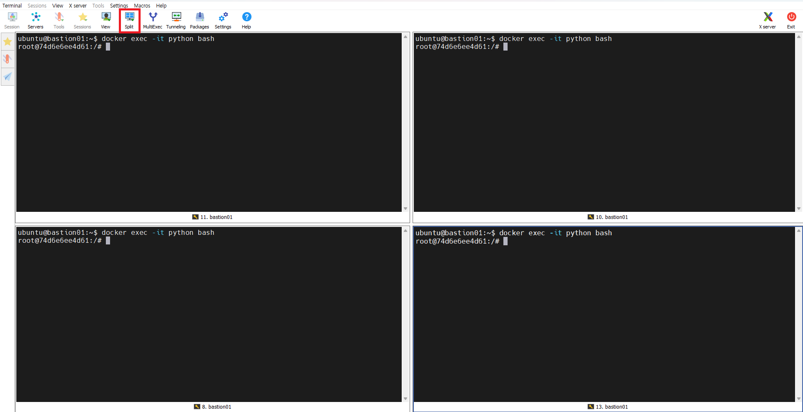

# Redis Hands-in 3

> Redis FailOVer Test


Redis 장애상황을 가정하여 특정 Node 를 Down 상황을 발생시켜볼 것이다.

그러므로 개인별 Basion k8s Cluster 를 이용할 것이다.


# 1. K8s Cluster 접속정보 변경

개인별 Bastion k8s Cluster 을 바라보도록 접속정보를 변경해 보자.


env 파일에서 localcluster는 주석처리하고 ktdseducluster를 연결시킨다.

```sh
# ubuntu terminal 에서


$ vi ~/env
...
#export KUBECONFIG=~/.kube/config-ktdseducluster    # <-- 주석처리
export KUBECONFIG=~/.kube/config-localcluster       # <-- 주석해지

# 저장후 종료


## 반드시 exit 후 terminal 재접속 할것
## 모든 terminal을 exit후 재접속
$ exit


# 재접속후
# 확인
$ cat ~/env
...
#export KUBECONFIG=~/.kube/config-ktdseducluster
export KUBECONFIG=~/.kube/config-localcluster


# ktdseducluster 로 연결여부 확인
$ kubectl get nodes
NAME        STATUS   ROLES                  AGE     VERSION
bastion02   Ready    control-plane,master   5d14h   v1.28.6+k3s2


# 위와 같이 1개의 node 가 보인다면 성공
```


# 2. [MR] Master Backup 중요성

Master Backup 여부에 따라 Master 재기동시  Data 유지 되는지를 확인해 보자.

Master 를 백업하지 않는 상태에서 재기동 하게 되면 Replica 까지 모두 초기화 된다.

이를 확인해 보자.


## 1) master backup 없이 재기동


### (1) 수행순서

```
1) MR Redis 설치 without PV
2) set 명령수행
3) Replica 에서 get 확인
4) Master down / 재기동 수행
5) Replica 에서 get 확인

```


### (2) 실습환경

터미널 2개를 준비하자.

* 터미널1 : ubuntu 내
* 터미널2 : redis-client pod - (replica용도)


### ※ [참고] Mobaxterm Split

Mobaxterm Split 기능을 이용하면 N개의 terminal을 한꺼번에 볼수 있으니 참고하자.




### (3) [터미널2] Replica 로 접속하여 get 확인

```sh

## redis-client 로 접근한다.
$ kubectl -n redis-mr exec -it deploy/redis-client -- bash

root@redis-client-9f57dc6d6-j578s:/data# 

# 1초에 한번씩 get 하자.
$ while true;do redis-cli -h ds-redis-replicas -a new1234 get a; sleep 1;echo; done;


```


### (4) [터미널1] Master down/restart

```sh
## redis-client 로 접근한다.
$ kubectl -n redis-mr get pod
NAME                           READY   STATUS    RESTARTS   AGE
ds-redis-master-0              1/1     Running   0          34m
ds-redis-replicas-0            1/1     Running   0          34m
ds-redis-replicas-1            1/1     Running   0          34m

# master pod down/restart
$ kubectl -n redis-mr delete pod ds-redis-master-0


# 확인
$ kubectl -n redis-mr get pod  -w
NAME                           READY   STATUS    RESTARTS   AGE
ds-redis-master-0              0/1     Running   0          5s
...
ds-redis-master-0              1/1     Running   0          20s


```


### (5) [터미널2] 결과 확인

```sh


"1"

"1"

Fri Mar  8 13:12:52 UTC 2024    # <-- 삭제
(nil)

```

* 결론
  * slave 로 접속하여 읽어들이는 value 가 초기화 되어 버렸다.
  * 이런 상황을 방지하기 위해서 반드시 MR 구조에서는 Master를 백업해야 한다.


## 2) master backup후 재기동


### (1) 수행순서

```
1) MR Redis 설치 with PV
2) set 명령수행
3) Replica 에서 get 확인
4) Master down / 재기동 수행
5) Replica 에서 get 확인
```


### (2) 실습환경

터미널3개를 준비하자.

* 터미널1 : ubuntu
* 터미널2 : redis-client pod - (master용도)
* 터미널3 : redis-client pod - (slave용도)


### (3) [터미널1] Redis 설치 with PV

#### 기존 Redis 제거

```sh

# 확인
$ helm -n redis-mr ls
NAME            NAMESPACE       REVISION        UPDATED                                 STATUS          CHART                             APP VERSION
ds-redis        redis-mr        1               2024-03-08 13:37:00.692463764 +0000 UTC deployed        redis-18.1                7.1     7.2.4


# Redis 삭제
$ helm -n redis-mr delete ds-redis


```


#### Redis 설치

```sh
## ubuntu에서...

# helm install
# master 1, replica 2 실행

# 설치
$ helm -n redis-mr install ds-redis bitnami/redis \
    --set global.redis.password=new1234 \
    --set image.registry=docker.io \
    --set master.persistence.enabled=true \
    --set master.persistence.size=1Gi \
    --set master.service.type=NodePort \
    --set master.service.nodePorts.redis=32300 \
    --set replica.replicaCount=2 \
    --set replica.persistence.enabled=false \
    --set replica.service.type=NodePort \
    --set replica.service.nodePorts.redis=32310

##
NAME: ds-redis
LAST DEPLOYED: Fri Mar  8 14:11:43 2024
NAMESPACE: redis-mr
STATUS: deployed
REVISION: 1
TEST SUITE: None
NOTES:
CHART NAME: redis
CHART VERSION: 18.17.1
APP VERSION: 7.2.4


# 설치목록 확인
$ helm -n redis-mr ls
NAME            NAMESPACE       REVISION        UPDATED                                 STATUS          CHART           APP VERSION
ds-redis        redis-mr        1               2024-03-08 13:37:00.692463764 +0000 UTC deployed        redis-18.17.1   7.2.4


# 확인
$ helm -n redis-mr status my-release
$ helm -n redis-mr get all my-release


```


#### pod / svc 확인

```sh


$ kubectl -n redis-mr get svc
NAME                TYPE        CLUSTER-IP      EXTERNAL-IP   PORT(S)          AGE
ds-redis-headless   ClusterIP   None            <none>        6379/TCP         47s
ds-redis-replicas   NodePort    10.43.239.194   <none>        6379:32310/TCP   47s
ds-redis-master     NodePort    10.43.217.35    <none>        6379:32300/TCP   47s


$ kubectl -n redis-mr get pod
NAME                           READY   STATUS    RESTARTS   AGE
ds-redis-master-0              1/1     Running   0          2m2s
ds-redis-replicas-0            1/1     Running   0          2m2s
ds-redis-replicas-1            1/1     Running   0          86s


# 약 1분 정도 소요됨 
```


#### statefulset  pvc 확인

```sh

$ kubectl -n redis-mr get pod ds-redis-master-0 -o yaml


apiVersion: v1
kind: Pod
metadata:
  name: ds-redis-master-0
  namespace: redis-mr
  ...
spec:
  containers:
  ...
    volumeMounts:
    - mountPath: /data                          # <-- backup 데이터가 존재하는 위치
      name: redis-data
      ...

  volumes:
  - name: redis-data
    persistentVolumeClaim:
      claimName: redis-data-ds-redis-master-0  # <-- pvc 확인
      ...
---

```


### (4) [터미널3] Replica접속 get

```sh
## ubuntu에서...

## redis-client 로 접근한다.
$ kubectl -n redis-mr exec -it deploy/redis-client -- bash

root@redis-client-9f57dc6d6-j578s:/data# 


# 1초에 한번씩 get 하자.
$ while true;do redis-cli -h ds-redis-replicas -a new1234 get a; sleep 1;echo; done;
(nil)

(nil)

# 현재는 아무런 데이터 가 없으므로 null 값이 리턴된다.

```


### (5) [터미널2] Master접속 set 

```sh
## ubuntu에서...


## redis-client 로 접근한다.
$ kubectl -n redis-mr exec -it deploy/redis-client -- bash

root@redis-client-9f57dc6d6-j578s:/data# 


# master connect
$ redis-cli -h ds-redis-master  -a new1234


## set 명령 수행
my-release-redis-master:6379> set a 1111
OK

my-release-redis-master:6379> set a 2222
OK

my-release-redis-master:6379> set a 3333
OK


# Master 에서 입력하면 Replica[터미널3]에서 바로 복제 되는 것을 확인할 수 있다.


$ exit

```


#### AOF 파일 확인

Master POD 로 접근하여 AOF 파일이 어떻게 쌓이는지 확인해보자.

반드시 Master POD 로 접근해야 한다.

```sh
## ubuntu에서...


## Master pod 내로 접근한다.
$ kubectl -n redis-mr exec -it pod/ds-redis-master-0 -- bash


# append only File 확인
$ cat /data/appendonlydir/appendonly.aof.1.incr.aof
*2
$6
SELECT
$1
0
*3
$3
set
$1
a
$4
1111
*3
$3
set
$1
a
$4
2222
*3
$3
set
$1
a
$4
3333


# file 을 확인해보면
# 우리가 입력한 명령어들이 append 되어 있다.

```

* AOF 파일 내용 확인
  * 모든 명령어 기록은 항상 * 로 시작하며 * 다음 숫자는 명령을 구성하고 있는 단어 갯수
  * $ 는 요소를 나타냄, $ 뒤 숫자는 요소의 글자수를 나타냄
  * 그 다음행은 명령자체가 기록됨


### (6) [터미널1] Master down/restart

```sh
## ubuntu에서...


## redis-client 로 접근한다.
$ kubectl -n redis-mr get pod
NAME                           READY   STATUS    RESTARTS   AGE
ds-redis-master-0              1/1     Running   0          5m20s
ds-redis-replicas-0            1/1     Running   0          5m20s
ds-redis-replicas-1            1/1     Running   0          4m49s


# Master pod down/restart
# Master pod delete
$ kubectl -n redis-mr delete pod ds-redis-master-0


# 확인
$ kubectl -n redis-mr get pod  -w
NAME                           READY   STATUS    RESTARTS   AGE
ds-redis-master-0              0/1     Running   0          5s
...
ds-redis-master-0              1/1     Running   0          20s


```


### (7) [터미널2] 결과 확인

```sh

"3333"

"3333"

```

* 결론

  * slave 로 접속하여 읽어들이는 value 가 초기화 되지 않고 유지 된다.

    


### (8) [터미널2] Master pod Data 확인

```sh
## ubuntu에서...


## master pod 내로 접근한다.
$ kubectl -n redis-mr exec -it pod/ds-redis-master-0 -- bash


# append only File 확인

$ cat /data/appendonlydir/appendonly.aof.1.incr.aof
*2
$6
SELECT
$1
0
*3
$3
set
$1
a
$4
1111
*3
$3
set
$1
a
$4
2222
*3
$3
set
$1
a
$4
3333
------

# master pod 가 재기동 되었음에도 이전 AOF 파일들이 그대로 존재한다.

```

* 결론
  * 안정적인 운영을 위해 Redis-MR 구조에서는 반드시 Master 를 백업하자.


### (9) Clean Up

```sh

# 1) helm
# helm 확인
$ helm -n redis-mr ls


# helm 삭제
$ helm -n redis-mr delete ds-redis


# 2) pvc
# pvc 확인
$ kubectl -n redis-mr get pvc
NAME                           STATUS   VOLUME                                     CAPACITY   ACCESS MODES   STORAGECLASS   AGE
redis-data-ds-redis-master-0   Bound    pvc-c07f96f6-c128-4a35-be0f-80ebe52acfc1   1Gi        RWO            local-path     11m

# pvc 삭제
$ kubectl -n redis-mr delete pvc redis-data-ds-redis-master-0 


# 3) pv
# pv 확인
$ kubectl -n redis-mr get pv
NAME                                       CAPACITY   ACCESS MODES   RECLAIM POLICY   STATUS   CLAIM                                   STORAGECLASS   REASON   AGE
pvc-c07f96f6-c128-4a35-be0f-80ebe52acfc1   1Gi        RWO            Delete           Bound    redis-mr/redis-data-ds-redis-master-0   local-path              11m

# pvc 삭제
$ kubectl -n redis-mr delete pv pvc-c07f96f6-c128-4a35-be0f-80ebe52acfc1


# 4)
# 확인
$ kubectl -n redis-mr get all


```


# 3. [RC] FailOver Test

Redis Cluster 에서 FailOver Test를 진행해 보자.


## 1) 환경준비

Master node 1개를 down 하여 Cluster 가 정상 작동하는지, Slave 가 Master 로 승격되어 서비스에 문제는 없는지 추이를 살펴 본자.


### (1) 수행순서

```
1) Cluster node 중 master node down(pod 삭제)
2) cluster nodes 로 Master Node 상태 확인
```


### (2) 실습환경

터미널 2개를 준비하자.

* 터미널1 : ubuntu - down 등 수행 용도

  * ```sh
    ubuntu@bastion02:~$
    ```

* 터미널2 : redis-cli  command 명령수행  용도

  * ```sh
    $ kubectl -n redis-cluster exec -it deploy/redis-client -- bash
    root@redis-client-9f57dc6d6-7kffv:/data#
    
    $ redis-cli -h ds-redis-redis-cluster -c -a new1234
    ```

* 터미널3 : redis-cli - 초당 1회 get 용도

  * ```sh
    $ kubectl -n redis-cluster exec -it deploy/redis-client -- bash
    root@redis-client-9f57dc6d6-7kffv:/data#
    ```

* 터미널4 : python-client - 초당 1회 get 용도

  * ```sh
    $ kubectl -n redis-cluster exec -it deploy/python -- bash
    root@python-5847f48f6c-zdblv:/#
    ```

    


### (3) [터미널2] redis-cli 에서 기본 데이터 입력

```sh
## redis-client pod 내에서...

$ redis-cli -h ds-redis-redis-cluster -c -a new1234

$ set a 11
  set b 22
  set c 33

```


### (3) [터미널3]  redis-cli 에서 초당 1회 get

```sh
## redis-client pod 내에서...
    
# 1초에 한번씩 get 실행
$ while true; do date; \
    redis-cli -h ds-redis-redis-cluster -c -a new1234 get a; \
    redis-cli -h ds-redis-redis-cluster -c -a new1234 get b; \
    redis-cli -h ds-redis-redis-cluster -c -a new1234 get c; \
    echo; sleep 1; done

```


### (4) [터미널4]  python 에서 초당 1회 get

```sh
## python pod 내에서...

$ python

```


아래 명령으로 초당 1회씩 get 명령을 실행하자.

```python

from time import sleep
from rediscluster import RedisCluster

startup_nodes = [{"host":"ds-redis-redis-cluster.redis-cluster.svc", "port":"6379"}]
rc = RedisCluster(startup_nodes=startup_nodes, 
                  decode_responses=True, 
                  skip_full_coverage_check=True,
                  password="new1234")

# 1초에 한번씩 get 실행
for i in range(10000):
    print(f"Count: {i} / 10000")
    sleep(1)
    rc.get("a")
    rc.get("b")
    rc.get("c")

```


### (5) [터미널2] redis cluster 확인

Down 시킬 master 를 하나 선정한다.

```sh

# 확인
ds-redis-redis-cluster:6379> cluster nodes
d25d71a3282e47d3d12c4c7d92d3bddc712a148c 10.42.2.77:6379@16379 slave e64f0b9d8ca9b97ebe0ef4982542bd592cd5ee07 0 1710043738000 3 connected
846d10b42b6b9e212fd0d4abf0ae9b778ad85876 10.42.2.80:6379@16379 slave 596caffb0fcf230cbbb3804214863a55c7c4421c 0 1710043738717 2 connected
596caffb0fcf230cbbb3804214863a55c7c4421c 10.42.2.78:6379@16379 myself,master - 0 1710043737000 2 connected 5461-10922
3878969c8652eaf2c095ea9342470083b6eb4186 10.42.2.76:6379@16379 master - 0 1710043739722 1 connected 0-5460
e64f0b9d8ca9b97ebe0ef4982542bd592cd5ee07 10.42.2.79:6379@16379 master - 0 1710043737000 3 connected 10923-16383
5c8303528d249a50ee5299c3a425eb1c73318f17 10.42.2.81:6379@16379 slave 3878969c8652eaf2c095ea9342470083b6eb4186 0 1710043739000 1 connected


# master / slave 구조 확인
# slave 뒤 ID 가 master 를 가르키고 있다.


10.42.2.79:6379> get a
"11"

10.42.2.79:6379> get b
-> Redirected to slot [3300] located at 10.42.2.76:6379
"22"

10.42.2.76:6379> get c
-> Redirected to slot [7365] located at 10.42.2.78:6379
"33"


# Down 대상 master 선정

# a key 가 존재하는 Master(10.42.0.79)) 를 down 시켜 보자.
# 아마도 Slave(10.42.2.77) 가 Master 로 승격 될 것이다.

# master : 10.42.0.79   <-- down 대상
# slave  : 10.42.2.77   <-- 이후 Master 승격

```


## 2) Master node down


### (1) [터미널1] master node down

10.42.0.79 master node down

```sh


$ kubectl -n redis-cluster get pod -o wide
NAME                           READY   STATUS    RESTARTS   AGE   IP           NODE        NOMINATED NODE   READINESS GATES
redis-client-9f57dc6d6-7kffv   1/1     Running   0          21h   10.42.2.74   bastion02   <none>           <none>
python-5847f48f6c-zdblv        1/1     Running   0          21h   10.42.2.75   bastion02   <none>           <none>
ds-redis-redis-cluster-1       1/1     Running   0          20m   10.42.2.78   bastion02   <none>           <none>
ds-redis-redis-cluster-0       1/1     Running   0          20m   10.42.2.76   bastion02   <none>           <none>
ds-redis-redis-cluster-2       1/1     Running   0          20m   10.42.2.79   bastion02   <none>           <none>
ds-redis-redis-cluster-5       1/1     Running   0          20m   10.42.2.80   bastion02   <none>           <none>
ds-redis-redis-cluster-3       1/1     Running   0          20m   10.42.2.77   bastion02   <none>           <none>
ds-redis-redis-cluster-4       1/1     Running   0          20m   10.42.2.81   bastion02   <none>           <none>


# master : 10.42.0.79 : ds-redis-redis-cluster-2
# slave  : 10.42.2.77 : ds-redis-redis-cluster-3 


###
# down 시도
###

$ kubectl -n redis-cluster delete pod ds-redis-redis-cluster-2
pod "ds-redis-redis-cluster-2" deleted


$ kubectl -n redis-cluster get pod

NAME                           READY   STATUS    RESTARTS   AGE
redis-client-9f57dc6d6-7kffv   1/1     Running   0          21h
python-5847f48f6c-zdblv        1/1     Running   0          21h
ds-redis-redis-cluster-1       1/1     Running   0          22m
ds-redis-redis-cluster-0       1/1     Running   0          22m
ds-redis-redis-cluster-5       1/1     Running   0          22m
ds-redis-redis-cluster-3       1/1     Running   0          22m
ds-redis-redis-cluster-4       1/1     Running   0          22m
ds-redis-redis-cluster-2       0/1     Running   0          15s

$ kubectl -n redis-cluster get pod -o wide
NAME                           READY   STATUS    RESTARTS   AGE   IP           NODE        NOMINATED NODE   READINESS GATES
redis-client-9f57dc6d6-7kffv   1/1     Running   0          22h   10.42.2.74   bastion02   <none>           <none>
python-5847f48f6c-zdblv        1/1     Running   0          21h   10.42.2.75   bastion02   <none>           <none>
ds-redis-redis-cluster-1       1/1     Running   0          42m   10.42.2.78   bastion02   <none>           <none>
ds-redis-redis-cluster-0       1/1     Running   0          42m   10.42.2.76   bastion02   <none>           <none>
ds-redis-redis-cluster-5       1/1     Running   0          42m   10.42.2.80   bastion02   <none>           <none>
ds-redis-redis-cluster-3       1/1     Running   0          42m   10.42.2.77   bastion02   <none>           <none>
ds-redis-redis-cluster-4       1/1     Running   0          42m   10.42.2.81   bastion02   <none>           <none>
ds-redis-redis-cluster-2       0/1     Running   0          21m   10.42.2.82   bastion02   <none>           <none>


```

* Down 된 ds-redis-redis-cluster-2 pod 재기동된다.
* ds-redis-redis-cluster-2 의 IP 를 확인해보자.
  * 기존 10.42.0.79 에서 재기동되면서 새로운 IP(10.42.2.82) 로 할당되었다.
* 이후 readiness 실패하여 정상기동 되지 않는다.


### (2) [터미널3,4] 데이터 확인

* down 발생시점에서 약 20초정도 이후 정상 작동한다.


### (3) [터미널1] POD log 확인

Slave --> Master 로 변경된 pod log 를확인해 보자.

```sh

$ kubectl -n redis-cluster logs ds-redis-redis-cluster-3


1:S 10 Mar 2024 04:14:46.204 * Connection with master lost.
1:S 10 Mar 2024 04:14:46.204 * Caching the disconnected master state.
1:S 10 Mar 2024 04:14:46.204 * Reconnecting to MASTER 10.42.2.79:6379
1:S 10 Mar 2024 04:14:46.204 * MASTER <-> REPLICA sync started
1:S 10 Mar 2024 04:14:46.204 # Error condition on socket for SYNC: Connection refused
1:S 10 Mar 2024 04:14:46.405 * Connecting to MASTER 10.42.2.79:6379
1:S 10 Mar 2024 04:14:46.405 * MASTER <-> REPLICA sync started

# 약 20초 이후 Cluster fail
1:S 10 Mar 2024 04:15:05.953 * Marking node e64f0b9d8ca9b97ebe0ef4982542bd592cd5ee07 () as failing (quorum reached).
1:S 10 Mar 2024 04:15:05.953 # Cluster state changed: fail
1:S 10 Mar 2024 04:15:05.976 * Start of election delayed for 907 milliseconds (rank #0, offset 1897).
1:S 10 Mar 2024 04:15:06.981 * Starting a failover election for epoch 7.
1:S 10 Mar 2024 04:15:06.993 * Failover election won: I'm the new master.
1:S 10 Mar 2024 04:15:06.993 * configEpoch set to 7 after successful failover

# 여기서부터 Master 로 변경되었다.
1:M 10 Mar 2024 04:15:06.993 * Discarding previously cached master state.
1:M 10 Mar 2024 04:15:06.993 * Setting secondary replication ID to 48d106616d275a26ddf91c34bc5f0a5e923442a6, valid up to offset: 1898. New replication ID is a05cd391f027d0bf8da7016cae10906d3a2963d7
1:M 10 Mar 2024 04:15:06.993 * Cluster state changed: ok

# cluster ok

```

* Slave 에서 Master 로 승격되었다.


Down 된  Master pod log 를확인해 보자.

```sh
$ kubectl -n redis-cluster logs ds-redis-redis-cluster-2

1:M 10 Mar 2024 04:14:52.840 * No cluster configuration found, I'm 11439c6cb119c655887813742cb13eb8be4d3ab0
1:M 10 Mar 2024 04:14:52.844 * Server initialized
1:M 10 Mar 2024 04:14:52.847 * Creating AOF base file appendonly.aof.1.base.rdb on server start
1:M 10 Mar 2024 04:14:52.851 * Creating AOF incr file appendonly.aof.1.incr.aof on server start
1:M 10 Mar 2024 04:14:52.851 * Ready to accept connections tcp


```

* master 로 시작되긴 했지만
* cluster config 정보를 찾지 못했다.


### (4) [터미널2] redis cluster 확인

데이터가 잘 읽어지는지 확인해 보자.

```sh

10.42.2.78:6379> get a
-> Redirected to slot [15495] located at 10.42.2.77:6379
"11"
10.42.2.77:6379>  get b
-> Redirected to slot [3300] located at 10.42.2.76:6379
"22"
10.42.2.76:6379> get c
-> Redirected to slot [7365] located at 10.42.2.78:6379
"33"

```

* downtime 이 발생하지만 문제 없이 읽어진다.
* 만약 현재 접속된 node 가 down 되었다면 connection 이 끊어질 수 있다.


cluster node 를 확인해보자.

```sh

# 확인
10.42.2.78:6379> cluster nodes

d25d71a3282e47d3d12c4c7d92d3bddc712a148c 10.42.2.77:6379@16379 master - 0 1710045164241 7 connected 10923-16383
846d10b42b6b9e212fd0d4abf0ae9b778ad85876 10.42.2.80:6379@16379 slave 596caffb0fcf230cbbb3804214863a55c7c4421c 0 1710045163000 2 connected
596caffb0fcf230cbbb3804214863a55c7c4421c 10.42.2.78:6379@16379 myself,master - 0 1710045161000 2 connected 5461-10922
3878969c8652eaf2c095ea9342470083b6eb4186 10.42.2.76:6379@16379 master - 0 1710045162228 1 connected 0-5460
e64f0b9d8ca9b97ebe0ef4982542bd592cd5ee07 10.42.2.79:6379@16379 master,fail - 1710044090847 1710044085792 3 connected
5c8303528d249a50ee5299c3a425eb1c73318f17 10.42.2.81:6379@16379 slave 3878969c8652eaf2c095ea9342470083b6eb4186 0 1710045163233 1 connected


```

* 기존 slave(10.42.2.77)  가 ㅡmaster 로 승격되었다.
* 문제점이 존재한다.
  * down 된 master 의 이전 IP 가  Fail 로 존재한다.
  * Master 로 승격된 이후 전용 Slave 가 존재하지 않는다.
  * Fail 된 node 가 새로운 Slave 로 합류되어야 하지만 보이지 않는다.
* Fail Node 는 어떻게 정상화 시킬 수 있을까? 


### (5) [터미널1] Fail Node 원인 분석


#### pod not ready 확인

pod 를 확인해 보자.

```sh
$ kubectl -n redis-cluster get pod -o wide

NAME                           READY   STATUS    RESTARTS   AGE   IP           NODE        NOMINATED NODE   READINESS GATES
redis-client-9f57dc6d6-7kffv   1/1     Running   0          22h   10.42.2.74   bastion02   <none>           <none>
python-5847f48f6c-zdblv        1/1     Running   0          22h   10.42.2.75   bastion02   <none>           <none>
ds-redis-redis-cluster-1       1/1     Running   0          54m   10.42.2.78   bastion02   <none>           <none>
ds-redis-redis-cluster-0       1/1     Running   0          54m   10.42.2.76   bastion02   <none>           <none>
ds-redis-redis-cluster-5       1/1     Running   0          54m   10.42.2.80   bastion02   <none>           <none>
ds-redis-redis-cluster-3       1/1     Running   0          54m   10.42.2.77   bastion02   <none>           <none>
ds-redis-redis-cluster-4       1/1     Running   0          54m   10.42.2.81   bastion02   <none>           <none>
ds-redis-redis-cluster-2       0/1     Running   0          32m   10.42.2.82   bastion02   <none>           <none>


```

ds-redis-redis-cluster-2 pod 가 down 이후  readiness 를 통과하지 못했다. 

원인이 무엇인지 확인해보자.


아래는 readinessprobe 명령이다.

```sh

$ kubectl -n redis-cluster get pod ds-redis-redis-cluster-2 -o yaml

apiVersion: v1
kind: Pod
metadata:
  name: ds-redis-redis-cluster-2
  ...
  containers:
    ...
    readinessProbe:
      exec:
        command:
        - sh
        - -c
        - /scripts/ping_readiness_local.sh 1
      failureThreshold: 5
      initialDelaySeconds: 5
      periodSeconds: 5
      successThreshold: 1
      timeoutSeconds: 2
      ...
```


ping_readiness_local.sh 값을 확인해보자.

```shell

# pod 내로 진입
$ kubectl -n redis-cluster exec -it ds-redis-redis-cluster-2 -- bash

I have no name!@ds-redis-redis-cluster-2:/$


# shell file 확인
$ cat /scripts/ping_readiness_local.sh
#!/bin/sh
set -e

REDIS_STATUS_FILE=/tmp/.redis_cluster_check
if [ ! -z "$REDIS_PASSWORD" ]; then export REDISCLI_AUTH=$REDIS_PASSWORD; fi;
response=$(
  timeout -s 15 $1 \
  redis-cli \
    -h localhost \
    -p $REDIS_PORT_NUMBER \
    ping
)
if [ "$?" -eq "124" ]; then
  echo "Timed out"
  exit 1
fi
if [ "$response" != "PONG" ]; then
  echo "$response"
  exit 1
fi
if [ ! -f "$REDIS_STATUS_FILE" ]; then
  response=$(
    timeout -s 15 $1 \
    redis-cli \
      -h localhost \
      -p $REDIS_PORT_NUMBER \
      CLUSTER INFO | grep cluster_state | tr -d '[:space:]'
  )
  if [ "$?" -eq "124" ]; then
    echo "Timed out"
    exit 1
  fi
  if [ "$response" != "cluster_state:ok" ]; then
    echo "$response"
    exit 1
  else
    touch "$REDIS_STATUS_FILE"
  fi

```

* 위 명령들 중 하나가 실패인데 원인을 더 찾아보자.


fail node 에서 확인해보자.

```sh

$ sh -c "/scripts/ping_readiness_local.sh 1"
cluster_state:fail

# 실패한다.


# ping pong test
$ redis-cli \
    -h localhost \
    -p 6379 \
    ping
PONG


# cluster info 확인 1
$ redis-cli \
      -h localhost \
      -p $REDIS_PORT_NUMBER \
      CLUSTER INFO

cluster_state:fail
cluster_slots_assigned:0
cluster_slots_ok:0
cluster_slots_pfail:0
cluster_slots_fail:0
cluster_known_nodes:1
cluster_size:0
cluster_current_epoch:0
cluster_my_epoch:0
cluster_stats_messages_sent:0
cluster_stats_messages_received:0
total_cluster_links_buffer_limit_exceeded:0


# cluster info 확인 2
$ redis-cli \
      -h localhost \
      -p $REDIS_PORT_NUMBER \
      CLUSTER INFO | grep cluster_state | tr -d '[:space:]'

cluster_state:fail


```

* 결국 cluster_state 가 실패하여 not ready 되었다.


### (6) 결론

* slave 가 master 로 승격되어 서비스는 정상 작동한다.
* 재기동된 기존의 node 는 자동으로 slave 로 추가되지 않는다.
* 그러므로 수작업으로 추가작업 해야 한다.


## 3) Fail Over 처리

Fail node 를 추방하고 기존 node 는 slave node로 추가하는 작업을 수행한다.


### (1) 수행순서

```
1) forget 명령으로 해당노드를 group에서 제거한다.
2) meet 명령으로 node 추가
   - 일반적으로 master node 로 추가된다.  그러므로 slave 로 변경해 줘야 한다.
3) replicate 명령으로 slave 설정을 한다.
```


### (2) [터미널2] meet-replicate

```sh

# 작업전 확인
10.42.2.78:6379> cluster nodes
d25d71a3282e47d3d12c4c7d92d3bddc712a148c 10.42.2.77:6379@16379 master - 0 1710045164241 7 connected 10923-16383
846d10b42b6b9e212fd0d4abf0ae9b778ad85876 10.42.2.80:6379@16379 slave 596caffb0fcf230cbbb3804214863a55c7c4421c 0 1710045163000 2 connected
596caffb0fcf230cbbb3804214863a55c7c4421c 10.42.2.78:6379@16379 myself,master - 0 1710045161000 2 connected 5461-10922
3878969c8652eaf2c095ea9342470083b6eb4186 10.42.2.76:6379@16379 master - 0 1710045162228 1 connected 0-5460
e64f0b9d8ca9b97ebe0ef4982542bd592cd5ee07 10.42.2.79:6379@16379 master,fail - 1710044090847 1710044085792 3 connected
5c8303528d249a50ee5299c3a425eb1c73318f17 10.42.2.81:6379@16379 slave 3878969c8652eaf2c095ea9342470083b6eb4186 0 1710045163233 1 connected

```

* 추방 대상 node ID
  * e64f0b9d8ca9b97ebe0ef4982542bd592cd5ee07


### (3) [터미널2] 해당 노드 추방

forget 명령으로 해당 노드를 Cluster Group에서 제거한다.

모든 pod 에서 1분이내에 수행해야 한다.

그렇지 않으면 gosship protocol에 의해서 원복된다.

```sh
# redis-cli pod 내에서

# 1) forget 
$ 
redis-cli -h ds-redis-redis-cluster-0.ds-redis-redis-cluster-headless -c -a new1234 cluster forget e64f0b9d8ca9b97ebe0ef4982542bd592cd5ee07
redis-cli -h ds-redis-redis-cluster-1.ds-redis-redis-cluster-headless -c -a new1234 cluster forget e64f0b9d8ca9b97ebe0ef4982542bd592cd5ee07
redis-cli -h ds-redis-redis-cluster-2.ds-redis-redis-cluster-headless -c -a new1234 cluster forget e64f0b9d8ca9b97ebe0ef4982542bd592cd5ee07
redis-cli -h ds-redis-redis-cluster-3.ds-redis-redis-cluster-headless -c -a new1234 cluster forget e64f0b9d8ca9b97ebe0ef4982542bd592cd5ee07
redis-cli -h ds-redis-redis-cluster-4.ds-redis-redis-cluster-headless -c -a new1234 cluster forget e64f0b9d8ca9b97ebe0ef4982542bd592cd5ee07
redis-cli -h ds-redis-redis-cluster-5.ds-redis-redis-cluster-headless -c -a new1234 cluster forget e64f0b9d8ca9b97ebe0ef4982542bd592cd5ee07


# 2) 확인
$
redis-cli -h ds-redis-redis-cluster-0.ds-redis-redis-cluster-headless -c -a new1234 cluster nodes
redis-cli -h ds-redis-redis-cluster-1.ds-redis-redis-cluster-headless -c -a new1234 cluster nodes
redis-cli -h ds-redis-redis-cluster-2.ds-redis-redis-cluster-headless -c -a new1234 cluster nodes
redis-cli -h ds-redis-redis-cluster-3.ds-redis-redis-cluster-headless -c -a new1234 cluster nodes
redis-cli -h ds-redis-redis-cluster-4.ds-redis-redis-cluster-headless -c -a new1234 cluster nodes
redis-cli -h ds-redis-redis-cluster-5.ds-redis-redis-cluster-headless -c -a new1234 cluster nodes

846d10b42b6b9e212fd0d4abf0ae9b778ad85876 10.42.2.80:6379@16379 myself,slave 596caffb0fcf230cbbb3804214863a55c7c4421c 0 1710047483000 2 connected
d25d71a3282e47d3d12c4c7d92d3bddc712a148c 10.42.2.77:6379@16379 master - 0 1710047487000 7 connected 10923-16383
3878969c8652eaf2c095ea9342470083b6eb4186 10.42.2.76:6379@16379 master - 0 1710047487253 1 connected 0-5460
596caffb0fcf230cbbb3804214863a55c7c4421c 10.42.2.78:6379@16379 master - 0 1710047488277 2 connected 5461-10922
5c8303528d249a50ee5299c3a425eb1c73318f17 10.42.2.81:6379@16379 slave 3878969c8652eaf2c095ea9342470083b6eb4186 0 1710047488000 1 connected
e64f0b9d8ca9b97ebe0ef4982542bd592cd5ee07 10.42.2.79:6379@16379 master,fail - 1710044086389 1710044083377 3 connected


# 3) meet
##   재기동된 신규 pod의 IP를 확인한다.
$ 
redis-cli -h ds-redis-redis-cluster -a new1234 CLUSTER meet 10.42.2.81 6379

redis-cli -h ds-redis-redis-cluster-0.ds-redis-redis-cluster-headless -c -a new1234 cluster meet 10.42.2.81 6379


# 3) replicate
## REPLICAS <node-id>
##    Return <node-id> replicas.
## replicate 명령은 자신을 지정한 node-id의 슬레이브로 만드는 명령이다.
## 그러므로 replica node 로 login 한다음 master node-id 를 설정한다.
$ redis-cli -h localhost -c -a $REDIS_PASSWORD CLUSTER REPLICATE 12a06ae7cd0ae7efd267814e28a83ff7824b8178


# 작업후
$ cluster nodes
12a06ae7cd0ae7efd267814e28a83ff7824b8178 10.42.0.170:6379@16379 master - 0 1689391225000 2 connected 5461-10922
95acfe21a64250fa3359eb10e5f9cd23d38ec36c 10.42.0.168:6379@16379 master - 0 1689391224000 7 connected 10923-16383
a2e3366d2310533a6cab5181afa197c93a5904a3 10.42.0.169:6379@16379 myself,master - 0 1689391226000 1 connected 0-5460
0da823d72181e684dfaf1b0c9cc9b58be96675ce 10.42.0.173:6379@16379 slave 95acfe21a64250fa3359eb10e5f9cd23d38ec36c 0 1689391226830 7 connected
217cf57cc8a39cac12dd9d614317ad55fe4c57e4 10.42.0.171:6379@16379 master,fail - 1689390078333 0 0 connected
b109ed74a0e639d34067d1bf78a860931d0ee941 10.42.0.172:6379@16379 slave a2e3366d2310533a6cab5181afa197c93a5904a3 0 1689391224817 1 connected

```


### (3) [터미널1] 추가될 pod IP 확인

```sh
$ kubectl -n redis-cluster get pod -o wide

NAME                           READY   STATUS    RESTARTS   AGE   IP           NODE        NOMINATED NODE   READINESS GATES
redis-client-9f57dc6d6-7kffv   1/1     Running   0          22h   10.42.2.74   bastion02   <none>           <none>
python-5847f48f6c-zdblv        1/1     Running   0          22h   10.42.2.75   bastion02   <none>           <none>
ds-redis-redis-cluster-1       1/1     Running   0          82m   10.42.2.78   bastion02   <none>           <none>
ds-redis-redis-cluster-0       1/1     Running   0          82m   10.42.2.76   bastion02   <none>           <none>
ds-redis-redis-cluster-5       1/1     Running   0          82m   10.42.2.80   bastion02   <none>           <none>
ds-redis-redis-cluster-3       1/1     Running   0          82m   10.42.2.77   bastion02   <none>           <none>
ds-redis-redis-cluster-4       1/1     Running   0          82m   10.42.2.81   bastion02   <none>           <none>
ds-redis-redis-cluster-2       0/1     Running   0          60m   10.42.2.82   bastion02   <none>           <none>


```

* ds-redis-redis-cluster-2  10.42.2.82

  


### (4) [터미널2] 노드 추가

```sh
# redis-cli pod 내에서

# 1) meet
##   재기동된 신규 pod의 IP를 확인한다.
$ 
redis-cli -h ds-redis-redis-cluster -a new1234 CLUSTER meet 10.42.2.82 6379
OK


# 2) cluster 확인
redis-cli -h ds-redis-redis-cluster -a new1234 CLUSTER nodes

11439c6cb119c655887813742cb13eb8be4d3ab0 10.42.2.82:6379@16379 master - 0 1710047887469 0 connected
846d10b42b6b9e212fd0d4abf0ae9b778ad85876 10.42.2.80:6379@16379 myself,slave 596caffb0fcf230cbbb3804214863a55c7c4421c 0 1710047887000 2 connected
d25d71a3282e47d3d12c4c7d92d3bddc712a148c 10.42.2.77:6379@16379 master - 0 1710047888482 7 connected 10923-16383
3878969c8652eaf2c095ea9342470083b6eb4186 10.42.2.76:6379@16379 master - 0 1710047886000 1 connected 0-5460
596caffb0fcf230cbbb3804214863a55c7c4421c 10.42.2.78:6379@16379 master - 0 1710047887000 2 connected 5461-10922
5c8303528d249a50ee5299c3a425eb1c73318f17 10.42.2.81:6379@16379 slave 3878969c8652eaf2c095ea9342470083b6eb4186 0 1710047887000 1 connected


# 


```

* master 로 추가 되었다.
* 추가된 node 를 slave(replicas) 로 변경한다.


### (5) [터미널2]  replicas 설정

```sh
# redis-cli pod 내에서

# 1) replicate
## REPLICAS <node-id>
##    Return <node-id> replicas.
## replicate 명령은 자신을 지정한 node-id의 슬레이브로 만드는 명령이다.
## 그러므로 replica node 로 접속한 다음 master node-id 를 설정한다.

$
redis-cli -h ds-redis-redis-cluster-2.ds-redis-redis-cluster-headless -a new1234 CLUSTER REPLICATE d25d71a3282e47d3d12c4c7d92d3bddc712a148c
OK


# 작업후
$ 
redis-cli -h ds-redis-redis-cluster -a new1234 CLUSTER nodes

11439c6cb119c655887813742cb13eb8be4d3ab0 10.42.2.82:6379@16379 slave d25d71a3282e47d3d12c4c7d92d3bddc712a148c 0 1710048319462 7 connected
3878969c8652eaf2c095ea9342470083b6eb4186 10.42.2.76:6379@16379 master - 0 1710048320467 1 connected 0-5460
596caffb0fcf230cbbb3804214863a55c7c4421c 10.42.2.78:6379@16379 master - 0 1710048318450 2 connected 5461-10922
d25d71a3282e47d3d12c4c7d92d3bddc712a148c 10.42.2.77:6379@16379 myself,master - 0 1710048319000 7 connected 10923-16383
5c8303528d249a50ee5299c3a425eb1c73318f17 10.42.2.81:6379@16379 slave 3878969c8652eaf2c095ea9342470083b6eb4186 0 1710048317435 1 connected
846d10b42b6b9e212fd0d4abf0ae9b778ad85876 10.42.2.80:6379@16379 slave 596caffb0fcf230cbbb3804214863a55c7c4421c 0 1710048318000 2 connected


```

* master 3개 slave 3개 의 모습이로 정상화 되었다.


### (6) [터미널1]  pod 확인

```sh
$ kubectl -n redis-cluster get pod -o wide
NAME                           READY   STATUS    RESTARTS   AGE   IP           NODE        NOMINATED NODE   READINESS GATES
redis-client-9f57dc6d6-7kffv   1/1     Running   0          22h   10.42.2.74   bastion02   <none>           <none>
python-5847f48f6c-zdblv        1/1     Running   0          22h   10.42.2.75   bastion02   <none>           <none>
ds-redis-redis-cluster-1       1/1     Running   0          91m   10.42.2.78   bastion02   <none>           <none>
ds-redis-redis-cluster-0       1/1     Running   0          91m   10.42.2.76   bastion02   <none>           <none>
ds-redis-redis-cluster-5       1/1     Running   0          91m   10.42.2.80   bastion02   <none>           <none>
ds-redis-redis-cluster-3       1/1     Running   0          91m   10.42.2.77   bastion02   <none>           <none>
ds-redis-redis-cluster-4       1/1     Running   0          91m   10.42.2.81   bastion02   <none>           <none>
ds-redis-redis-cluster-2       1/1     Running   0          69m   10.42.2.82   bastion02   <none>           <none>


```

* ds-redis-redis-cluster-2 1/1 로 정상 처리 되었다.
* cluster 의 일원으로 추가되고 readiness 가 성공하면서 정상기동되었다.


## 4) [참고] FiailOver with add-node

* 순서

```
1) forget 명령으로 해당노드를 group에서 제거한다.
2) add-node 옵션으로 Slave Node 추가
```


```sh
# 샘플
$ redis-cli --cluster \
    add-node 127.0.0.1:7001 127.0.0.1:7000 \
    --cluster-slave 869859e396c881b3c26f2a386c1495235225b57b

# 작업전
$ cluster nodes
b109ed74a0e639d34067d1bf78a860931d0ee941 10.42.0.172:6379@16379 master - 0 1689469636411 8 connected 0-5460
95acfe21a64250fa3359eb10e5f9cd23d38ec36c 10.42.0.168:6379@16379 master - 0 1689469637000 7 connected 10923-16383
12a06ae7cd0ae7efd267814e28a83ff7824b8178 10.42.0.170:6379@16379 master - 0 1689469637417 2 connected 5461-10922
a2e3366d2310533a6cab5181afa197c93a5904a3 10.42.0.169:6379@16379 master,fail - 1689469515457 1689469511429 1 connected
da5aaba2df35da46204ff96eb4be853ccd507606 10.42.0.174:6379@16379 slave 12a06ae7cd0ae7efd267814e28a83ff7824b8178 0 1689469636000 2 connected
0da823d72181e684dfaf1b0c9cc9b58be96675ce 10.42.0.173:6379@16379 myself,slave 95acfe21a64250fa3359eb10e5f9cd23d38ec36c 0 1689469635000 7 connected


# 1) forget
## 모든 node 에서 1분이내에 수행해야 한다.
## 그렇지 않으면 gosship protocol에 의해서 원복된다.

$ 
redis-cli -h 10.42.0.170 -c -a $REDIS_PASSWORD cluster forget a2e3366d2310533a6cab5181afa197c93a5904a3
redis-cli -h 10.42.0.168 -c -a $REDIS_PASSWORD cluster forget a2e3366d2310533a6cab5181afa197c93a5904a3
redis-cli -h 10.42.0.169 -c -a $REDIS_PASSWORD cluster forget a2e3366d2310533a6cab5181afa197c93a5904a3
redis-cli -h 10.42.0.173 -c -a $REDIS_PASSWORD cluster forget a2e3366d2310533a6cab5181afa197c93a5904a3
redis-cli -h 10.42.0.172 -c -a $REDIS_PASSWORD cluster forget a2e3366d2310533a6cab5181afa197c93a5904a3

OK


# 2) add-node
## format
## [슬레이브 IP:PORT] , [클러스터 노드 IP:PORT], [--cluster-slave 옵션], [마스터가 될 노드 ID]

$ redis-cli -a new1234 \
    --cluster add-node 10.42.0.175:6379 10.42.0.172:6379 \
    --cluster-slave b109ed74a0e639d34067d1bf78a860931d0ee941


# 작업후
$ cluster nodes
ac04246dfccf850cbdf78565a52f131b1160233a 10.42.0.175:6379@16379 slave b109ed74a0e639d34067d1bf78a860931d0ee941 0 1689470266001 8 connected
0da823d72181e684dfaf1b0c9cc9b58be96675ce 10.42.0.173:6379@16379 slave 95acfe21a64250fa3359eb10e5f9cd23d38ec36c 0 1689470264000 7 connected
da5aaba2df35da46204ff96eb4be853ccd507606 10.42.0.174:6379@16379 slave 12a06ae7cd0ae7efd267814e28a83ff7824b8178 0 1689470264996 2 connected
b109ed74a0e639d34067d1bf78a860931d0ee941 10.42.0.172:6379@16379 myself,master - 0 1689470262000 8 connected 0-5460
12a06ae7cd0ae7efd267814e28a83ff7824b8178 10.42.0.170:6379@16379 master - 0 1689470264000 2 connected 5461-10922
95acfe21a64250fa3359eb10e5f9cd23d38ec36c 10.42.0.168:6379@16379 master - 0 1689470263990 7 connected 10923-16383

```


