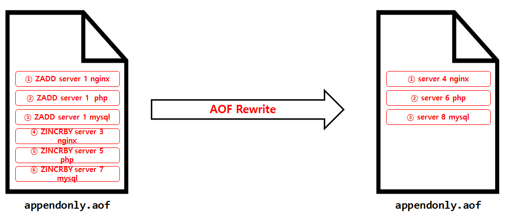

# 1. Redis Persistence


## 1) AOF backup

* 

```sh
redis.config
...
appendonlyfilemode yes    <- 선택
appendonlyfilemode no    
...


```


## 2) AOF Rewrite

* Redis의 AOF 기능은 모든 명령을 수행하고 파일에 기록되기 때문에 로그파일이 크기가 무한대로 커실수 있는 문제가 발생할 수 있음
* 이러한 문제를 미연에 방지하기 위한 기능인 AOF 에서 특정 시점에 전체 데이터를 다시쓰는 Rewrite 기능을 제공
* AOF의 Rewrtie 의 기능을 수행하고 나면 여러번 반복된 이전 데이터는 사라지며 최종 데이터의 기록만 남게 됨
* AOF 파일의 크기를 많이 줄일 수 있음





rewrite 명령

```sh
BGREWRITEAOF
```


rewrite 작업 전후 사이즈 확인

```sh


# 작업 전
$ ls -ltr
total 12
-rw-r--r-- 1 1001 root 108 Mar 12 07:49 appendonly.aof.2.base.rdb
-rw-r--r-- 1 1001 root  88 Mar 12 07:49 appendonly.aof.manifest
-rw-r--r-- 1 1001 root 110 Mar 12 08:32 appendonly.aof.2.incr.aof


# aof rewrite
$ BGREWRITEAOF


# 작업 후
$ ls -ltr
-rw-r--r-- 1 1001 root   0 Mar 12 08:34 appendonly.aof.3.incr.aof
-rw-r--r-- 1 1001 root 110 Mar 12 08:34 appendonly.aof.3.base.rdb
-rw-r--r-- 1 1001 root  88 Mar 12 08:34 appendonly.aof.manifest


```

